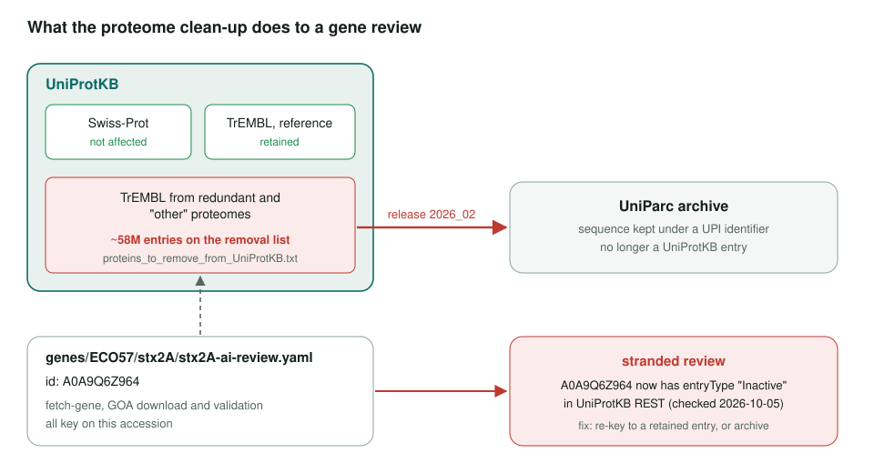
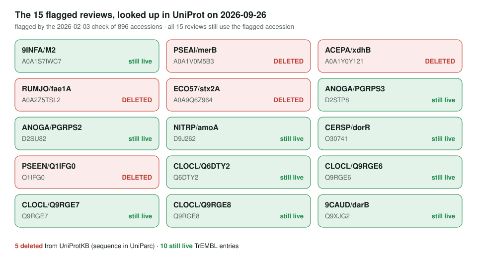

<!-- _class: lead -->

# UniProt proteome removal

Which gene reviews lose their UniProtKB entry

AI Gene Review · projects/PROTEOME_REMOVAL · 2026

---

<!-- _class: bluf -->

## Bottom line

- UniProt listed **~58M TrEMBL entries** from redundant and non-reference proteomes for removal by **release 2026_02** (archived in UniParc).
- A check of the **896** accessions in the repo on 2026-02-03 found **15 reviews** on the list; **none has been re-keyed or archived**.
- On 2026-10-05, **5 are inactive** in UniProtKB REST and **10 are still live**. The repo is now 5,630 folders, so the scan needs re-running.

---

## Why it matters

---

## The 15 flagged reviews today

---

## How the check was done

- Used UniProt's **explicit removal list** (`proteins_to_remove_from_UniProtKB.txt`, 578 MB), not proteome membership, which proved unreliable.
- Intersected with the repo's accessions using `LC_ALL=C comm -12` on sorted lists: linear time, but **locale-sensitive**.
- The `just` targets described on the project page are **not in the current justfiles**.

---

## Status and next steps

- ✅ Removal list checked against 896 accessions (Feb 2026): 15 hits.
- ⬜ For the **5 inactive** entries (merB, xdhB, fae1A, stx2A, Q1IFG0): find a retained accession or archive the review.
- ⬜ Decide whether a UniParc UPI is an acceptable review key.
- ⬜ Restore the check as a `just` target and re-run over all 5,630 gene folders.
- Tracked in ai-gene-review#4003.

**Read more:** `projects/PROTEOME_REMOVAL.md`
