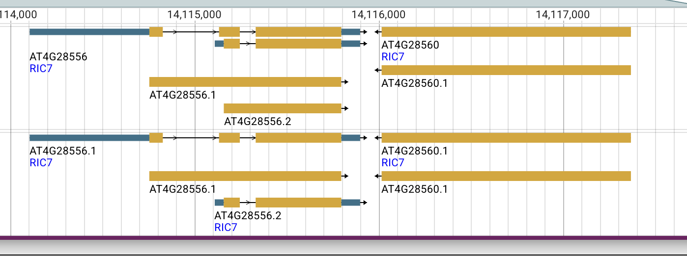

# Two Arabidopsis loci called RIC7: F4JLB7 / EXLRR12 and Q1G3K8

**Finding: F4JLB7 maps correctly to AT4G28560, a 450-residue LRR protein also named EXLRR12. It is a different protein from the 216-residue CRIB-domain RIC7, Q1G3K8, encoded by the adjacent, oppositely oriented locus AT4G28556. TAIR uses RIC7 for both loci and mixes their biological descriptions and literature associations. Consequently, a RIC7 name match cannot establish that a functional experiment concerns F4JLB7.** Published RIC7 primers from the original 2001 study and the later stomatal study match AT4G28556, strongly identifying the experimental target as the CRIB protein. The historical origin of the name collision, exact clone boundaries, and individual promoter-fragment assignments remain to be resolved. Sources: [TAIR AT4G28560](https://www.arabidopsis.org/locus?name=AT4G28560), [TAIR AT4G28556](https://www.arabidopsis.org/locus?name=AT4G28556), [UniProt F4JLB7](https://www.uniprot.org/uniprotkb/F4JLB7/entry), and [UniProt Q1G3K8](https://www.uniprot.org/uniprotkb/Q1G3K8/entry).

**The immediate GO-curation concern is probable wrong-gene attribution of three experimental annotations on F4JLB7:** protein binding (IPI), pollen tube growth (IMP), and apical plasma membrane (IDA), all assigned by TAIR from PMID:11752391. The published cloning primers identify AT4G28556/Q1G3K8, so those experiments should not serve as direct experimental evidence for the LRR protein. The same paper also supplies experimental annotations on Q1G3K8. This is potential conflation within the experimental GO evidence, not merely a shared gene symbol. [Annotation-level audit below](#experimental-go-annotations-probable-wrong-gene-attribution).

This distinction also matters for the ProtNLM evaluation: the kinase prediction must be judged against the deposited F4JLB7 sequence, while the primer evidence connects the ROP-effector experiments to AT4G28556/Q1G3K8. A Cornell dissertation independently identified the same domain/name conflict in 2021. A subsequent EXLRR study appears to perpetuate the functional conflation.

[Back to ProtNLM2 Evaluation](../PROTNLM_EVALUATION.md). Evidence examined on **7 September 2026**.

## The two records

| Feature | AT4G28560 / F4JLB7 | AT4G28556 / Q1G3K8 |
|---|---|---|
| TAIR symbols | RIC7 (primary), EXLRR12 | RIC7 (primary) |
| Protein length | 450 amino acids | 216 amino acids for the Q1G3K8 sequence |
| UniProt status | Unreviewed | Reviewed (Swiss-Prot) |
| Domain assignments | LRR: IPR001611, IPR032675 | CRIB: IPR000095, IPR036936 |
| Relevant sequence feature | Predicted signal peptide, residues 1–22 | Annotated CRIB domain, residues 36–49 |
| TAIR models | AT4G28560.1 | AT4G28556.1 and AT4G28556.2 |
| Chromosome 4 locus span, 1-based inclusive | 14,116,015–14,117,367, reverse strand | 14,114,104–14,115,897, forward strand |
| RefSeq protein | [NP_194585.1](https://www.ncbi.nlm.nih.gov/protein/NP_194585.1) | [NP_001031740.1](https://www.ncbi.nlm.nih.gov/protein/NP_001031740.1) |
| RefSeq transcript | [NM_118998.1](https://www.ncbi.nlm.nih.gov/nuccore/NM_118998.1) | [NM_001036663.2](https://www.ncbi.nlm.nih.gov/nuccore/NM_001036663.2) |
| NCBI Gene | [828974](https://www.ncbi.nlm.nih.gov/gene/828974) | [3770548](https://www.ncbi.nlm.nih.gov/gene/3770548) |

These are locus spans, not a claim that every transcript has the same boundaries. The domain and feature assignments are available in the [F4JLB7 UniProt flat file](https://rest.uniprot.org/uniprotkb/F4JLB7.txt) and [Q1G3K8 UniProt flat file](https://rest.uniprot.org/uniprotkb/Q1G3K8.txt). A database name or function description is less discriminating here than the underlying sequence and domain architecture.

## Experimental GO annotations: probable wrong-gene attribution

### Three experimental assertions on F4JLB7 need source-level reconciliation

A live QuickGO/GOA query on **7 September 2026** confirms the following annotations on **UniProtKB:F4JLB7**, all assigned by **TAIR** and citing [Wu et al. 2001, PMID:11752391](https://pubmed.ncbi.nlm.nih.gov/11752391/). These are existing experimental GO assertions, not ProtNLM predictions or annotations proposed by this project.

| GO annotation on F4JLB7 | Evidence | GOA annotation date | Why the experimental attribution is suspect |
|---|---|---|---|
| [GO:0005515 — protein binding](https://www.ebi.ac.uk/QuickGO/term/GO:0005515) | IPI | 2010-08-17 | The record supplies interaction partner `AGI_LocusCode:AT3G51300` in WITH/FROM. The paper assays RIC7–ROP binding, but its RIC7 cloning primers match AT4G28556. That interaction is not experimental evidence for binding by the LRR protein F4JLB7. |
| [GO:0009860 — pollen tube growth](https://www.ebi.ac.uk/QuickGO/term/GO:0009860) | IMP | 2003-08-04 | The RIC7 overexpression phenotype concerns reduced elongation in tobacco pollen tubes. The primer-defined Arabidopsis construct belongs to AT4G28556, so the phenotype should not be assigned to F4JLB7 through the shared RIC7 symbol. |
| [GO:0016324 — apical plasma membrane](https://www.ebi.ac.uk/QuickGO/term/GO:0016324) | IDA | 2003-08-04 | GFP-RIC7 imaging concerns the CRIB construct identified by the primers. A plausible membrane association of F4JLB7 cannot make this experiment evidence for the LRR protein's apical localization. |

The terms and definitions were checked against QuickGO. The concern is **which gene product was measured**, not the meaning of the terms. IPI, IMP and IDA describe the supporting experiment; they do not guarantee that its target accession was resolved correctly.

Sources: [live QuickGO query for both accessions](https://www.ebi.ac.uk/QuickGO/services/annotation/search?geneProductId=UniProtKB%3AF4JLB7%2CUniProtKB%3AQ1G3K8&limit=100), and the preserved [experimental GOA snapshot](RIC7-experimental-goa-2026-09-07.tsv), including annotation identifiers, providers, dates and WITH/FROM values. The live service may change; the table describes the dated snapshot.

### Experimental evidence is distributed across both accessions

The problem is not a simple pair of identical annotation sets. Different terms and evidence codes from the same RIC7 literature occur on the two proteins. The comparison below combines the nine-row experimental extract with the [full Q1G3K8 GOA file](https://github.com/ai4curation/ai-gene-review/blob/main/genes/ARATH/Q1G3K8/Q1G3K8-goa.tsv); its ND and IBA rows are present only in the full GOA file:

| Source / observation | On F4JLB7 in the experimental extract | On Q1G3K8 in the full GOA file |
|---|---|---|
| Wu 2001: ROP interaction | Protein binding, IPI, TAIR | No corresponding experimental binding row; the full GOA file contains an ND molecular-function root annotation. Our Q1G3K8 review proposes small GTPase binding as its replacement. |
| Wu 2001: pollen-tube phenotype | Pollen tube growth, IMP, TAIR | Pollen tube growth is present as **IBA**, a phylogenetic inference, not an experimental row from this paper. |
| Wu 2001: membrane localization | Apical plasma membrane, IDA, TAIR | Plasma membrane, **EXP**, UniProt, dated 2023-11-05. |
| Wu 2001: cytoplasmic localization | No corresponding experimental row | Cytoplasm, **EXP**, UniProt, dated 2023-11-05. |
| Jeon 2008: guard-cell localization and light response | No experimental rows from PMID:18178769 | Nucleus, plasma membrane and response to light stimulus, **IDA**, TAIR, dated 2008-02-25; cytoplasm, **EXP**, UniProt, dated 2023-11-05. |

Thus experimental evidence from PMID:11752391 has been attached to **both** accessions. The primer mapping supplies a concrete reason to question the F4JLB7 assignments while retaining the CRIB-protein interpretation. The 2008 paper also explicitly identifies AT4G28556, consistent with its GOA target. The new stomatal-regulation annotations in this project's Q1G3K8 review are proposals, separate from these pre-existing GOA rows.

The two F4JLB7 annotations dated 2003 predate TAIR's recorded addition of AT4G28556 in 2005. This is consistent with an older locus association surviving a gene-model correction. These are **annotation record dates**, not proof of when the UniProt cross-reference was created or a complete edit history. In particular, they do not establish that TAIR originally curated the experiments against the modern F4JLB7 sequence.

### Curation implication and limits

**Prioritize the three TAIR-derived F4JLB7 rows for removal or correction of their gene-product association at the source**, using the published primers and the two reference transcripts as evidence. Trace the source AGI-to-UniProt mapping: the error could reside in the locus annotation, the cross-reference used to export it, or both. On AT4G28556/Q1G3K8, reconcile binding, pollen-growth and localization evidence with the existing rows, preserving assay context and choosing appropriate specificity rather than blindly copying the F4JLB7 annotations.

This recommendation rests on target-specific sequence evidence, not an abstract mentioning another gene. The physical clone and exact N-terminal boundary remain incompletely reconstructed, but that does not make the LRR and CRIB loci equally plausible targets of the published primers.

Correcting an evidence assignment does **not** assert that F4JLB7 cannot bind proteins, occur at a membrane, or influence growth. Those functions require evidence tied to F4JLB7 itself. Broad membrane compatibility cannot rescue a misassigned apical-localization experiment. The membrane TAS annotations from the Borner studies, general signal-transduction IC assertion, and PAINT IBA annotations have different provenance and need their own assessments. Trace any downstream inference seeded by the suspect experimental rows; do not assume every F4JLB7 IBA descends from them.

The F4JLB7 YAML labels these three reviews **UNDECIDED** and cites the primer analysis and this report: **probable wrong-gene experimental attribution requiring source-level reconciliation**. The outstanding decision concerns correction of the curator/export mapping and reconstruction of the physical clone, rather than equally plausible primer targets. This is a curation recommendation, not a claim that TAIR or GOA has already been corrected.

## Genomic context: adjacent genes, not alternative isoforms

*Figure 1. JBrowse screenshot supplied by cjm, captured 7 September 2026 at 18:06 local time. The left locus, AT4G28556, has two displayed transcript models and rightward arrows. AT4G28560 is to its right, with leftward arrows. Both have the displayed symbol RIC7. The screenshot is reproduced without alteration; its crop does not include the browser URL or track legend. Source locus pages: [AT4G28556](https://www.arabidopsis.org/locus?name=AT4G28556) and [AT4G28560](https://www.arabidopsis.org/locus?name=AT4G28560).*

The genes have convergent transcriptional orientations: their 3′ ends face one another. The reported locus intervals leave 117 bases between them. This arrangement rules out interpreting the two accessions as alternative splice products of one annotated gene. Proximity may help explain a historical assignment problem, but does not establish how it occurred.

## Sequence checks

cjm reported that a protein sequence obtained from the AT4G28560 TAIR page gave a 100% BLAST match to F4JLB7. The checks below independently verify the mapping by direct sequence equality, rather than repeating that BLAST search.

| Comparison performed | Observed result |
|---|---|
| F4JLB7 versus RefSeq NP_194585.1 | Exact full-length equality, 450 residues |
| Translation of chromosome NC_003075.7, reverse-strand interval 14,116,015–14,117,367, versus F4JLB7 | Exact full-length equality, 450 residues |
| Q1G3K8 versus RefSeq NP_001031740.1 | Exact full-length equality, 216 residues |
| Annotated CDS translation of cDNA DQ487576 versus Q1G3K8 | Exact full-length equality, 216 residues |

For the genomic check, the 1,353-base reverse-strand sequence was retrieved in coding orientation and translated with the standard genetic code to the first stop codon. For the protein checks, the sequences were parsed from UniProt and GenBank records and compared directly, without trimming or alignment. For DQ487576, the comparison used the record's annotated CDS translation. These checks were run with Biopython and repeated when preparing this report.

The public inputs are the UniProt flat files linked above, the two RefSeq protein records, [DQ487576](https://www.ncbi.nlm.nih.gov/nuccore/DQ487576), and this [NCBI genomic interval retrieval](https://eutils.ncbi.nlm.nih.gov/entrez/eutils/efetch.fcgi?db=nuccore&id=NC_003075.7&seq_start=14116015&seq_stop=14117367&strand=2&rettype=fasta&retmode=text). DQ487576 encodes [ABF59238.1](https://www.ncbi.nlm.nih.gov/protein/ABF59238.1), providing a cDNA sequence corresponding to the CRIB protein. The cDNA identity alone does not establish experimental construct identity; the published primer mapping below supplies the connection. Inputs, code and machine-readable output are preserved in the [reproducible analysis](https://github.com/ai4curation/ai-gene-review/tree/main/genes/ARATH/Q1G3K8/Q1G3K8-bioinformatics).

## Published primers identify the experimental RIC7 locus

The RIC7 cloning primers in [Wu et al. (2001), Table 4](https://doi.org/10.1105/tpc.010218), and transcript-assay primers in [Hong et al. (2015/2016), RT-PCR methods](https://doi.org/10.1111/nph.13625), were mapped to both candidate RefSeq transcripts. The subsequent ABA/ROS study by [Zhu et al. (2021), PMID:33586611](https://doi.org/10.1080/15592324.2021.1876379) supplies a third pair, also included below. Forward primers were matched directly; reverse primers by reverse complement. The analysis allowed a 5′ cloning tail by finding the longest exact 3′ suffix of at least 14 bases.

| Primer | Exact match on AT4G28556 transcript NM_001036663.2 | AT4G28560 transcript NM_118998.1 |
|---|---|---|
| Wu RIC7 forward | 21 bases, positions 660–680; 7-base 5′ tail excluded | No match of at least 14 bases |
| Wu RIC7 reverse | All 23 bases, positions 1281–1303 | No match of at least 14 bases |
| Hong RIC7 forward | All 29 bases, positions 705–733 | No match of at least 14 bases |
| Hong RIC7 reverse | All 29 bases, positions 1256–1284 | No match of at least 14 bases |
| Zhu 2021 RIC7 forward | All 22 bases, positions 804–825 | No match of at least 14 bases |
| Zhu 2021 RIC7 reverse | All 22 bases, positions 917–938 | No match of at least 14 bases |

Positions are 1-based inclusive; reverse-primer coordinates describe their reverse-complement matches. All three pairs face inward and also match the Q1G3K8-encoding cDNA DQ487576. The [primer sequences with source DOIs](https://github.com/ai4curation/ai-gene-review/blob/main/genes/ARATH/Q1G3K8/Q1G3K8-bioinformatics/data/primers.tsv) and [computed results](https://github.com/ai4curation/ai-gene-review/blob/main/genes/ARATH/Q1G3K8/Q1G3K8-bioinformatics/results.json) make the comparison inspectable.

**This strongly assigns the tested RIC7 targets to AT4G28556.** The test distinguishes these two candidate loci; it is not a genome-wide primer-specificity analysis. The Wu forward primer maps near, rather than exactly at, the current CDS start, so locus identity does not prove that the fusion encoded precisely the present 216-residue canonical protein. Hong's transcript-assay primers do not reconstruct every promoter or expression construct. These limits are narrower than uncertainty about which of the two genes is the ROP effector.

## What the saved TAIR pages establish

The two TAIR pages were saved by cjm as MHTML on 7 September 2026, at approximately 18:24 local time. Their page content was extracted and compared. The following observations concern what those saved records display; the publication associations are not themselves verification of an experimental construct.

### An internally inconsistent description

The [AT4G28560 record](https://www.arabidopsis.org/locus?name=AT4G28560) describes a CRIB-containing protein that interacts with GTP-bound Rop1, says it is most similar to RIC6 and RIC8, and then calls it an extracellular LRR-containing protein. It lists RIC7 as the primary symbol and EXLRR12 as another symbol. Its displayed protein domains are LRR domains. By contrast, the [AT4G28556 record](https://www.arabidopsis.org/locus?name=AT4G28556) describes a downstream effector of active Rop2 and displays CRIB domain assignments.

The collision therefore exists in the underlying database descriptions, not only in the AI Gene Review presentation. Both NCBI Gene records also use RIC7, so a second database displaying the same symbol does not resolve the problem.

### Historical clues, with limits

| Event or publication | What the saved TAIR pages show |
|---|---|
| Wu et al., 2001, original RIC-family study | Associated with AT4G28560; absent from the displayed AT4G28556 publication list |
| 8 August 2005 | AT4G28556 update history explicitly records that the locus was added |
| Jeon et al., 2008, ROP2 and stomatal opening | Associated with AT4G28556 |
| Hong et al., online 2015 / issue 2016, ROP2–RIC7–Exo70B1 | Associated with **both** AT4G28556 and AT4G28560 |
| Dutta et al., online 2023 / issue 2024, extracellular LRR proteins | Associated with AT4G28560 |

This pattern is consistent with an older RIC7 locus assignment followed by an incomplete reassignment after the CRIB gene model was added. **That is a historical hypothesis, not a documented curation event.** AT4G28560 displays no update history. The pages' identical last-modified dates, 18 April 2026, do not reveal when individual names, descriptions, or literature links changed. The saved pages also do not expose a complete annotation audit trail or expanded community comments.

## Independent recognition in a Cornell dissertation

**Cammarata, Joseph Thomas (2021). _Regulation of Stem Cell Identity and Function in Moss_. PhD dissertation, Cornell University, May 2021, p. 176. DOI: [10.7298/kbfq-2m47](https://doi.org/10.7298/kbfq-2m47).** [Repository handle](https://hdl.handle.net/1813/109720); [PDF, jump to search for AT4G28560](https://ecommons.cornell.edu/bitstreams/f9afd5cb-4b10-48a5-a82c-5b1344e4a722/download#search=AT4G28560). Author, title, year, DOI, and handle were verified against the [DataCite metadata record](https://api.datacite.org/dois/10.7298/kbfq-2m47).

In the section discussing FEA3 and TMM, the dissertation reports:

> “we found that this gene encodes a protein predicted to contain 9 LRR domains and no CRIB domain”

The surrounding passage places AT4G28560 in a clade sister to FEA3, reports similarity-search hits to FEA3 relatives rather than RIC-family members, and notes that AT4G28556 is also annotated as RIC7. This independently identifies the same conflict between the AT4G28560 sequence and its RIC7/CRIB description. It does not establish identical functions between AT4G28560 and maize FEA3.

**Access limitation:** the quotation and surrounding passage were checked in the search-indexed text of PDF page 176. The complete PDF could not be retrieved during this investigation, so Supplemental Figure 2 and the underlying phylogenetic analysis were not inspected. The reported domain count and phylogenetic placement are attributed to the dissertation, not presented as newly reproduced results.

## The ambiguity reaches later literature

[Dutta et al., _Expression analysis of genes encoding extracellular leucine-rich repeat proteins in Arabidopsis thaliana_](https://doi.org/10.1093/bbb/zbad171) (online 2023; journal issue 2024; [PMID:38040489](https://pubmed.ncbi.nlm.nih.gov/38040489/)) identifies AtExLRR proteins using signal-peptide and LRR features, excluding a transmembrane domain downstream of the LRR region. This provides a relevant sequence-based framework for EXLRR12, but is not an experimental demonstration of its protein localization.

The article also treats AtExLRR12 as the stomatal regulator RIC7, citing Hong et al. It explicitly excludes AtExLRR12 from its promoter experiments because RIC7 promoter experiments were already reported. Thus the name/function association influences which experiment the authors perform. The full-text sections “Phylogenetic analysis of AtExLRRs” and “Promoter: GUS analysis of AtExLRRs” document this directly.

This is evidence that the association propagated into later reasoning. The coding/transcript primer evidence points to AT4G28556, but the earlier promoter fragment still requires its own boundary check; the citation alone cannot transfer promoter evidence to AT4G28560. The paper's extracellular-protein classification also cautions against automatically treating EXLRR12 as a conventional transmembrane receptor. Membrane attachment and receptor activity require their own evidence.

## Consequences for the prediction review

The [focused OpenScientist investigation](https://github.com/ai4curation/ai-gene-review/blob/main/genes/ARATH/F4JLB7/F4JLB7-hypotheses/prediction-kinase-activity/openscientist.md) integrates domain assignments, catalytic-motif checks, and structural interpretation to argue that F4JLB7 lacks a kinase domain. That analysis carries substantial weight for judging the prediction. Its explanation of the exact historical mechanism of name carry-over remains a hypothesis, separate from the sequence evidence.

The two questions should be evaluated separately:

- **Does F4JLB7 have kinase activity?** Its LRR architecture and the focused sequence/structure investigation contradict the kinase interpretation. Neither a CRIB-family name nor similarity restricted to the LRR portion of a multidomain kinase supplies a missing catalytic domain. The current ProtNLM assessment is NPI for kinase activity.
- **Does F4JLB7 participate in phosphorylation or ROP-dependent signaling?** A protein can participate in a process without catalyzing its defining reaction, but positive evidence is needed for this particular protein. The current phosphorylation prediction remains UNC. Experiments described under RIC7 cannot be transferred solely by symbol.

The identity evidence supports challenging the three specific experimental evidence assignments to F4JLB7 listed above. It does not challenge the validity of the experiments on the CRIB protein or establish that all other annotations on either accession are wrong.

## Remaining questions and decisive checks

1. **Reconcile the three experimental GO assignments.** Trace the TAIR locus records and AGI-to-UniProt export mapping for the IPI, IMP and IDA rows on F4JLB7 from PMID:11752391. Correct the gene-product association and reconcile corresponding Q1G3K8 annotations, retaining the original assay context.
2. **Resolve remaining construct boundaries.** The Wu and Hong primer pairs identify AT4G28556. Recover complete clone sequences and promoter/insertion details from Wu et al. (2001), Jeon et al. (2008), and Hong et al. (2015/2016) to establish exact N-terminal boundaries, promoter fragments and mutant insertions. A transcript result does not automatically settle promoter or insertion identity.
3. **Trace the database history.** Examine archived gene models and symbol/annotation transactions around the addition of AT4G28556 in 2005. Determine which assignments were moved, duplicated, or retained. Current cross-references alone cannot reconstruct those events.
4. **Establish EXLRR12 biology on its own evidence.** Examine protein-localization, membrane-anchor, and receptor-function evidence tied specifically to AT4G28560/F4JLB7. LRR architecture and a signal peptide support an extracellular interpretation but do not establish a ligand or signaling mechanism.
5. **Review downstream transfers individually.** Use accession and construct mapping to assess each annotation or literature claim, retaining uncertainty where the actual experimental target cannot yet be verified.

For discussion and reporting, **AT4G28560 / F4JLB7 / EXLRR12** and **AT4G28556 / Q1G3K8 / CRIB-domain RIC7** distinguish the objects without silently changing official primary symbols.

## Primary literature to trace

- Wu G, Gu Y, Li S, Yang Z (2001). _A genome-wide analysis of Arabidopsis Rop-interactive CRIB motif-containing proteins that act as Rop GTPase targets._ **The Plant Cell** 13:2841–2856. [DOI:10.1105/tpc.010218](https://doi.org/10.1105/tpc.010218); [PMID:11752391](https://pubmed.ncbi.nlm.nih.gov/11752391/). The local publication cache is abstract-only; indexed full-text Table 4 supplies the primers mapped above, while complete physical construct sequences remain unverified.
- Jeon BW et al. (2008). _The Arabidopsis small G protein ROP2 is activated by light in guard cells and inhibits light-induced stomatal opening._ **The Plant Cell** 20:75–87. [DOI:10.1105/tpc.107.054544](https://doi.org/10.1105/tpc.107.054544); [PMID:18178769](https://pubmed.ncbi.nlm.nih.gov/18178769/).
- Hong D, Jeon BW, Kim SY, Hwang JU, Lee Y (2016; first published 9 October 2015). _The ROP2–RIC7 pathway negatively regulates light-induced stomatal opening by inhibiting exocyst subunit Exo70B1 in Arabidopsis._ **New Phytologist** 209:624–635. [DOI:10.1111/nph.13625](https://doi.org/10.1111/nph.13625); [PMID:26451971](https://pubmed.ncbi.nlm.nih.gov/26451971/).

The Cornell dissertation and Dutta et al. article are cited in their respective sections above. The saved TAIR pages and original JBrowse screenshot were supplied by cjm; the screenshot is included as Figure 1. The MHTML browser archives are not redistributed with this report.
