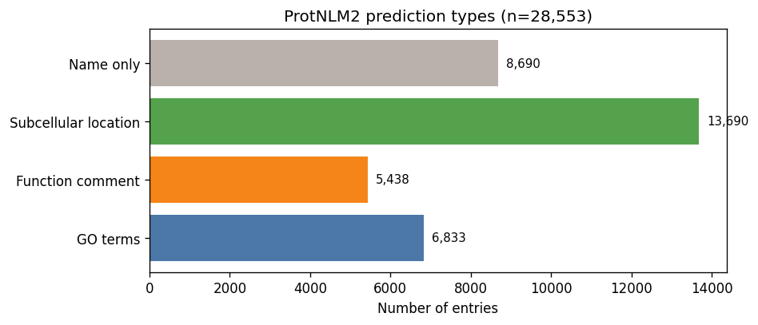
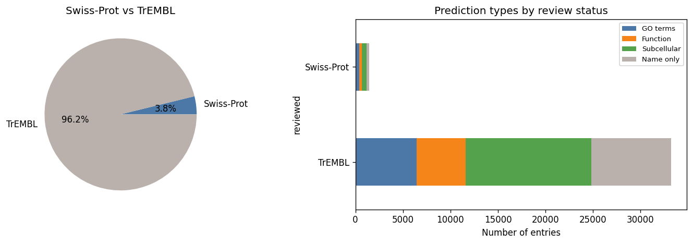
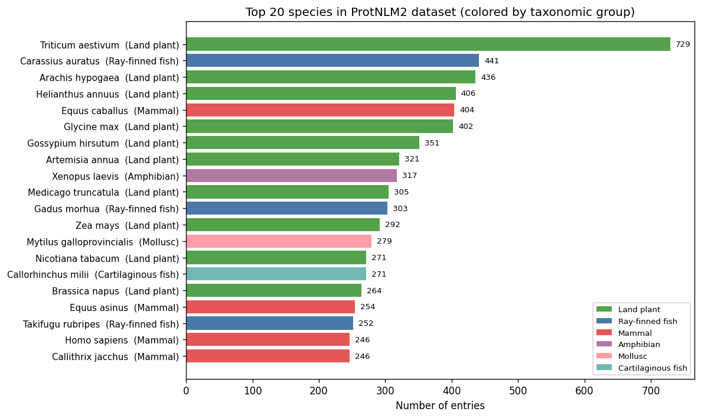
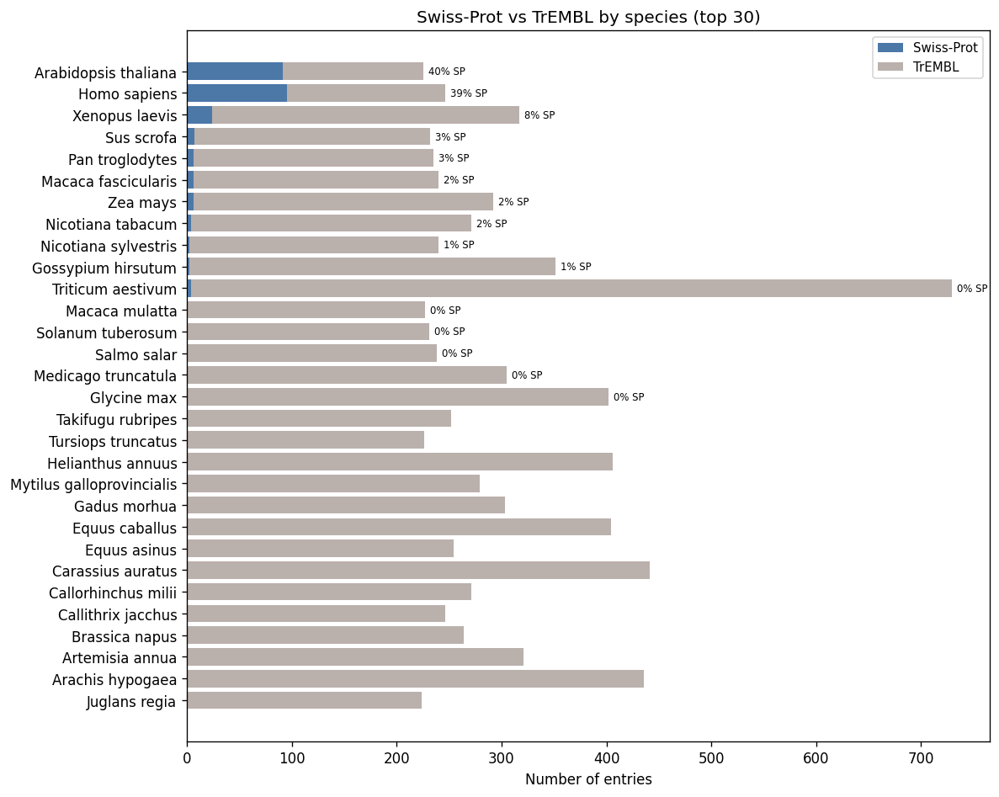
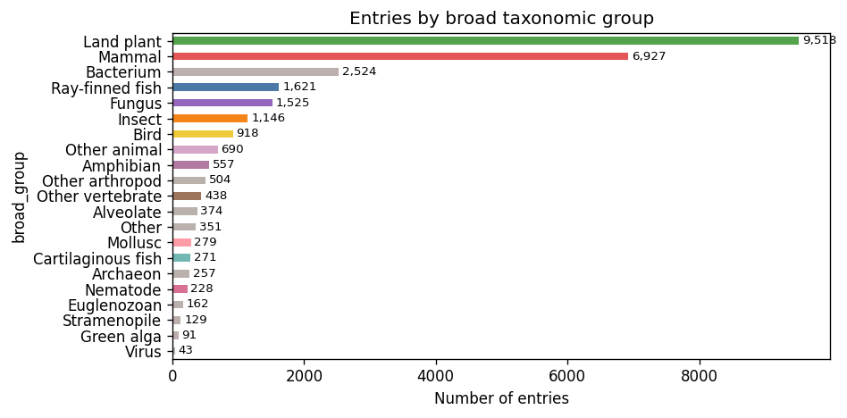
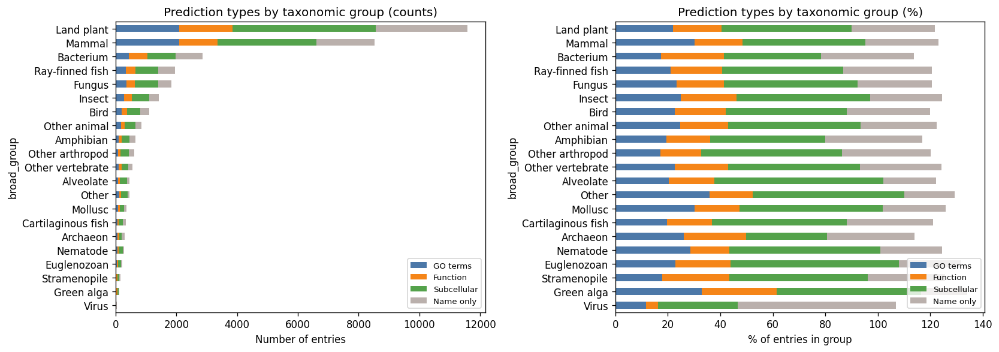
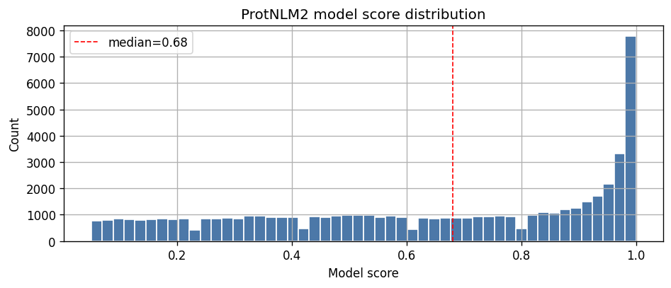
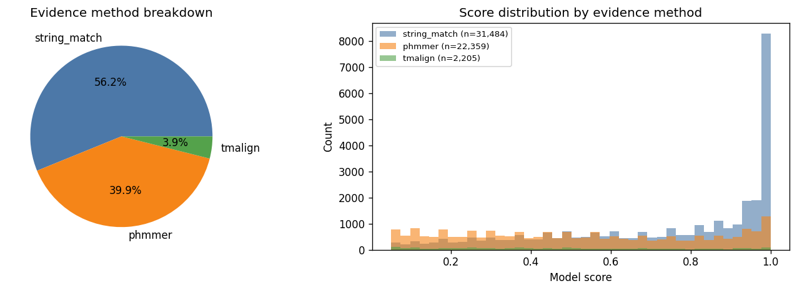
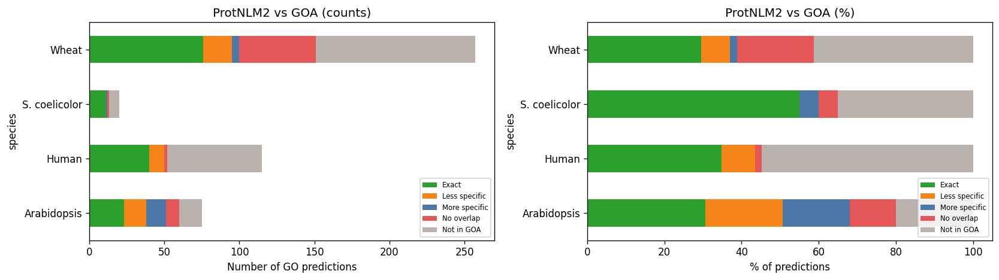
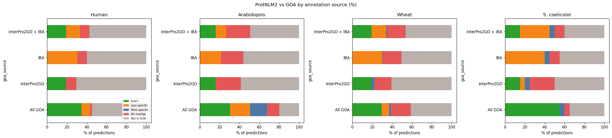

# Evaluating ProtNLM2 Predictions Against Curated GO Annotations

**Analysis of 28,553 proteins across 440 species (pre-release dataset)**

Using ontology closure-based comparison against GOA

---

## What is ProtNLM2?

Google's protein language model that predicts protein names, GO terms, subcellular locations, and function comments.

28,553 entries. Every protein gets a name; ~24% also get GO terms, ~48% get subcellular locations, ~19% get function comments. 30% get only a name.

---

## ProtNLM2 architecture ([UniProt docs](https://www.uniprot.org/help/ProtNLM))

**T5 seq2seq model** trained on 240M proteins (UniProt 2023_04, Swiss-Prot + TrEMBL). Inputs: amino acid sequence, organism TaxID, AlphaFold secondary structure. Ensemble of multiple models.

**Post-processing: the Evidencer** --- a corroboration pipeline (not part of the model):
1. **Exclusion filter**: GO taxon constraints, nomenclature violations, malformed IDs → rejected
2. **String match** (56%): predicted text matches existing annotations or cross-referenced DBs (InterPro, GO, EC)
3. **phmmer** (40%): sequence similarity to proteins with matching annotations (bit score > 25)
4. **TM-align** (4%): structural similarity via AlphaFold models (TM-score > 0.5)

**Key insight:** `model_score` is the LM's own confidence (threshold: 0.05), independent of evidence strength (r = −0.01 with phmmer score).

**Dataset note:** our XML (28,553 entries) is a pre-release; the [public pilot](https://ftp.ebi.ac.uk/pub/contrib/UniProt/ProtNLM2/List_of_UniProt_accessions_that_have_ProtNLM2_annotations.tsv) has 26,856 (1,697 removed by quality filtering).

---

## Dataset composition

96% TrEMBL, 4% Swiss-Prot. But Swiss-Prot does not mean well-characterized.

Species distribution is unusual --- dominated by agricultural species (wheat, peanut, horse) rather than model organisms. Likely reflects popular TrEMBL submissions.

---

## Swiss-Prot fraction varies dramatically by species

---

## Taxonomic composition and prediction richness

Land plants dominate by entry count. Prediction richness (% with GO terms) varies across groups.

---

## Model scores and evidence methods

Right-skewed scores with spike near 1.0. String match is the dominant evidence type (56%), phmmer 40%, tmalign 4%.

---

## Evaluation approach: closure-based comparison

Compare ProtNLM2 GO predictions against curated GOA using **`isa_partof_closure`** in DuckDB.

| Category | Definition |
|---|---|
| **EXACT** | Same GO term exists in GOA for this protein |
| **LESS_SPECIFIC** | Predicted term is a strict ancestor of a GOA term (redundant) |
| **MORE_SPECIFIC** | Predicted term is a strict descendant (potentially novel) |
| **NO_OVERLAP** | Different ontology branch --- novel or incorrect |
| **NOT_IN_GCRP** | Protein not in Gene Centric Reference Proteome --- cannot evaluate |

Seven species: **Human**, **Mouse**, **Arabidopsis**, **Wheat**, **S. coelicolor**, **X. laevis**, **X. tropicalis**

---

## Cross-species comparison: ProtNLM2 vs all GOA

LESS_SPECIFIC dominates for all species. MORE_SPECIFIC and NO_OVERLAP are concentrated in plants (thinner GOA coverage).

---

## ProtNLM2 vs automated pipelines (InterPro2GO, IBA)

Compared to InterPro2GO or IBA alone, more predictions appear as MORE_SPECIFIC or NO_OVERLAP. But are these genuine gains?

---

## Systematic review: 6 patterns explain all "novel" predictions

Every MORE_SPECIFIC and NO_OVERLAP prediction falls into one of these:

| Pattern | ~Count | Genuinely novel? |
|---|---|---|
| **Trivial deepening** (zinc > metal, DNA > nucleic acid) | ~20 | No --- simple rules |
| **Phmmer transfer** (copy from top hit) | ~15 | Maybe --- depends on orthology |
| **Cross-aspect gap** (MF kinase vs BP phosphorylation) | ~15 | No --- evaluation artifact |
| **Uninformative CC** (cytoplasm, membrane) | ~5 | No |
| **Cross-kingdom error** (neuron terms on a plant) | 1 (6 preds) | No --- actively wrong |
| **Multidomain false positive** (LRR hit to LRRK2 kinase) | ~2 | No --- wrong domain |

---

## Case study 1: Trivially correct (A0A3B6GK97, wheat)

ProtNLM2 predicts `lipid catabolic process` > GOA's `lipid metabolic process`

Protein has IBA: **glycerophospholipase activity** + **monoacylglycerol lipase activity**. Lipases are catabolic enzymes by definition.

**Guilt-by-association in wheat GOA:**
- 89 proteins with glycerophospholipase + lipid metabolic process
- **84 (94%)** also have lipid catabolic process
- Simple rule: lipase activity -> add lipid catabolic process

ProtNLM2 is doing bookkeeping, not discovering biology.

---

## Case study 2: Phmmer transfer (A0A3B6RKV1, wheat JmjC)

ProtNLM2 predicts 5 specific plant biology terms (gibberellin signaling, photomorphogenesis, seed germination, epigenetic regulation, red light response).

**All 5 trace to one phmmer hit:** Q67XX3 = *Arabidopsis* **JMJ22** (score 689.2)

JMJ22 has all 5 terms with experimental evidence (IMP, IGI, IDA, IEP). ProtNLM2 simply copies the top hit's annotations.

This is ISS/ISO-style annotation transfer. The "added value" over IBA is that ProtNLM2 transfers BP annotations that PAINT's more conservative approach chose not to propagate.

---

## Case study 3: False positive (F4JLB7, Arabidopsis RIC7)

ProtNLM2 predicts `kinase activity` + `phosphorylation` (score 0.23)

- phmmer hit: **LRRK2** (mouse), score **33** --- barely above noise
- LRRK2 is a 2,527 aa multidomain protein: LRR + ROC + COR + **kinase**
- RIC7 (F4JLB7) only has LRR repeats --- a ROP GTPase effector, **not a kinase**
- ProtNLM2 also matched the wrong PANTHER family

**Classic multi-domain problem:** annotation leaks from one domain of a multidomain hit to a protein that only shares a different domain. Score is low (0.23) but prediction is still reported.

---

## Case study 4: Cross-kingdom error (F6LAX4, wheat TOG)

phmmer hit: A0A7S3G569 (*Palpitomonas bilix*, a protist), score 420

ProtNLM2 predicts for a **wheat** protein:
- `neuron projection` --- **plants do not have neurons**
- `neuronal cell body` --- **plants do not have neurons**
- `protein antigen binding` --- adaptive immunity, not applicable to plants

TOG domains are conserved (tubulin binding), but the protist hit carries animal neuron annotations. No organism-awareness filter in the pipeline.

---

## Case study 5: Ontology gaps (Q9KZ33, S. coelicolor)

IBA: `sigma factor activity`. ProtNLM2: `transcription initiation`.

Biologically tightly coupled but classified as NO_OVERLAP because:
- sigma factor activity -> `regulation of transcription initiation` (MF ancestry)
- transcription initiation -> `DNA-templated transcription` (BP ancestry)
- No is_a/part_of path between "regulation of X" and "X"

This is a real limitation of closure-based evaluation --- not a ProtNLM2 insight.

---

## Summary of findings

1. **Mostly recapitulates existing annotations** --- EXACT + LESS_SPECIFIC dominate

2. **MORE_SPECIFIC predictions are often trivially derivable** from GBA, curatorial rules, or logical axioms

3. **Phmmer transfer** is the main mechanism --- same as ISS/ISO, just more aggressive than PAINT/IBA

4. **Real errors exist:** cross-kingdom transfer (neuron-in-wheat) and multidomain false positives (LRR-to-kinase)

5. **NO_OVERLAP is inflated** by cross-aspect ontology gaps and uninformative CC predictions

6. **model_score provides some calibration** (false positives tend to score low) but wrong predictions still get reported

*Note: semantic similarity metrics (Resnik, Lin) as used in CAFA are not a good alternative --- they reward predictions that are ontologically close but biologically opposite (e.g. positive vs negative regulation).*

---

## Next steps

- Expand to more species (currently 4 of 440)
- **Systematic GBA analysis:** for all MORE_SPECIFIC predictions, compute co-annotation rate to distinguish trivially derivable from genuinely novel
- Consider broader relationship types (`enables`, `regulates`) for cross-aspect evaluation
- Compare against **experimental evidence codes** specifically (IDA, IMP, IGI)
- Cross-reference with **AIGR expert reviews** for the 8 overlapping proteins

---

<!-- _class: lead -->

# Questions?

**Notebook:** `projects/PROTNLM_EVALUATION/protnlm_summary.ipynb`
**Data:** 28,553 entries parsed from ProtNLM2 XML export
**Tools:** DuckDB + GO ontology closures for hierarchical comparison
