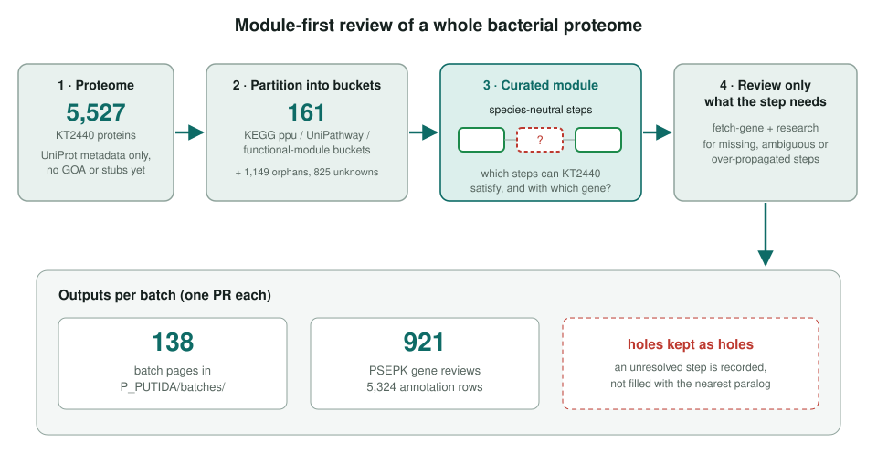
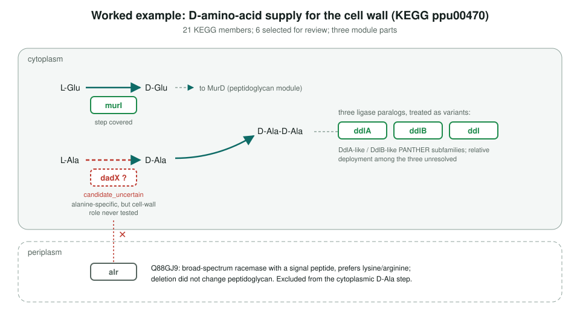
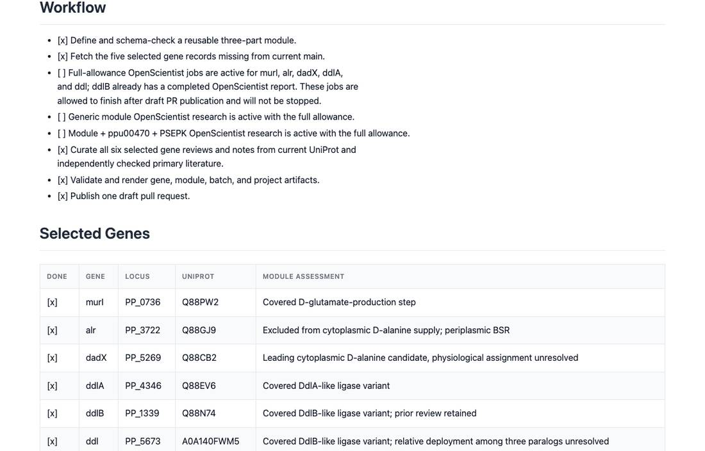
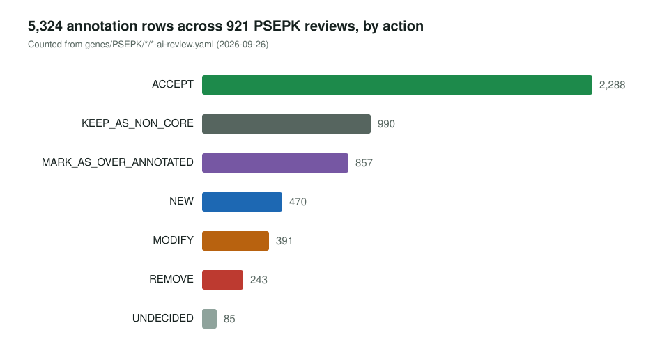

<!-- _class: lead -->

# *Pseudomonas putida* KT2440

Module-first GO review of a whole bacterial proteome

AI Gene Review · projects/P_PUTIDA · 2026

---

<!-- _class: bluf -->

## Bottom line

- KT2440 is a versatile soil bacterium whose GO annotation is **almost entirely automated**.
- Since July 2026 we review it **pathway by pathway**: start from a curated module, ask which steps KT2440 can satisfy, review only the genes each step needs.
- September 2026 snapshot: **921 PSEPK reviews** (5,324 rows) and **138 batch pages**, still growing; unresolved steps are kept as **explicit holes**.

---

## Why a module-first pass

- 5,527 proteins; only ~50 GO annotations cite a paper.
- Gene-by-gene review does not scale to a genome, and treats every gene as equally uncertain.
- A module says **what the organism must do**; review effort goes to steps that are **missing, ambiguous or over-propagated**.
- Early phase: 18 selected genes, then batches of 50 and 16 (TCA, stress, DNA repair, aromatic amino acids).

---

## The workflow

---

## A hole kept as a hole

---

## What a batch page records

projects/P_PUTIDA/batches/ppu00470_d_amino_acid_cell_wall_precursor_supply.md: selected genes and their module assessment.

---

## Results so far

857 rows marked over-annotated, 243 removed, 85 left undecided.

---

## Status and next steps

- ✅ Whole-proteome metadata, gene list, 161-bucket partition, pathway worklist.
- ✅ 138 pathway batches, from the ppu00400 tryptophan pilot (PR #1874) to the most recent, purine-base oxidation (PR #2643).
- ⬜ The status columns in `data/psepk_pathway_worklist.tsv` and the "Completed Reviews" tables predate most of this work.
- ⬜ 777 of 921 reviews are still `status: DRAFT`. The 1,149 orphan and 825 unknown-function genes have no pathway module to seed them.

**Read more:** `projects/P_PUTIDA.md` · `projects/P_PUTIDA/P_PUTIDA_MODULE_PLAN.md` · `projects/P_PUTIDA/batches/`
