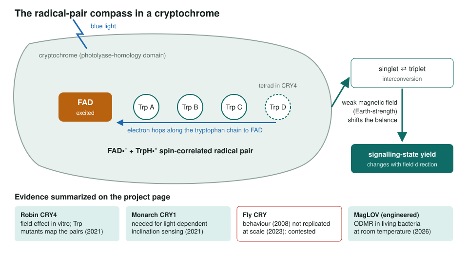
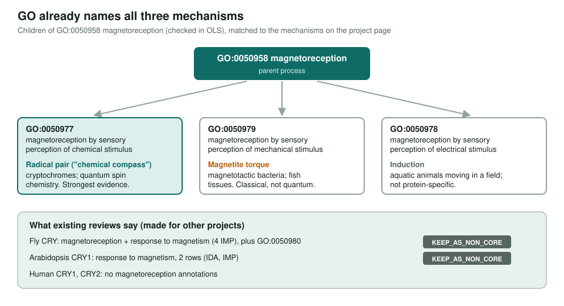

<!-- _class: lead -->

# Quantum sensing proteins

Scoping cryptochromes and engineered flavoproteins as magnetic sensors

AI Gene Review · projects/QUANTUM_SENSING · scoping · 2026

---

<!-- _class: bluf -->

## Bottom line

- The best-supported quantum sensor is the **radical-pair compass** in cryptochromes: light-made spin pairs whose chemistry feels weak magnetic fields.
- From one deep-research report we shortlisted **5 proteins** (robin CRY4, monarch CRY1, human CRY2, fly CRY, MagLOV) and **5 chassis**, and flagged contested areas.
- **Scoped, not started** as a native-robin / monarch / MagLOV review set; existing fly and Arabidopsis CRY reviews keep magnetoreception as **non-core**.

---

## How the compass is thought to work

---

## Mechanisms and their GO terms

---

## Open scoping questions

- Biological sensor (behaviour, cell signalling) or an in vitro spin-chemistry module?
- Geomagnetic-field sensing only, or broader coherence and tunnelling effects?
- Which chassis: purified protein, yeast or mammalian cells, insect cells, plants, or magnetotactic bacteria?
- Treat fly behaviour and vibrational olfaction as **contested**; photosynthetic coherence is energy transfer, not sensing.

---

## Status and next steps

- ✅ Deep-research synthesis, candidate shortlist, chassis options (Jan 2026).
- ⬜ Triage pipeline described on the page is **not in the repo** (`projects/quantum-sensing-bioinformatics/`).
- ⬜ Triage robin CRY4 and monarch CRY1 accessions; decide whether engineered MagLOV constructs belong in a gene-review project.
- ⬜ Reassess fly and plant CRY magnetoreception rows before treating them as more than contested, non-core outputs.
- Side note in the folder: `LIGHT_SOURCE_OPEN_DATASETS.md` (open X-ray datasets), unrelated to the review.

**Read more:** `projects/QUANTUM_SENSING.md`
