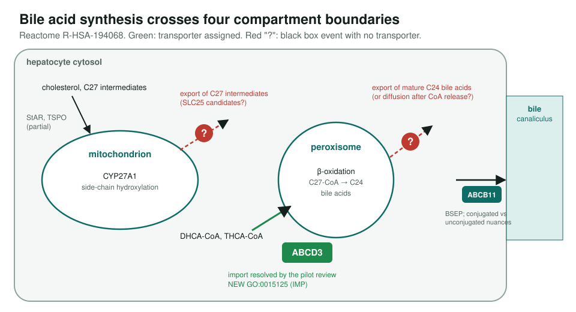
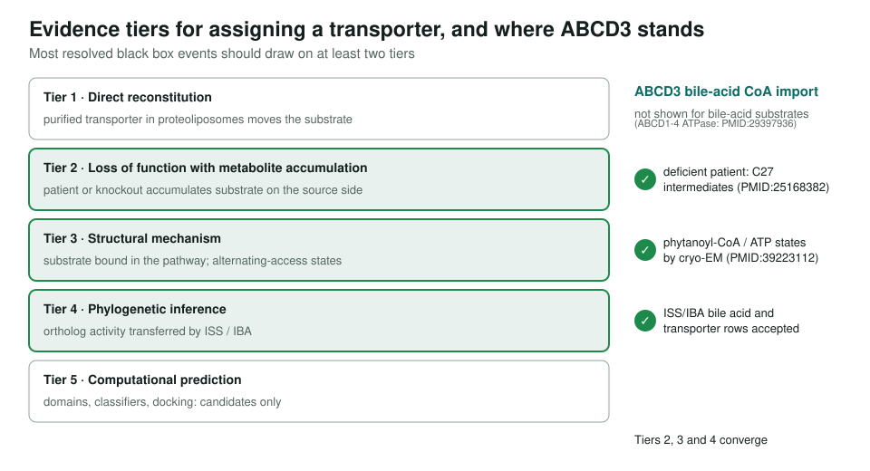

<!-- _class: lead -->

# Reactome black box events

Can gene reviews name the missing transporters in pathway reactions?

AI Gene Review · projects/REACTOME_GAP_FILLING · 2026 · scoping, one pilot

---

<!-- _class: bluf -->

## Bottom line

- Reactome **black box events** are reactions that must happen but have **no assigned catalyst or transporter**, often at an organelle membrane.
- **Pilot done: ABCD3** (81 annotations reviewed) gets a **NEW bile acid transmembrane transporter** term for peroxisomal import of C27 bile-acid CoA esters.
- **Scoped, not started** beyond that: no systematic black-box query yet; the other bile acid gaps have no candidate reviewed.

---

## The pilot pathway

---

## How ABCD3 was resolved

---

## Workflow and expansion targets

1. **Identify** black box events in a Reactome pathway; sort by reaction type and membrane.
2. **Candidates** from GO, expression, domain architecture, deep research.
3. **Converge** with a full gene review: activity, loss of function, structure, localization.
4. **Tier** the result and report to Reactome curators.

Next areas: mitochondrial SLC25 carriers, cholesterol and sphingolipid trafficking, other ABC families, peroxisomal SLCs.

---

## Status

- One gene review (`genes/human/ABCD3/`), proposing NEW `GO:0015125` (IMP).
- Reactome R-HSA-382575 lists ABCD3 for LCFA transport but not for bile-acid CoA esters: an update to propose.
- Collaboration with Reactome curators (P. D'Eustachio, L. Matthews).

**Read more:** `projects/REACTOME_GAP_FILLING.md` · `genes/human/ABCD3/ABCD3-ai-review.yaml`
