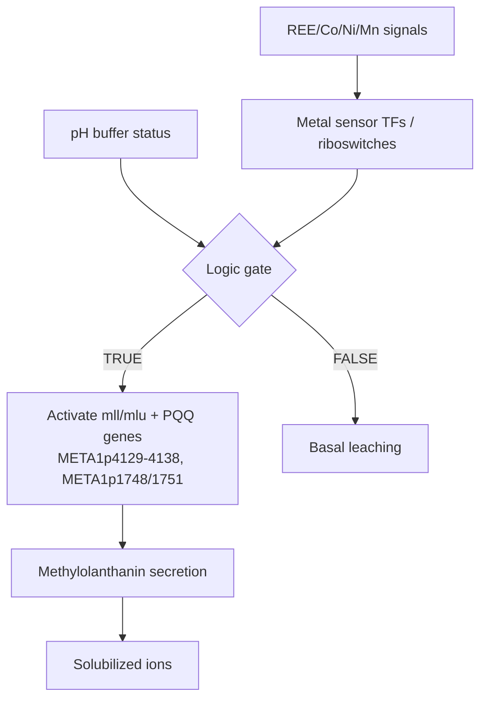
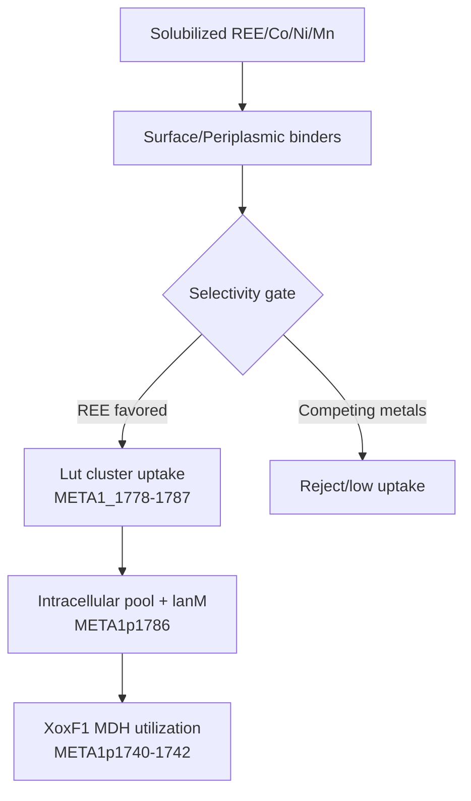

# Rare Earth Element (REE) Extraction Pathways (Biological Systems)

Concepts for engineered pathways to sense, mobilize, capture, concentrate, and release rare earth elements (REEs) and associated strategic metals (Co, Ni, Mn) using microbial or plant chassis.

## Scope

Targeted metal classes:
- REEs: La, Ce, Pr, Nd, Sm, Eu, Gd, Tb, Dy, Ho, Er, Tm, Yb, Lu, Y
- Strategic co-occurring metals: Co, Ni, Mn, Cu, Zn, Fe

System goals:
1. Detect metal ions in complex matrices
2. Mobilize metals via leaching (acidolysis, redoxolysis)
3. Bind and sequester selectively
4. Concentrate intracellularly
5. Trigger controlled export into recovery solution

## Candidate Chassis (Starting Points)

- Acidithiobacillus ferrooxidans (acidophilic Fe(II) oxidation; rus operon)
- Methylorubrum extorquens AM1 and Methylobacterium aquaticum 22A (lanthanide-utilizing methylotrophs; lanM/lut/xoxF)
- Cupriavidus/Ralstonia sp. CH34 (cnr/czc metal resistance systems)
- Pseudomonas chlororaphis (phenazine redox shuttles)

## Chassis Focus: Methylorubrum extorquens AM1 (METEA)

Mapping below uses locus tags from the METEA gene set. Locus tag format: `MexAM1_META1p####`.
See METEA-specific notes: [projects/METEA_MLL_CLUSTER.md](projects/METEA_MLL_CLUSTER.md).

## High-Level Pipeline (Conceptual)

```
[Insoluble minerals/adsorbents]
          |
          |  (biosensor-triggered leaching)
          v
   [Solubilized metal ions]
          |
          |  (selective binding + uptake)
          v
   [Intracellular sequestration]
          |
          |  (storage/concentration)
          v
   [Inducible export/release]
          |
          v
   [Recovery solution: high-purity metal fractions]
```

## Module 1: Adaptive Biosensors + Leaching Control

Objective: Sense target metal ions and induce production of leaching agents to solubilize metals through acidolysis and redoxolysis.

Design elements:
- Metal-responsive transcription factors (TFs) or riboswitches
- Synthetic promoters tuned for specific metal thresholds
- Logic-gated control (AND/OR) for multi-metal profiles
- Feedback dampening to prevent over-acidification

Leaching agent classes:
- Organic acids: gluconate, citrate, oxalate, malate
- Siderophore-like chelators (metal-agnostic mobilization)
- Redox shuttles: quinones, flavins, phenazines
- Proton extrusion systems (acidolysis)

Example control logic:
```
IF (REE_high OR Co_high) AND (pH_buffer_ok) THEN
  upregulate acidolysis + redoxolysis modules
ELSE
  maintain basal leaching
```

Control logic (diagram):


Candidate chassis:
- Acidithiobacillus ferrooxidans (Fe(II) oxidation-driven acidophilic leaching)
- Pseudomonas chlororaphis (phenazine redox shuttles)

Gene system candidates (examples to validate in chassis):
- Metal-responsive regulators: NikR (nickel sensor), MntR (manganese sensor), CnrX/CnrY/CnrH (Co/Ni sensing module)
- Acidolysis via PQQ-dependent gluconate: gcd + pqqABCDE/pqqFG
- Redox shuttles: phenazine biosynthesis operon phzA/B/C/D/E/F/G
- Fe(II) oxidation module for bioleaching: rus operon (cyc2, cyc1, coxBACD, rus)

M. extorquens AM1 locus map (lanthanophore-driven mobilization):
- METEA pathway context: [projects/METEA_MLL_CLUSTER.md](projects/METEA_MLL_CLUSTER.md).
- mluA: MexAM1_META1p4129 (mll/lut regulatory/auxiliary system)
- mluR: MexAM1_META1p4130 (regulatory; mll/lanthanide response)
- mluI: MexAM1_META1p4131 (auxiliary; mll cluster)
- mllA: MexAM1_META1p4132 (methylolanthanin biosynthesis, NIS synthetase)
- mllBC: MexAM1_META1p4133
- mllDE: MexAM1_META1p4134
- mllF: MexAM1_META1p4135
- mllG: MexAM1_META1p4136
- mllH: MexAM1_META1p4137
- mllJ: MexAM1_META1p4138
- pqqA/pqqD: MexAM1_META1p1751 (PQQ cofactor biosynthesis; optional coupling to acidolysis)
- pqqE: MexAM1_META1p1748 (PQQ cofactor biosynthesis)

## Module 2: Selective Binding + Uptake

Objective: Capture solubilized metals with high selectivity and transfer them into the cell.

Key components:
- Metal-binding proteins with tuned affinity (REE-selective EF-hand variants)
- Metallophores/metallochaperones engineered for REE preference
- Periplasmic binding proteins (Gram-negative) or surface display binders
- Import systems: ABC transporters, TonB-dependent receptors, NRAMP-like transporters

Selectivity strategies:
- Multi-site chelation with geometry matched to REE ionic radius
- Competitive exclusion of Fe/Cu/Zn using engineered binding pockets
- pH-gated binding to favor REE at mildly acidic conditions

Control logic (diagram):


Candidate chassis:
- Methylorubrum extorquens AM1 and Methylobacterium aquaticum 22A (lanthanide utilization and transport)

Gene system candidates (examples to validate in chassis):
- Lanthanide-binding protein: lanM (lanmodulin)
- Lanthanide uptake cluster: lutH (TonB receptor) and lut cluster genes (META1_1778 to META1_1787; includes lanM and lutD)
- Lanthanide-dependent MDH module: xoxF + xoxG + xoxJ
- Nickel uptake: nikABCDE (ABC transporter) with NikR control
- Manganese uptake: mntH (NRAMP-family importer)

M. extorquens AM1 locus map (lanthanide uptake):
- METEA pathway context: [projects/METEA_MLL_CLUSTER.md](projects/METEA_MLL_CLUSTER.md).
- lut cluster: META1_1778 to META1_1787 (lanthanide utilization/transport region)
- lanM: MexAM1_META1p1786 (lanmodulin; REE-binding protein within lut region)
- xoxF1: MexAM1_META1p1740 (lanthanide-dependent MDH)
- xoxG: MexAM1_META1p1741 (c-type cytochrome partner)
- xoxJ: MexAM1_META1p1742 (periplasmic accessory protein)

## Module 3: Intracellular Sequestration + Concentration

Objective: Store metals safely and concentrate to useful levels.

Storage strategies:
- Metallothionein-like proteins or designed metal cages
- Polyphosphate granules (nucleation for REE complexation)
- Engineered protein nanocages with metal-binding interiors
- Compartmentalization (bacterial microcompartments or eukaryotic organelles)

Potential readouts:
- Fluorescent REE reporters for in vivo quantification
- Growth-linked selection to enrich high-accumulating strains

Control logic (diagram):
```mermaid
flowchart TD
  A[Intracellular REE] --> B[Sequestration modules]
  B --> C[PolyP/lanthasome-like storage<br/>(METEA loci TBD)]
  C --> D[Storage granules]
  D --> E[Concentration readout]
```

Candidate chassis:
- Cyanobacterial metallothionein systems (SmtA as a transferable sequestration module)
- Pseudomonas and Cupriavidus backgrounds with high metal tolerance

Gene system candidates (examples to validate in chassis):
- Metallothionein: smtA (high-affinity metal-binding protein)
- Polyphosphate granule biogenesis: ppk1/ppk2 (polyphosphate kinases)

M. extorquens AM1 locus map (storage):
- Storage phenotype reported (lanthasome-like polyphosphate granules), but specific storage loci are not yet mapped in METEA files.
- Use this module to prioritize discovery of ppk-like and metal granule genes in METEA.

## Module 4: Inducible Export + Recovery

Objective: Release concentrated metals into recovery solutions after biomass harvest.

Trigger options:
- Inducible efflux transporters (REE-export pumps)
- Controlled lysis (chemical, thermal, or genetic kill-switch)
- pH or chelator-triggered release
- Light-activated export systems (optogenetic control)

Purity strategies:
- Sequential induction for metal-specific export
- Chelator exchange for fractionated recovery
- Time-gated release to separate REE from Co/Ni/Mn

Example timing sequence:
```
T0: Harvest biomass
T1: Induce REE export (selective efflux)
T2: Wash + collect REE fraction
T3: Induce Co/Ni/Mn export (secondary fraction)
```

Control logic (diagram):
```mermaid
flowchart TD
  A[Post-harvest trigger] --> B{Release mode}
  B -->|Efflux| C[Export pumps (METEA loci TBD)]
  B -->|Lysis| D[Controlled lysis]
  B -->|Chelator| E[Exchange release]
  C --> F[REE fraction]
  D --> F
  E --> F
  F --> G[Recovery solution]
```

Candidate chassis:
- Cupriavidus/Ralstonia sp. CH34 (czc/cnr efflux systems)
- Escherichia coli (rcnA efflux and regulator wiring)

Gene system candidates (examples to validate in chassis):
- Cobalt/Zn/Cd efflux: czcCBA (RND efflux pump)
- Cobalt/Nickel efflux: cnrCBA with cnrYXH regulation
- Nickel/Cobalt efflux: rcnA with rcnR regulation
- Manganese efflux: mntP (MntR-regulated)

M. extorquens AM1 locus map (export):
- Efflux loci for REE/Co/Ni/Mn in METEA remain to be mapped; add once specific transporters are identified.

## Integrated Pathway Blueprint (Simplified)

```
   Metal sensing
        |
        v
[TF/Riboswitch]---(logic)---->[Leaching agents]
        |                          |
        |                          v
        |                    [Solubilized ions]
        |                          |
        v                          v
[Selective binding] ---> [Uptake transporters]
        |
        v
[Sequestration + storage]
        |
        v
[Inducible export]
        |
        v
[Recovery solutions]
```

## Engineering Considerations

- Chassis selection (acid tolerance, metal resistance)
- Genetic stability under metal stress
- Avoiding non-specific uptake of toxic metals
- Balancing growth vs. metal accumulation
- Biosecurity and containment (kill-switches)

## Chassis Comparison (Decision Aid)

| Chassis | Strengths | Primary role in REE pipeline | Key tradeoffs | Best-fit module(s) |
|---|---|---|---|---|
| Methylorubrum extorquens AM1 (METEA) | Native lanthanide utilization; lanthanophore + lut uptake + xoxF | High-selectivity REE acquisition and intracellular handling | Sensitive to harsh acid leaching; export loci still TBD | Binding/uptake, sequestration |
| Acidithiobacillus ferrooxidans | Extreme acid tolerance; Fe(II) oxidation | Aggressive bioleaching via acidolysis/redoxolysis | Limited genetic toolset; growth conditions specialized | Biosensor/leaching |
| Cupriavidus/Ralstonia sp. CH34 | Broad metal resistance; czc/cnr efflux | Post-harvest export/fractionation and detox | Lower REE specificity; needs engineered uptake | Export/recovery |
| Pseudomonas chlororaphis | Robust secretion; phenazine redox shuttles | Redox-assisted leaching + possible siderophore support | REE selectivity weak; biosensor tuning needed | Leaching |

Decision criteria (pick one axis to optimize):
- If REE selectivity is top priority → METEA-centric pipeline (mll/lut/xoxF)
- If ore is highly recalcitrant/acidic → Acidithiobacillus-first leaching, then transfer
- If recovery purity is top priority → CH34 export modules post-harvest
- If redox mobilization is critical → Pseudomonas-mediated leaching

### Scoring Rubric (3-Axis)

Scales: 1 (low) to 5 (high). Weights (default): REE selectivity 0.45, leaching strength 0.35, metal tolerance 0.20.

| Chassis | REE selectivity | Leaching strength | Metal tolerance | Weighted score |
|---|---:|---:|---:|---:|
| Methylorubrum extorquens AM1 (METEA) | 5 | 2 | 3 | 3.75 |
| Acidithiobacillus ferrooxidans | 1 | 5 | 5 | 3.00 |
| Cupriavidus/Ralstonia sp. CH34 | 2 | 2 | 5 | 2.75 |
| Pseudomonas chlororaphis | 2 | 4 | 3 | 2.85 |

Notes:
- These are heuristic placeholders; tune after pilot assays (leaching rates, uptake specificity, survival).
- If you want different weights, re-score with: `score = 0.45*selectivity + 0.35*leaching + 0.20*tolerance`.

## Experimental Milestones

1. Build metal-responsive reporter strains for REE/Co/Ni/Mn
2. Validate leaching agent induction in mineral matrices
3. Measure selective uptake vs. competing metals
4. Demonstrate intracellular concentration without growth collapse
5. Trigger export and quantify metal purity in recovery solutions

## References (Starting Points)

- Acidithiobacillus ferrooxidans rus operon and Fe(II) oxidation: BMC Genomics 2008;9:597 (rus operon includes cyc2, cyc1, coxBACD, rus)
- Lanmodulin (lanM) and lanthanide binding: PMID 35814700; PMC9260416
- Lanthanide uptake cluster (lut) and lutH: PMID 35875576; PMC9260416
- Lanthanide-dependent MDH partners xoxF/xoxG/xoxJ: PMID 31017712
- PQQ biosynthesis genes pqqABCDEF/pqqFG: PMID 7665488; PMID 9043136
- PQQ-dependent glucose dehydrogenase (gcd): PMID 21306430; PMID 23766113
- Phenazine biosynthesis genes phzA-F/G: PMID 8586283; PMID 28871340
- Nickel uptake and sensing (nikABCDE/NikR): PMID 9882686; PMID 16159764
- Manganese homeostasis (mntH/mntP, MntR): PMID 21908668
- Czc efflux (czcCBA) and regulation: PMID 12867443; PMID 10559151
- Cnr efflux and regulation (cnrCBA/cnrYXH): PMID 10671463; PMC7019866
- RcnA nickel/cobalt efflux: PMID 15805538; PMID 16956381
- Metallothionein SmtA: PMID 1607014; PMID 11493688
- Polyphosphate kinases ppk1/ppk2: PMID 12486232; PMID 17360677

## Open Questions

- Can REE-specific binding outperform Fe/Cu/Zn competition in real matrices?
- What is the optimal balance between leaching aggressiveness and cell viability?
- Which chassis best tolerates acidic/redox leaching conditions?
- How to fractionate closely related REEs during export?
- What is the best trigger for post-harvest metal release?

## Next Steps

- Map candidate genes to chassis species and annotate GO terms
- Identify literature for REE-binding proteins and lanthanide transport systems
- Prototype biosensor circuits with tunable thresholds and logic gates
- Pilot small-scale bioleaching with complex ore simulants
