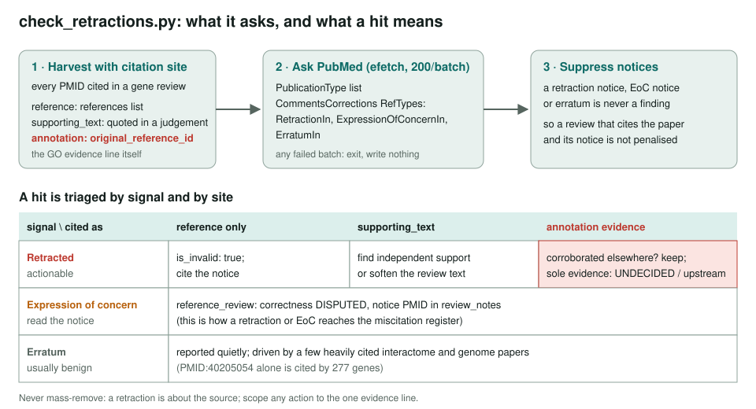
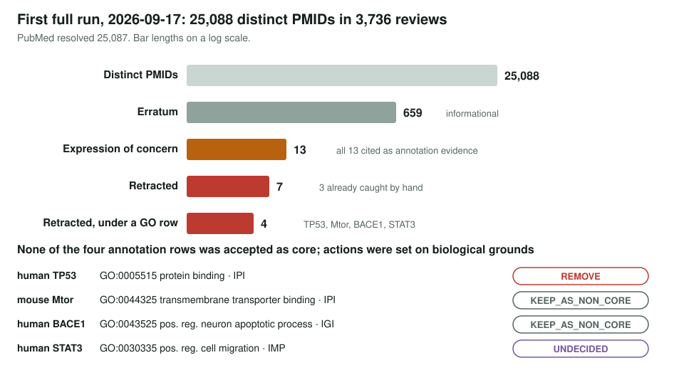

<!-- _class: lead -->

# Retracted literature behind annotations

Re-asking PubMed about every paper the gene reviews cite

AI Gene Review · projects/RETRACTIONS · 2026-10-05

---

<!-- _class: bluf -->

## Bottom line

- The ordinary fetch/validate path did not re-check whether a cited paper had since been **retracted**; `check_retractions.py` now does, recording **where** each PMID is cited.
- First run: **25,088 PMIDs** → **7 retracted**, **13 expressions of concern**, 659 errata. Reviews had caught **3 of 7** by hand; **4 of 7** sit under a GO annotation.
- None of the four is an accepted core function. Flagging them (`is_invalid`, notice citation) is **still to do**.

---

## Why this is a separate failure from miscitation

- A **miscitation** is wrong the moment it is written; reading the review finds it.
- A **retraction** was fine when written and **went bad afterwards**; only re-asking PubMed finds it.
- `just validate` checks a quote is verbatim in the cached paper, not that the paper still stands.
- Retraction notices can arrive after reviews are written: a careful review can be stale a year later.

---

## How the checker works

---

## First full run

---

## The seven retracted papers

| PMID | Gene | How it is cited | Flagged in review? |
|---|---|---|---|
| 16616141 | human TP53 | GO:0005515 IPI evidence | no (row already REMOVE) |
| 19225519 | human TNFRSF21 | reference list | **yes** |
| 22483618 | human LOXL2 | reference + supporting_text | **yes** |
| 27782176 | mouse Mtor | GO:0044325 IPI evidence | no |
| 29371969 | human BACE1 | GO:0043525 IGI evidence | no |
| 31638206 | human STAT3 | GO:0030335 IMP evidence | no |
| 32125225 | human ACTL8 | reference list | **yes** |

BACE1's paper had a 2018 correction before its 2026 retraction; keeping notice types apart avoids dating the retraction eight years early.

---

## Expressions of concern and errata

- **13 EoCs**, all cited as annotation evidence. Seven are generic `protein binding` IPI rows already marked REMOVE or over-annotated.
- First dense cluster to read: **PMID:19033661** (AIP1/VEGFR2, *J Clin Invest* 2008) supports **13 accepted or non-core rows** on DAB2IP and VEGFA.
- **659 errata are not a defect list**: PMID:40205054 alone is cited by 277 genes.
- One PMID does not resolve at all: **PMID:34521819** (JAK1, STAT1).

---

## Status and next steps

- ✅ Checker, register, first full run; seed case TNFRSF21 verified end to end.
- ⬜ Work the four annotation-evidence retractions (TP53, BACE1, STAT3, Mtor): `is_invalid`, cite notice, note whether the row survives.
- ⬜ `reference_review` (DISPUTED) for the 13 EoCs, starting with PMID:19033661.
- ⬜ Extend the scan to cached `*-goa.tsv` references; decide on CI via the publication-type backfill. Tracked in #4009.

**Read more:** `projects/RETRACTIONS.md` · `RETRACTIONS/retraction-register.md` · `check_retractions.py`
