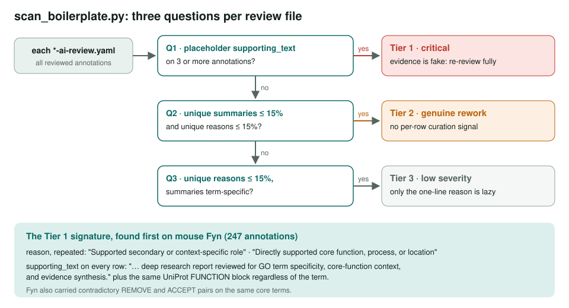
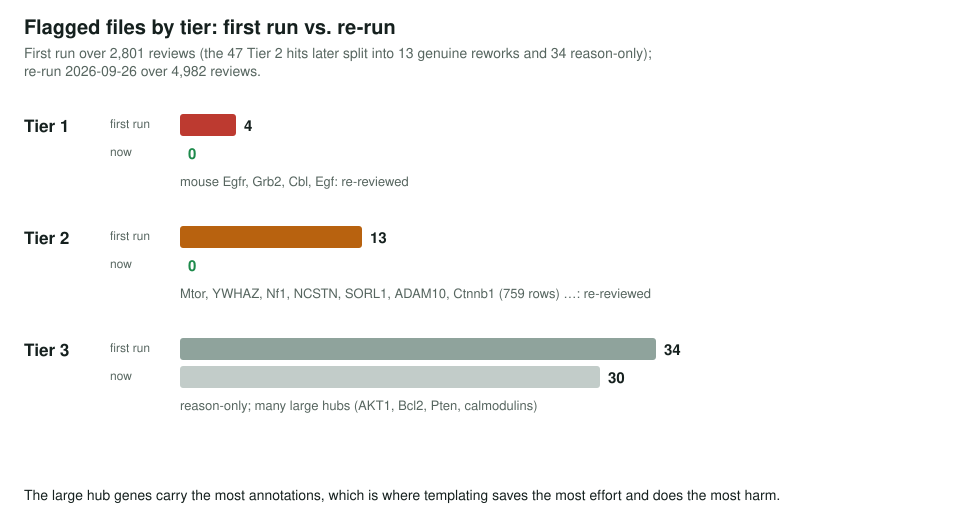
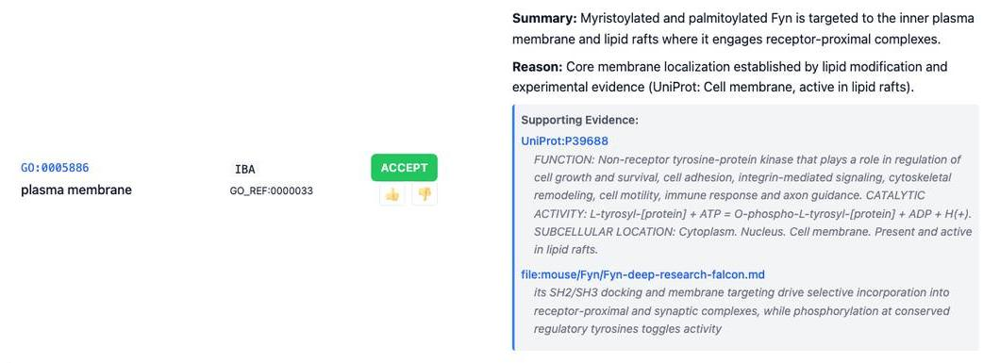

<!-- _class: lead -->

# Review Quality Audit

Detecting gene reviews whose reasoning and evidence are boilerplate

AI Gene Review · projects/REVIEW_QUALITY_AUDIT · 2026

---

<!-- _class: bluf -->

## Bottom line

- One generation pass filled whole reviews with **templated reasons** and a **placeholder evidence string**; actions looked plausible, curation was absent.
- `scan_boilerplate.py` flags this in three tiers. First run: **51 of 2,801** files; **4 Tier 1** and **13 genuine Tier 2** reviews were then **fully re-reviewed**.
- Re-run today over **4,982** files: **Tier 1: 0, Tier 2: 0**, 30 low-severity Tier 3. The CI smell test is **not yet** added.

---

## Why it matters

- A review is only useful if each row's **reason** and **supporting_text** are about **that term**.
- Boilerplate cannot be audited: a correct action and a wrong one carry the same text.
- It concentrates in **large hub genes** (Ctnnb1: 759 rows; Mtor: 372; Egfr: 304), where templating saves the most effort and over-annotation is most likely.

---

## The detector

---

## Results

---

## What a re-reviewed row looks like

Mouse Fyn after re-review: a term-specific summary and reason, backed by real UniProt and deep-research quotes.

---

## How the rework was done

- **Tier 1** (Egfr 304, Grb2 188, Cbl 140, Egf 129 rows): every `reason` and `supporting_text` regenerated against real sources; action labels only seeded the work.
- **Tier 2**, three batches: Mtor, YWHAZ, Nf1, NCSTN; the Alzheimer-risk set SORL1, ADAM10, ABCA1, FERMT2; Brca1, Tert, Ccnt1, NTE1.
- **Ctnnb1** (759 rows, 295 unique terms): four parallel agents split by β-catenin role, merged with disjoint coverage.

---

## Status and next steps

- ✅ Detector built; Tier 1 and Tier 2 cleared and confirmed by re-run.
- ⬜ Tier 3 (30 files): tighten the one-line `reason` in bulk; low priority.
- ⬜ Add the placeholder string and a low unique-reason ratio as a **CI smell test**.
- ⬜ Regenerate the committed report (post-rework, but still over 2,801 files).

**Read more:** `projects/REVIEW_QUALITY_AUDIT.md` · `REVIEW_QUALITY_AUDIT/scan_boilerplate.py` · `reports/REPORT.md`
