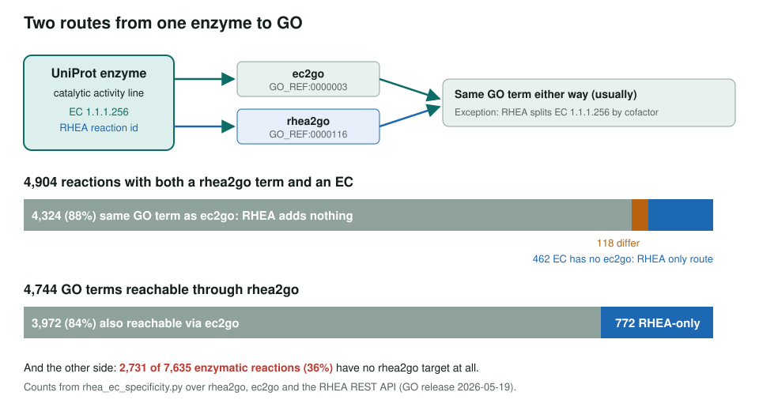
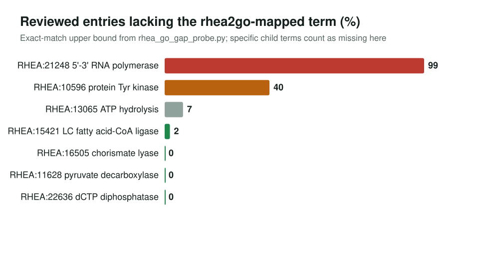

<!-- _class: lead -->

# RHEA to GO

What reaction-level annotation adds beyond EC numbers, and 132 curated new mappings

AI Gene Review · projects/RHEA · 2026

---

<!-- _class: bluf -->

## Bottom line

- RHEA reaches GO via `rhea2go` (GO_REF:0000116), but **88%** of reactions that also have an EC map to the **same GO term `ec2go` already gives**.
- Its real value: **772 RHEA-only GO terms**, **462** reactions whose EC has no `ec2go` line; meanwhile **36%** of enzymatic reactions have no GO target.
- We curated **132 new mappings** backed by reviewed enzymes: **42** new Swiss-Prot annotations. The residual gap is missing GO terms, not missing mappings.

---

## EC masks most of RHEA

---

## Why audit RHEA

- RHEA is a **curated, reaction-level** source of enzyme function, used on UniProt catalytic-activity lines.
- Gene reviews see `GO_REF:0000116` rows; we needed to know if they are **independent evidence or EC duplicates**.
- Specificity cuts both ways: 679 GO terms absorb >1 reaction (up to **67 ADH reactions → one term**), while 112 ECs split across several GO terms.

---

## Reverse gap: an upper bound

High values are generic-parent reactions where curated entries carry specific child terms. A closure-aware re-run is still needed to find true gaps.

---

## 132 curated mappings (`rhea2go.sssom.yaml`)

| Class | Rows | Meaning |
|---|---:|---|
| exactMatch | 110 | ready-to-add; most EC-bridge supported (BTD, TPMT, VKORC1L1, PYCR1, RNGTT) |
| broadMatch | 4 | only a class term exists (PHYKPL → lyase activity; B3GALNT2) |
| NoTermFound | 18 | new GO term needed (e.g. hppE fosfomycin epoxidase) |

Every row backed by a reviewed enzyme (RHEA-MAPPING-REVIEWS.md); passes `just validate-rhea-mappings`. Gain: 42 new reviewed-entry annotations.

---

## Status and next steps

- ✅ EC-masking and specificity measured; reverse-gap pilot; gap case reviews (PHYKPL, B3GALNT2, SAMD8, SULT6B1)
- ✅ 132-row SSSOM set validates; EC-bridge reviewed residual gain is 0
- ⬜ Forward closure-filtered cross-organism scan (needs go-db)
- ⬜ Closure-aware reverse gap on RHEA:21248 and RHEA:10596
- ⬜ Batch new-term requests for reactions with no GO target

**Read more:** `projects/RHEA.md` · `projects/RHEA/rhea2go.sssom.yaml` · `projects/RHEA/RHEA-ANNOTATION-GAIN.md`
