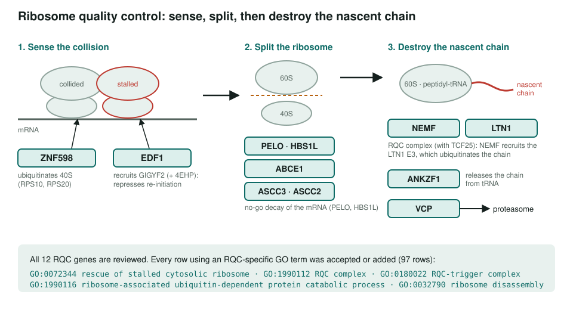
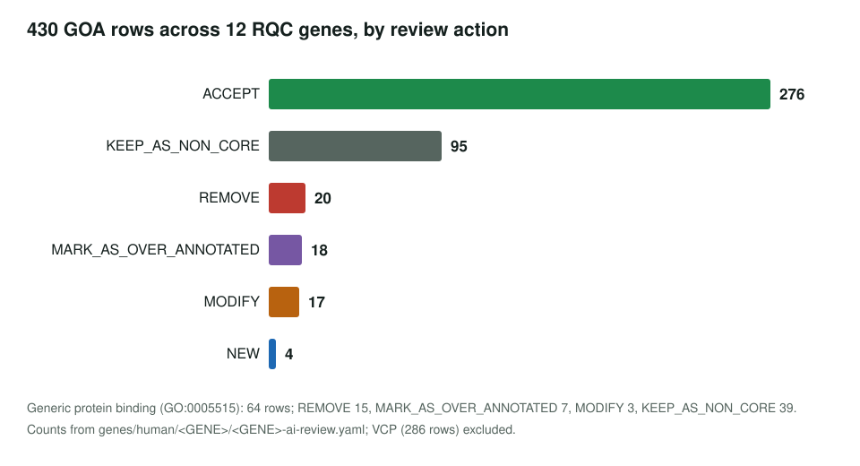
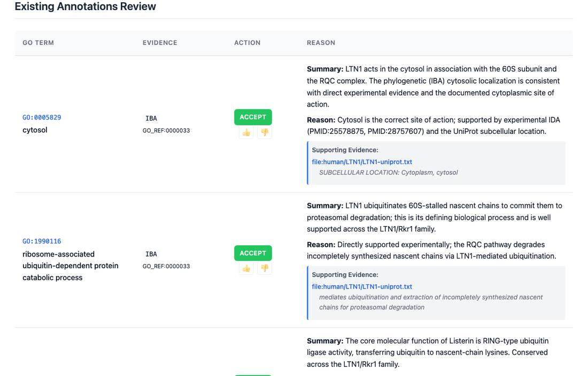

<!-- _class: lead -->

# Ribosome quality control

GO annotation review of the 12 genes that rescue stalled and colliding ribosomes in human

AI Gene Review · projects/RIBOSOME_QUALITY_CONTROL · IN_PROGRESS · 2026-10-05

---

<!-- _class: bluf -->

## Bottom line

- **All 13 candidate genes are reviewed** (12 RQC genes + VCP), done during the Proteostasis batches rather than under this project.
- **430 GOA rows** on the 12 RQC genes: 276 ACCEPT, 95 non-core, 20 REMOVE, 18 over-annotated, 17 MODIFY, 4 NEW.
- **Every RQC-specific row (97) was accepted or added.** Corrections fall on `protein binding` and off-pathway terms. **No module yet.**

---

## The pathway

---

## Why this pathway

- A **surveillance pathway** with sharp boundaries: sense a collision, split the ribosome, destroy the nascent chain.
- GO already has **specific terms** for each stage (`rescue of stalled cytosolic ribosome`, `RQC complex`, `RQC-trigger complex`), so this tests whether reviews confirm good curation rather than only finding errors.
- Disease links: NEMF variants in neurological disease; ribosome stalling in C9orf72 ALS.

---

## Results by action

---

## What a review looks like

LTN1 review page: the RQC-specific process GO:1990116 is accepted and marked as its defining process.

---

## Where the corrections are

| Gene | REMOVE | MODIFY |
|---|---|---|
| EDF1 | 7 `protein binding` | 3: to TFIID-class TF complex binding, nuclear hormone receptor binding, Pol II TF activity |
| ABCE1 | 5 `protein binding`, `membrane` (HDA) | 2: iron ion binding → 4Fe-4S cluster binding; mitochondrial matrix → mitochondrion |
| ANKZF1 | ERAD pathway (IBA) | 6: RNA endonuclease / tRNA catalytic rows → tRNA-specific ribonuclease activity |
| ASCC3 | DNA replication (NAS), membrane (HDA) | 2: → 3'-5' DNA helicase activity |
| ASCC2 | 3 `protein binding`, DNA replication (NAS) | 2: ubiquitin binding → K63-linked polyubiquitin binding |

---

## Status and next steps

- ✅ 13/13 candidate genes have complete reviews (no PENDING rows).
- ⬜ Build an **RQC module** (#3952).
- ⬜ Cross-check six production GO-CAMs that already model ZNF598 activation, GIGYF2–EIF4E2 repression, the RQC complex, NEMF CAT-tailing and ANKZF1 tRNA recycling (#3952).

**Read more:** `projects/RIBOSOME_QUALITY_CONTROL.md` · `genes/human/LTN1/` · `projects/PROTEOSTASIS/batch6_selection_notes.md`
