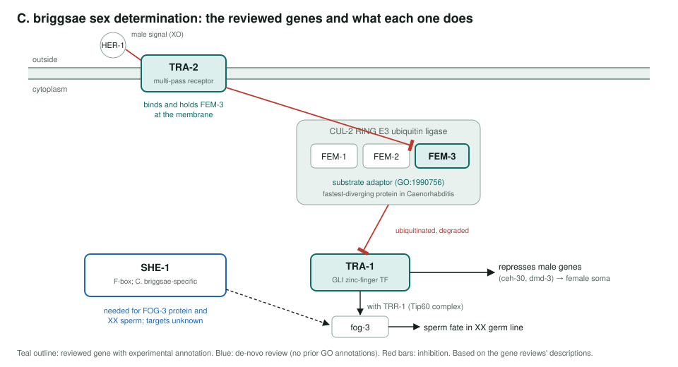
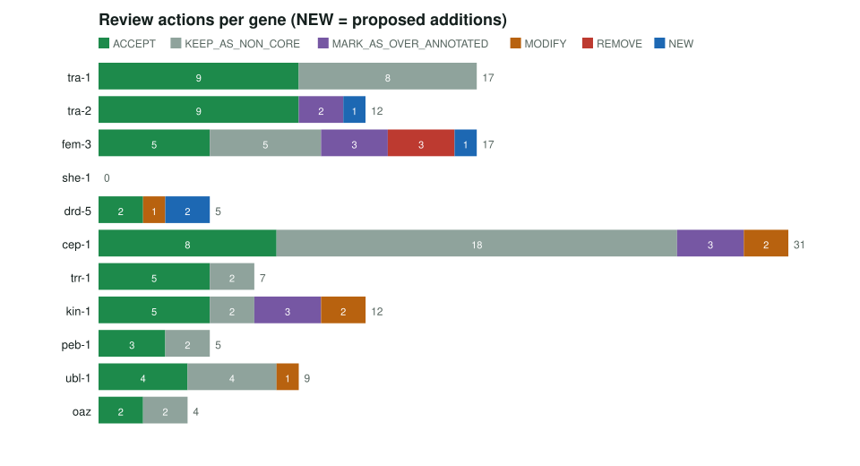

<!-- _class: lead -->

# Satellite model organisms

Reviewing GO annotations for nematodes studied as comparators to *C. elegans*

AI Gene Review · projects/SATELLITE_MODEL_ORGANISMS · 2026

---

<!-- _class: bluf -->

## Bottom line

- *C. briggsae* and *P. pacificus* are **comparators** for *C. elegans*; most of their GO annotations come **by orthology**.
- We reviewed **11 genes** (10 *C. briggsae*, 1 *P. pacificus*): **119 rows**, 52 ACCEPT, 43 non-core, and **4 NEW** terms proposed.
- **she-1**, a *C. briggsae*-specific F-box gene with **no GO annotations**, was curated from the literature. Next: decide on TrEMBL-only *P. pacificus* genes.

---

## Why satellites

- A satellite is studied **to interpret a reference MOD**, not as a MOD itself.
- Their annotations are mostly **IEA/IBA transfers** from *C. elegans* and beyond. The review asks whether each transfer holds in the satellite species.
- **Sex determination** is the classic *C. briggsae* vs *C. elegans* evo-devo story, so it was the first batch.
- *P. pacificus* has **one** Swiss-Prot entry (oaz, antizyme) against ~26,000 TrEMBL entries.

---

## The sex-determination batch

---

## Results per gene

oaz is *P. pacificus*; all others *C. briggsae*. she-1 has no bar because it had no existing annotations.

---

## Notable calls

| Gene | Call |
|---|---|
| fem-3 | NEW GO:1990756 ubiquitin ligase-substrate adaptor activity; 3 IEA rows REMOVED (e.g. GO:0060282 positive regulation of oocyte development) |
| tra-2 | NEW GO:0030674 protein-macromolecule adaptor activity (IPI); its 2 `protein binding` rows marked over-annotated |
| drd-5 | NEW GO:0016229 steroid dehydrogenase activity and GO:0120178 steroid hormone biosynthetic process (ISS) |
| kin-1 | generic kinase terms MODIFY → GO:0004691 cAMP-dependent protein kinase activity |
| cep-1 | GO:0003700 MODIFY → GO:0000981 (RNA Pol II-specific TF activity) |
| she-1 | de-novo core function: ubiquitin-like ligase-substrate adaptor (GO:1990756) |

---

## Status and next steps

- ✅ **11/11 seeded genes reviewed** (`genes/CAEBR/*`, `genes/PRIPA/oaz`).
- ⬜ *P. pacificus* developmental-plasticity genes (e.g. the *eud-1* morph switch) are **TrEMBL-only**; not started.
- In each review, record whether an orthology-based term is backed by **direct evidence in the satellite species**.

**Read more:** `projects/SATELLITE_MODEL_ORGANISMS.md` · `genes/CAEBR/` · `genes/PRIPA/oaz/`
