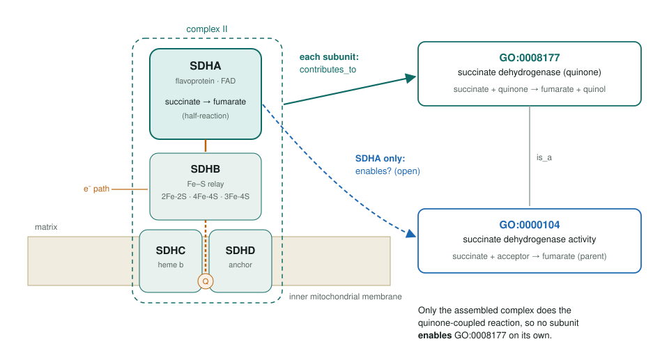
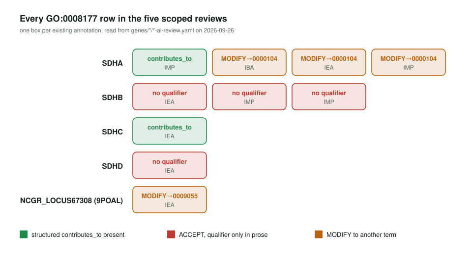

<!-- _class: lead -->

# Complex II: `enables` → `contributes_to`

A relation fix for succinate dehydrogenase subunits

AI Gene Review · projects/SDH_GP2TERM_CONTRIBUTES_TO · scoping · 2026

---

<!-- _class: bluf -->

## Bottom line

- No single subunit of **succinate dehydrogenase** performs GO:0008177; GO agreed (go-annotation#6414) that subunits get **`contributes_to`**, not `enables`.
- **5 repo reviews** carry GO:0008177. All say `contributes_to` in prose; only **SDHC** and **one SDHA row** have the structured qualifier.
- **Scoped, not yet started:** no review edited; SDHB (3 rows) and SDHD (1 row) are the concrete fixes.

---

## The mechanism behind the rule

---

## What the audit found

---

## The SDHA nuance

- SDHA's FAD site can oxidise succinate with an **artificial acceptor**: the half-reaction.
- That matches the parent **GO:0000104** succinate dehydrogenase activity, so `enables` there is **defensible** for SDHA alone.
- The quinone-coupled **GO:0008177** still needs the whole complex: `contributes_to` for all four subunits.
- The current SDHA review MODIFYs three GO:0008177 rows to GO:0000104 and keeps one as `contributes_to`: this needs an explicit decision.

---

## Status and next steps

- ⬜ **Tier 1:** SDHB (3 rows) and SDHD (1 row) should end up `contributes_to`. The qualifier mirrors GOA (SDHC's comes from `SDHC-goa.tsv`), so record the intent in `review` now and re-fetch once GOA reflects #6414.
- ⬜ **Tier 2:** decide SDHA GO:0000104 vs GO:0008177; decide 9POAL NCGR_LOCUS67308 (MODIFY → GO:0009055 or keep with qualifier).
- ⬜ PSEPK **sdhA / sdhB** reviews (added later) carry GO:0008177 with `enables`; add to scope.
- Order: note intent in `review` → wait for GOA → `just fetch-gene` → `just validate`.

**Read more:** `projects/SDH_GP2TERM_CONTRIBUTES_TO.md`
