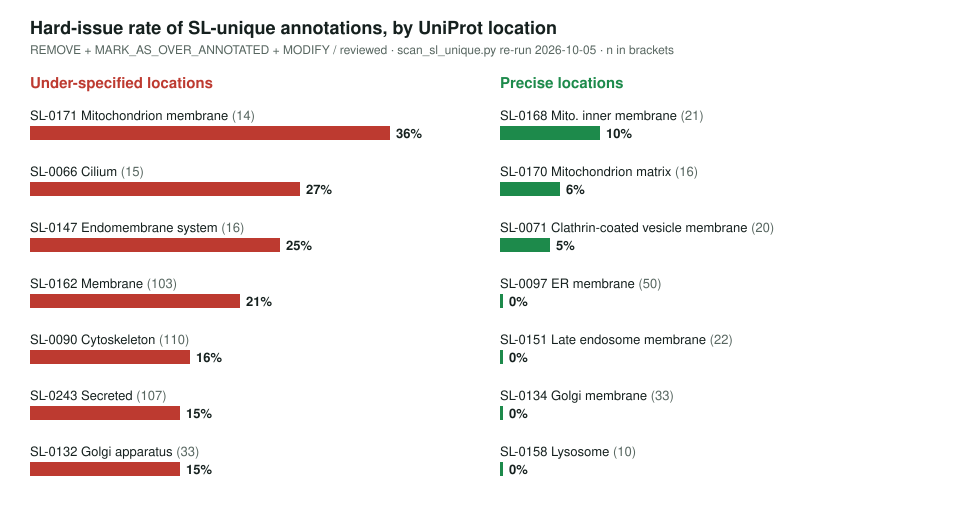
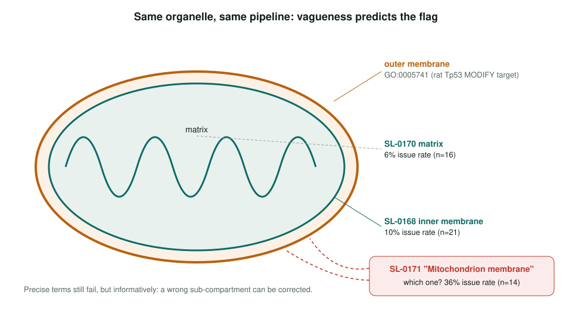

<!-- _class: lead -->

# UniProt subcellular locations

Reviewing GO annotations that come only from `GO_REF:0000044`

AI Gene Review · projects/SL · 2026-10-05

---

<!-- _class: bluf -->

## Bottom line

- The UniProt SL → GO pipeline is **still running** and supplies many CC annotations with **no other evidence**.
- Failures track **granularity**: broad locations such as `mitochondrial membrane`, `endomembrane system`, and `membrane` are flagged at **21–36%**.
- Dropping SL terms made **redundant** by a more specific term was **tested and refuted** (10% vs 8%). **27** first-pass annotations moved.

---

## Why SL, after SPKW

- SPKW (keywords, `GO_REF:0000043`) was retired by GOA around April 2026. **`GO_REF:0000044` is live.**
- The GAF writes `UniProtKB-SubCell:SL-xxxx` into WITH/FROM, so each row names its **source location**.
- Scan: every annotation whose **only** source is `GO_REF:0000044`, joined to the reviewer's verdict.
- Now **1,852** such annotations in **1,380** gene folders; **1,837** reviewed.

---

## Vague locations fail, precise ones do not

---

## A controlled comparison inside one organelle

---

## Four failure patterns

| Pattern | What goes wrong | Examples |
|---|---|---|
| **A** under-specification | true, but says nothing | `membrane` on an ER protein |
| **B** association ≠ residence | binds the structure, not in it | SGCA, SGCE → MODIFY to complex terms |
| **C** family-rule propagation | a family trait attached to all | enolase `Secreted` via HAMAP MF_00318 |
| **D** transit as destination | passes through on the way out | SALTY slrP, STAAU lytN |

Plus SL-0221: GO:0034045 was defective; GO has obsoleted it and created GO:7770114 phagophore membrane.

---

## The cheap fix that does not work

| Group | n | Issue rate |
|---|---|---|
| more specific CC term already present | 445 | **10%** |
| SL term is the most specific the gene has | 852 | **8%** |

- Reviewers flag **vagueness**, not duplication: "not wrong, but 'membrane' is the uninformative parent" (yeast DCV1).
- So GOA cannot suppress these by graph logic; it is a **per-annotation judgement**.

---

## Status and next steps

- ✅ Scanner and redundancy test committed: `projects/SL/scripts/`.
- ✅ 22 first-pass genes re-reviewed; **27 annotations moved** (18 SL-0221, 9 SL-0162/SL-0090).
- ⬜ Audit the few family rules that attach `Secreted` to housekeeping enzymes (pattern C, #4259).
- ⬜ Decide whether "true but uninformative" deserves its own verdict (31% land on KEEP_AS_NON_CORE).
- ⬜ Systematic check for SL → GO mappings whose axioms fail, like SL-0221 (#4260).

**Read more:** `projects/SL.md` · `projects/SL/SL-METHODOLOGY.md`
