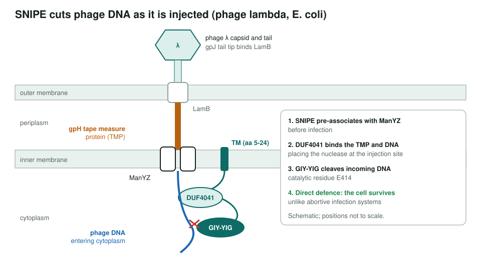
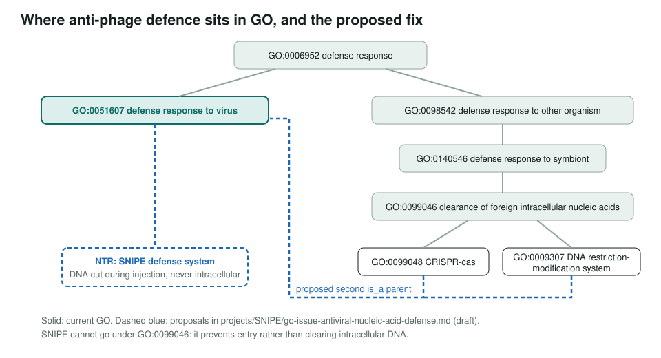
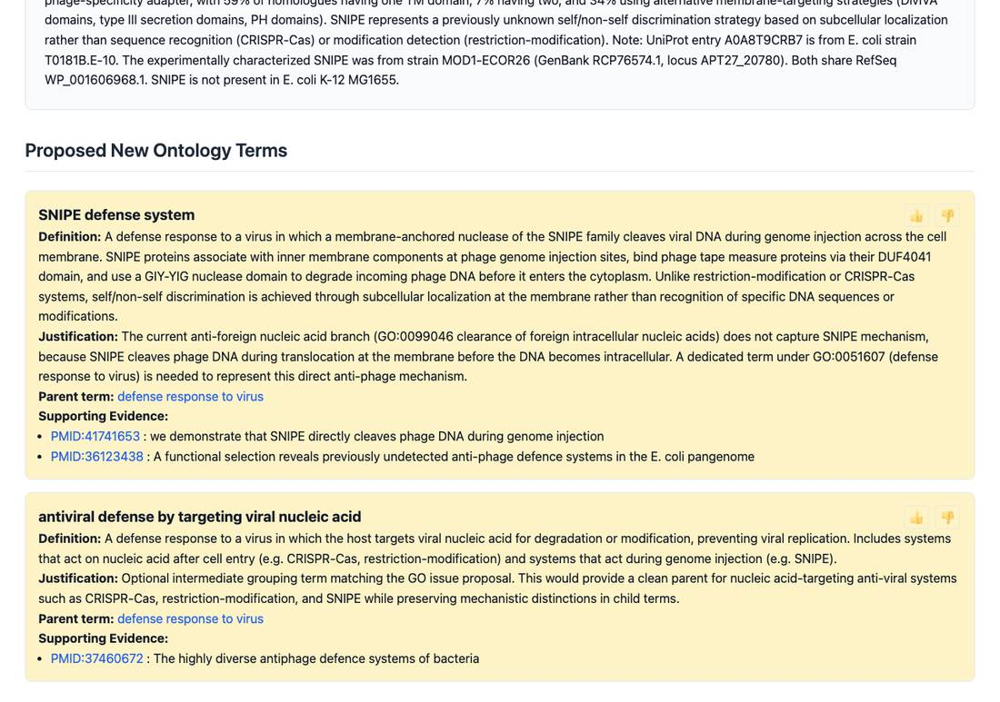

<!-- _class: lead -->

# SNIPE

A membrane-bound nuclease that cuts phage DNA during injection

AI Gene Review · projects/SNIPE · 2026

---

<!-- _class: bluf -->

## Bottom line

- **SNIPE** cuts phage DNA **as it crosses the inner membrane**, using the phage tape measure protein to aim its GIY-YIG nuclease (Saxton et al. 2026, PMID:41741653).
- The *E. coli* protein (A0A8T9CRB7) had **no GO annotations**; our review proposes **7 annotations** and **2 new process terms**.
- GO has **no SNIPE-specific process**: anti-phage nucleic-acid defence is framed as clearing *intracellular* DNA. A GO issue is drafted; the review is still DRAFT.

---

## The mechanism

---

## Why it matters

- A third way to tell self from non-self: **location**, not sequence (CRISPR) or modification (R-M).
- Homologues in **~33% of well-sequenced bacterial clades**; IPR025280 (ex-DUF4041) has 1,612 protein matches.
- **Direct** defence: the infected cell survives, unlike abortive infection.
- InterPro2GO needs the full architecture: `IPR025280`, a GIY-YIG co-feature, and membrane-targeting evidence.

---

## What the review proposes

| Aspect | Term (all NEW, IDA, PMID:41741653) |
|---|---|
| MF | `GO:0004520` DNA endonuclease activity · `GO:0003690` dsDNA binding |
| BP | `GO:0051607` defense response to virus · `GO:0045071` neg. reg. of viral genome replication |
| BP | `GO:0046597` host-mediated suppression of symbiont invasion · `GO:0006308` DNA catabolic process |
| CC | `GO:0005886` plasma membrane |

GOA held no rows for A0A8T9CRB7, so every annotation is proposed.

---

## GO cannot place it yet

---

## Two new terms, as rendered

---

## Status and next steps

- ✅ Paper summarized; full gene review (`genes/ECOLX/SNIPE/`, DRAFT) with bioinformatics.
- ✅ GO issue drafted: [GO hierarchy NTR](../go-issue-antiviral-nucleic-acid-defense.html) (no filed number recorded).
- ✅ Architecture-aware IPR025280 analysis for conservative InterPro2GO design.
- ⬜ Check GO annotations on SNIPE homologues; cross-reference DefenseFinder.
- ⬜ Propose architecture-aware InterPro2GO mappings for PF13250 / IPR025280.

**Read more:** `projects/SNIPE.md` · `genes/ECOLX/SNIPE/SNIPE-ai-review.yaml`
