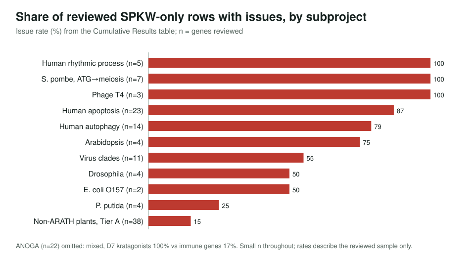
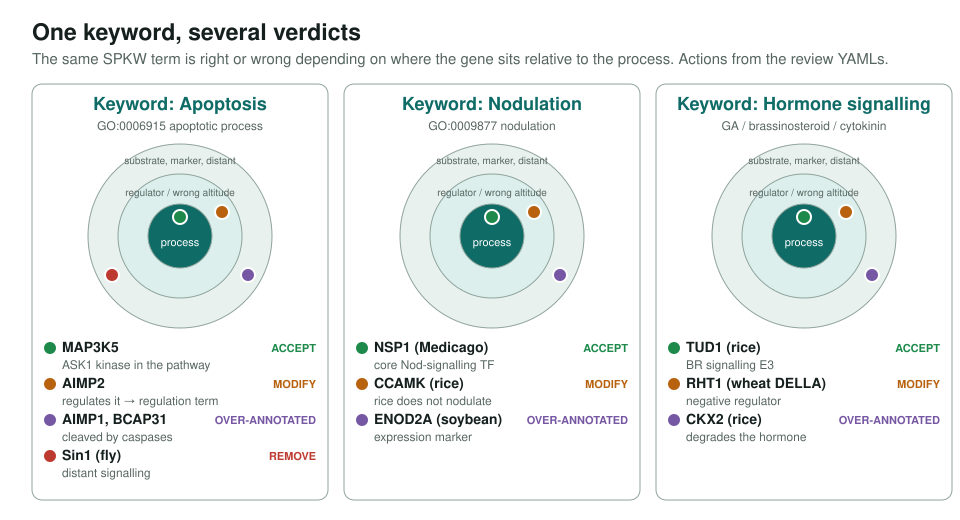
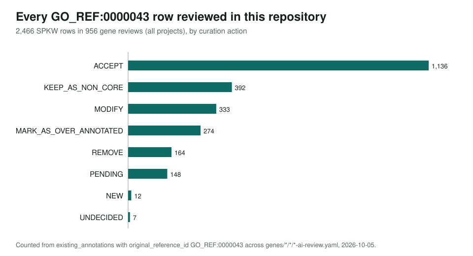

<!-- _class: lead -->

# SwissProt keyword (SPKW) annotations

A retrospective audit of GO_REF:0000043, where a UniProt keyword was the only source

AI Gene Review · projects/SPKW · 2026

---

<!-- _class: bluf -->

## Bottom line

- **Eukaryotic process keywords were unsafe**: 79–100% of reviewed SPKW-only apoptosis, autophagy, rhythm and *S. pombe* meiosis rows were over-annotations.
- **Bacterial keyword rows were mostly sound**; plant SPKW-unique terms carried real risk in only **~15%** of cases.
- GOA **retired SPKW for cellular organisms (~April 2026)**. That removed the bad rows and also correct ones, e.g. DELLA GA signalling (RHT1), patatin storage (PATB1).

---

## What we asked

- A keyword such as *Apoptosis* maps to a GO term via `GO_REF:0000043`. For many genes it was the **only** evidence.
- Closure filter: a row counts only if **no other source** supports that term **or a more specific one**.
- 12 downstream subprojects: human apoptosis / rhythm / autophagy; *S. pombe*, *Drosophila*, *Anopheles*, *P. putida*, *Arabidopsis*; phage T4, *E. coli* O157, virus clades; non-Arabidopsis plants.
- Swiss-Prot keywords are **manually assigned**, so errors in reviewed organisms sit in the **keyword→GO mapping**, not keyword choice.

---

## Issue rates by subproject

---

## One keyword, several verdicts

---

## Recurring failure patterns

| Pattern | Example |
|---|---|
| Regulatory conflation | AIMP2 → apoptotic process (MODIFY) |
| Caspase substrate ≠ apoptosis | AIMP1, BCAP31 (over-annotated) |
| Process conflation | *S. pombe* ATG genes → meiosis |
| Eukaryote-centric terms on phage | T4 DAM → innate immune response |
| Enzyme-class keyword → bare process | Methyltransferase → methylation (plant MTases) |
| Expression ≠ function | rhythmic-process genes; ENOD2A nodulation |

---

## The repository-wide picture

All SPKW rows reviewed anywhere in this repo, not only this project. Nearly half were accepted as they stand.

---

## What retirement cost

- Plants: 214 SPKW-unique terms tiered. **Tier A (over-annotation risk) 15%**; **Tier B+C (correct) ~79%**.
- Correct facts lost where the keyword was the only carrier: **RHT1** GA signalling, **PATB1** nutrient reservoir, **NSP1** nodulation, EME1 endonuclease, PR1B1 defense.
- Lesson for any mapping source: tier terms by risk and review by gene position, rather than keep-all or drop-all.

---

## Status

- **Mature** as a retrospective: 12 downstream subprojects, 137 genes in the results table; ViralZone is active upstream follow-up.
- Side finding: 265/550 plant `file:` quotes were non-verbatim because the validator skips `file:` refs; all fixed, no action changes.
- Methods and SQL: `projects/SPKW/SPKW-METHODOLOGY.md`.

**Read more:** `projects/SPKW.md` · `projects/SPKW/SPKW-PLANTS.md` · `projects/SPKW/SPKW-APOPTOSIS.md`
