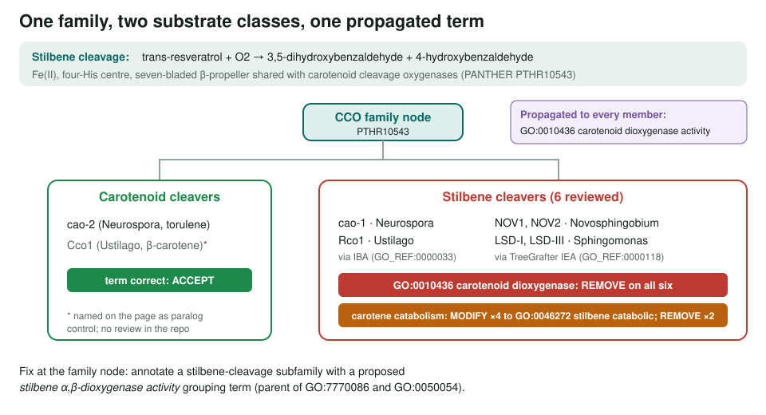
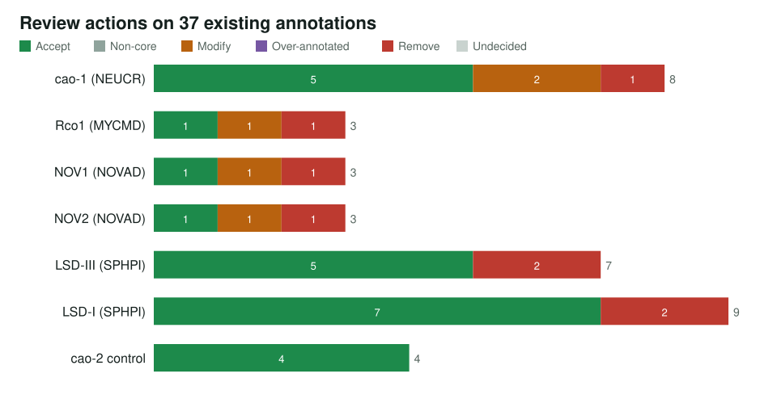
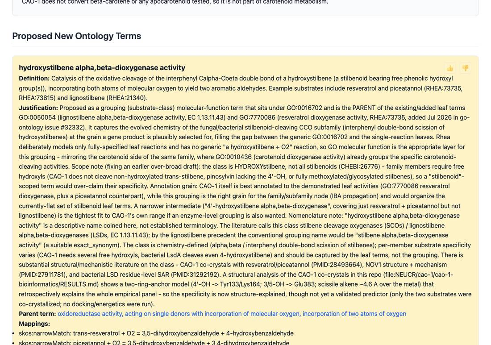

<!-- _class: lead -->

# Stilbene cleavage oxygenases

How a carotenoid term spread to every stilbene cleaver in the family

AI Gene Review · projects/STILBENE_CLEAVAGE_OXYGENASES · 2026

---

<!-- _class: bluf -->

## Bottom line

- SCOs split **resveratrol-type stilbenes** into two aldehydes, but share a fold and PANTHER family (PTHR10543) with **carotenoid** cleavers.
- We reviewed **7 members** (6 stilbene cleavers from fungi and bacteria, plus the carotenoid cleaver **cao-2** as control).
- `GO:0010436` *carotenoid dioxygenase activity* was **REMOVED on all six** stilbene cleavers, whether it came by IBA or TreeGrafter IEA; it was **accepted on cao-2**.

---

## The propagation error

---

## Why this family

- **Paralog positive controls** in two fungi: *Neurospora* cao-2 (carotenoid) vs cao-1 (stilbene); *Ustilago* Cco1 vs Rco1.
- The same family term is right for one paralog and wrong for the other; only **target-specific experiments** separate them.
- GO was revising this area in **July 2026**: `GO:1905594` *resveratrol binding* being obsoleted, `GO:7770086` *resveratrol dioxygenase activity* added.

---

## Actions per gene

---

## Carotene catabolism rows

| Gene | Organism | Propagation | `GO:0016121` carotene catabolic |
|---|---|---|---|
| cao-1 | *N. crassa* | IBA | MODIFY → `GO:0046272` stilbene catabolic |
| Rco1 | *U. maydis* | IBA | MODIFY → `GO:0046272` |
| NOV1 (Saro_0802) | *N. aromaticivorans* | TreeGrafter IEA | MODIFY → `GO:0046272` |
| NOV2 (Saro_2809) | *N. aromaticivorans* | TreeGrafter IEA | MODIFY → `GO:0046272` |
| LSD-III (lsdB) | *S. paucimobilis* | TreeGrafter IEA | REMOVE |
| LSD-I (Q53353) | *S. paucimobilis* | TreeGrafter IEA | REMOVE |

On LSD-I and LSD-III the carotenoid IEA rows sit beside the genes' own IDA lignostilbene-dioxygenase annotations.

---

## A proposed grouping term

From the cao-1 review: a *hydroxystilbene α,β-dioxygenase activity* grouping term as parent of GO:7770086 and GO:0050054, to carry the family-level annotation.

---

## Status and next steps

- ✅ 7 reviews written (all still status IN_PROGRESS); cao-1 structure analysis explains its substrate panel (two-ring anchor).
- ⬜ Propose the grouping term to GO; switch structured slots to `GO:7770086` once the validation snapshot has it.
- ⬜ Compare bacterial (NOV1/NOV2/LsdA) and fungal (CAO-1/Rco1) anchor residues.
- ⬜ Fix at the family node: a stilbene-cleavage subfamily in PTHR10543.

**Read more:** `projects/STILBENE_CLEAVAGE_OXYGENASES.md` · `genes/NEUCR/cao-1/` · `projects/IBA_REVIEW.md`
