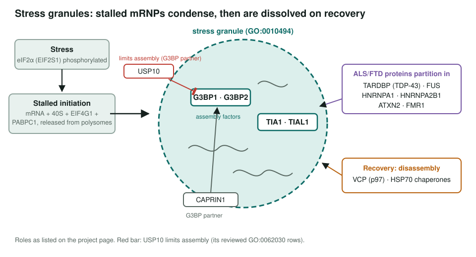
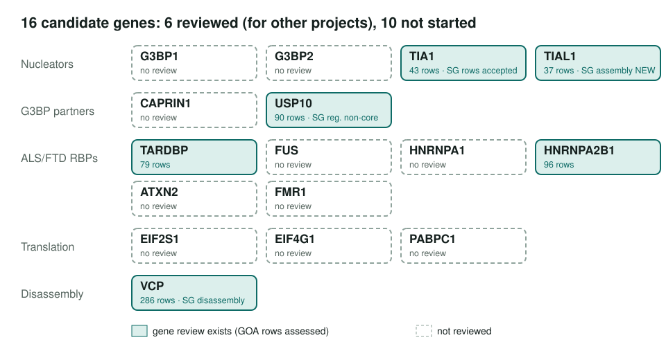

<!-- _class: lead -->

# Stress granules

Assembly and disassembly of stress-induced RNA-protein condensates in human: a scoped project

AI Gene Review · projects/STRESS_GRANULES · SCOPING · 2026

---

<!-- _class: bluf -->

## Bottom line

- **Scoped, not started.** No stress granule module; the core nucleators **G3BP1 and G3BP2 are not reviewed**.
- **7 of 16 listed candidates** already have reviews made for other projects (TIA1, TIAL1, USP10, TARDBP, HNRNPA2B1, ATXN2, VCP).
- In those, stress-granule rows were **accepted** for TIA1, TARDBP, ATXN2 and VCP; TIAL1 adds SG assembly as **NEW**, while USP10's negative-regulation rows are **non-core**.

---

## The biology

---

## Why this is worth doing

- Stress granules are the best-known **cytoplasmic condensate**, and several **ALS/FTD proteins** (TDP-43, FUS, hnRNPA1/A2B1, ATXN2) partition into them.
- Many RNA-binding proteins are *found in* granules; few *build* them. Separating nucleators from residents is the key curation call.
- The general question of how GO should represent condensates is handled in **CONDENSATES**.

---

## Where the candidate genes stand

---

## Next steps

1. `just fetch-gene human G3BP1` and `G3BP2`; review them, then CAPRIN1.
2. Review FUS, HNRNPA1, FMR1, PABPC1, EIF2S1 and EIF4G1.
3. Build a stress granule module distinguishing nucleators, regulators, residents and disassembly factors.

**Read more:** `projects/STRESS_GRANULES.md` · `genes/human/TIA1/` · `projects/CONDENSATES.md`
