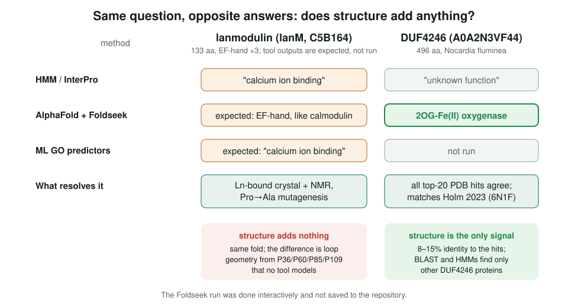
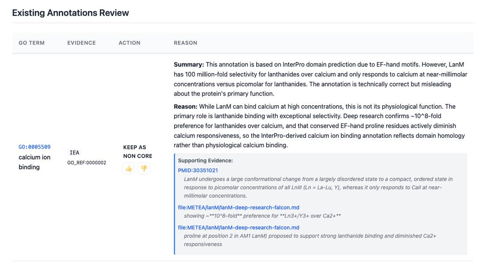
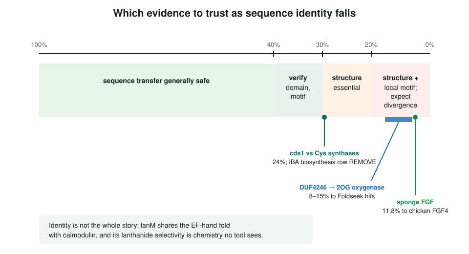

<!-- _class: lead -->

# Structure-based function prediction

When does protein structure help GO review, and when does it not?

AI Gene Review · projects/STRUCTURE_FUNCTION · 2026

---

<!-- _class: bluf -->

## Bottom line

- HMMs fail below ~20–30% identity, where fold and active sites often persist. We surveyed fold-, motif- and model-level tools and tested them on our own cases.
- **lanM**: structure adds nothing (still "EF-hand, calcium"). **DUF4246**: Foldseek finds 2OG-Fe(II) oxygenases at 8–15% identity, matching Holm 2023.
- Local **catalytic-residue** checks already decide calls (PqsC/PqsB, EryCII, ActI-ORF2, cds1). The planned pipeline script **does not exist yet**.

---

## Three levels where structure can help

- **Global fold** (SCOP/CATH/ECOD): "what kind of protein"; transfer safe only at superfamily level. TIM barrels span 5 of 6 EC classes.
- **Local motifs** (M-CSA/EnzyMM, PARSE): catalytic geometry; the highest-value level. PARSE found 183 putative enzymes in 34,015 dark-proteome structures.
- **Learned models** (SaProt, ProstT5, DPFunc, DeepGO-SE): 3Di-aware predictors, but trained on existing GO, so they inherit its errors.

---

## Two cases, opposite answers

---

## lanM in the review

The IEA calcium-binding row is KEEP_AS_NON_CORE: technically true (near-millimolar Ca²⁺) but not the physiological function (picomolar Ln³⁺).

---

## Where structure pays off

---

## Local active site beats global fold

| Gene | Fold | Active site | Call in review |
|---|---|---|---|
| PSEAE/pqsC | FabH/KAS-III | Cys-129/His-269 dyad | condensing enzyme |
| PSEAE/pqsB | FabH/KAS-III | lacks the dyad | non-catalytic partner |
| SACEN/eryCII | P450 | no heme cysteine | pseudoenzyme |
| MYCTU/cds1, VIBCH/cds1 | PLP, Cys-synthase family | ASSGST, not PTSGNTG | IBA *L-cysteine biosynthetic process* REMOVE |

---

## Status and next steps

- ✅ Tool landscape, lanM negative case, DUF4246 positive case, pipeline examples.
- ⬜ #4014: write `scripts/structural_search.py` and save DUF4246, cds1 and PHYKPL runs.
- ⬜ Foldseek and EnzyMM on **MYCTU/VIBCH cds1** and **PHYKPL**: do structural hits recover what IBA/IEA got wrong?
- ⬜ Screen DUF-only proteins in the pipeline; treat hits as ISS-level leads.

**Read more:** `projects/STRUCTURE_FUNCTION.md` · `genes/METEA/lanM/` · `genes/MYCTU/cds1/`
