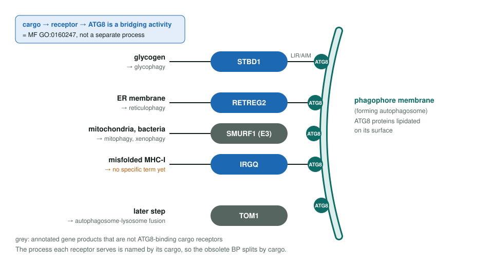
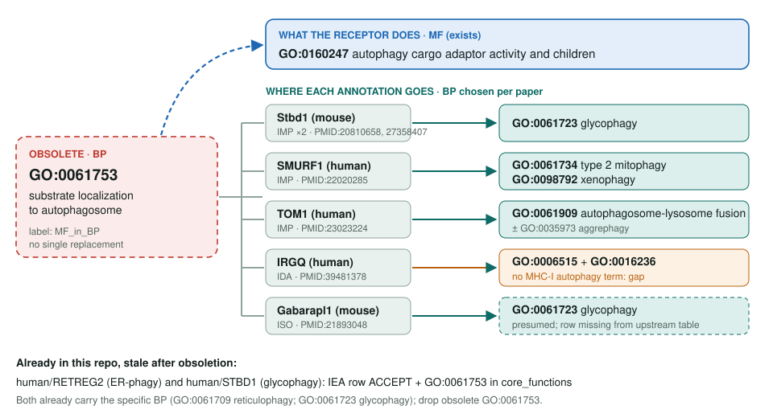

<!-- _class: lead -->

# Substrate localization to autophagosome obsoletion

GO:0061753 → the cargo adaptor MF plus one selective-autophagy process per paper

AI Gene Review · projects/SUBSTRATE_LOCALIZATION_TO_AUTOPHAGOSOME_OBSOLETION · 2026

---

<!-- _class: bluf -->

## Bottom line

- GO has obsoleted **GO:0061753** because it restated a molecular function (**GO:0160247** cargo adaptor activity); there is **no single replacement**.
- We traced **5 direct experimental rows**, **1 direct ISO row**, **5 MF extension rows** and **10 further ISS/ISO rows**, mapping each toward a cargo-specific process.
- **Landed upstream:** GO:0061753 is obsolete; **RETREG2 and STBD1** reviews here still ACCEPT it and use it in `core_functions`.

---

## A bridging activity, not a process

---

## One term, five destinations

---

## What we found upstream

- **Gabarapl1** (mouse Q8R3R8) also has a **direct** GO:0061753 row (ISO, MGI, PMID:21893048) that the issue's list of direct rows omits.
- The Gabarapl1 MF row is **ISO assigned by MGI**, not an experimental GO Central row.
- **IRGQ** routes misfolded MHC-I to lysosomes via GABARAPL2/LC3B; no selective-autophagy term fits, so it is a **new-term candidate**.
- The MF re-parenting under GO:0160247 (go-ontology#31866) is **already closed**.

---

## Repo impact

| Review | GO:0061753 rows | In `core_functions` | Specific BP already present |
|---|---|---|---|
| `human/RETREG2` | 1 IEA, ACCEPT | yes | GO:0061709 reticulophagy |
| `human/STBD1` | 1 IEA, ACCEPT | yes | GO:0061723 glycophagy |

- `core_functions` ids are strictly validated, so both reviews are local cache lag away from blocking.
- The repo impact section now lists both stale human reviews.
- Not yet reviewed here: TOM1, IRGQ, SMURF1, mouse Stbd1 and mouse Gabarapl1.

---

## Next steps

1. Drop GO:0061753 from `core_functions` in **RETREG2** and **STBD1**; revisit their IEA rows; `just validate human <gene>`.
2. Review mouse **Stbd1**, the clean direct-transfer case for glycophagy.
3. Review **IRGQ** and draft a `proposed_new_terms` entry for MHC-I quality-control autophagy.
4. Then **SMURF1**, **TOM1**, **Gabarapl1**; report the two table corrections to go-annotation#6497.

**Siblings:** `VESICLE_TARGETING_OBSOLETION`, `SYNAPTIC_VESICLE_DOCKING_OBSOLETION`, `ER_EXIT_SITE_LOCALIZATION_OBSOLETION` (same MF_in_BP rationale)
**Tracker:** #2385 · **Upstream:** go-annotation#6497 open · go-ontology#32304 closed
