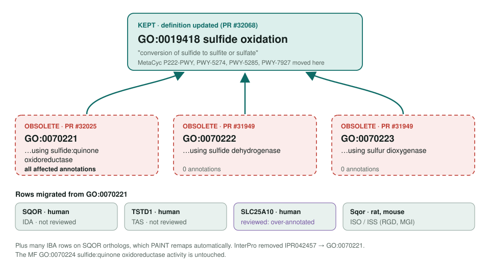
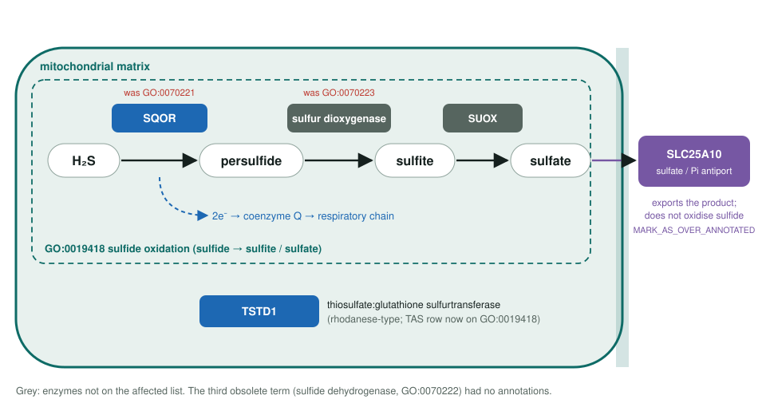

<!-- _class: lead -->

# Sulfide oxidation children obsoletion

GO:0070221 · GO:0070222 · GO:0070223 → GO:0019418 sulfide oxidation

AI Gene Review · projects/SULFIDE_OXIDATION_OBSOLETION · 2026

---

<!-- _class: bluf -->

## Bottom line

- GO **obsoleted three enzyme-specific children** of sulfide oxidation; all three ontology PRs are **merged**.
- Only **GO:0070221** (via SQOR) had annotations: human SQOR (IDA), TSTD1 (TAS), SLC25A10 (TAS), plus rodent Sqor ISO/ISS.
- **Partly done:** SLC25A10 is now reviewed (row on GO:0019418, over-annotated); **SQOR and TSTD1 are unreviewed**.

---

## Three children collapse into the parent

---

## Why the children went

- Each child named **the enzyme that does the oxidation**, which is more specific than any gene product needs.
- **GO:0070222** and **GO:0070223** had **zero** direct annotations.
- The mechanism stays expressible through the MF, e.g. **GO:0070224** sulfide:quinone oxidoreductase activity.
- Upstream cleanup: InterPro dropped **IPR042457 → GO:0070221**; Reactome migrated its 2 rows; IBA rows follow PAINT.

---

## Who does the oxidising

---

## State in this repo

| Gene | Former row / current state | Current review state |
|---|---|---|
| SQOR (Q9Y6N5) | IDA + IBA | none |
| TSTD1 (Q8NFU3) | TAS + IEA | none |
| SLC25A10 (Q9UBX3) | TAS, now on GO:0019418 (Reactome) | `genes/human/SLC25A10`: MARK_AS_OVER_ANNOTATED |

SLC25A10 was reviewed in the mitochondrial carrier work (#2093), after this page was written. The carrier exchanges sulfate and thiosulfate for phosphate; it does not oxidise sulfide.

---

## Next steps

1. `just fetch-gene human SQOR`: anchor MF on GO:0070224 and BP on GO:0019418; SQOR deficiency makes it clinically relevant.
2. Then **TSTD1**: is GO:0019418 right for a thiosulfate sulfurtransferase, or was the TAS weak?
3. Leave S. pombe hmt2 and bacterial homologs to IBA remapping.

**Upstream:** go-annotation#6388 (closed) · go-ontology#31842 (closed) · PRs #31949, #32025, #32068 (merged)

**Read more:** `projects/SULFIDE_OXIDATION_OBSOLETION.md`
