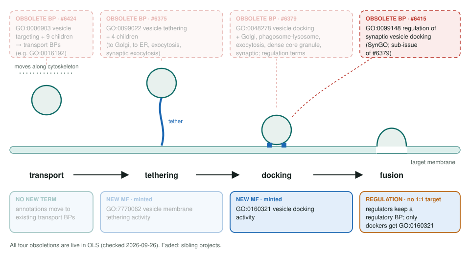
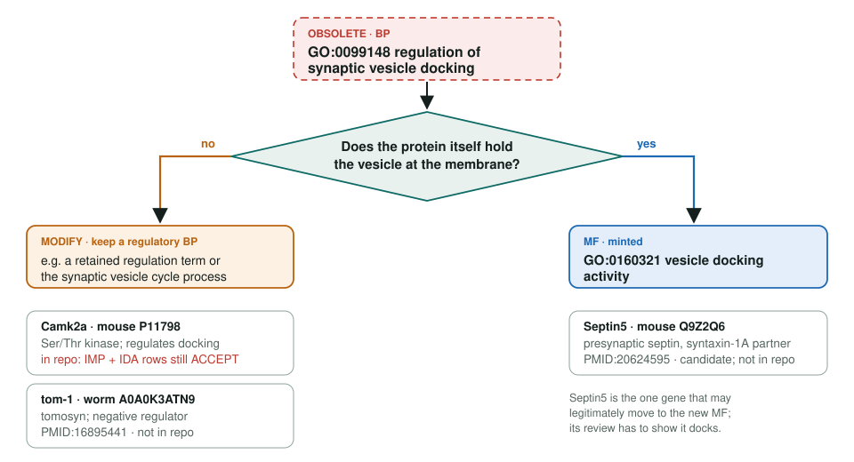

<!-- _class: lead -->

# Regulation of synaptic vesicle docking obsoletion

GO:0099148 retired as docking becomes a molecular function, GO:0160321

AI Gene Review · projects/SYNAPTIC_VESICLE_DOCKING_OBSOLETION · 2026

---

<!-- _class: bluf -->

## Bottom line

- GO now treats vesicle docking as a **molecular function** (GO:0160321); **GO:0099148** regulation of synaptic vesicle docking is **obsolete**.
- Its SynGO rows sit on **Camk2a, Septin5 and tom-1**; a regulator should **not** inherit the docking MF.
- **Camk2a fixed in #3237 (open):** both GO:0099148 rows → MODIFY to **GO:0048172** regulation of short-term neuronal synaptic plasticity, not the docking MF.

---

## Where this term sits in the vesicle refactor

---

## Why docking became a function

- Upstream reason: the term **"represents a molecular function"**, the binding activity of a docking protein.
- GO:0160321 is defined as binding that **stably attaches a vesicle** to its target membrane; it sits after tethering (**GO:7770062**) and before fusion.
- A *regulation of* process has **no 1:1 MF counterpart**, so each gene needs its own decision.
- Upstream spreadsheet: SynGO's 8 rows on GO:0099148, plus about 60 IEA ortholog rows that follow automatically.

---

## Regulator or docker?

---

## State in this repo

| Gene | Rows on GO:0099148 | Review here |
|---|---|---|
| Camk2a (mouse P11798) | IMP + IDA, PMID:17660813 | ACCEPT → **MODIFY** GO:0048172 (#3237, open) |
| Septin5 (mouse Q9Z2Q6) | IMP + IDA, PMID:20624595 | none |
| tom-1 (worm A0A0K3ATN9) | IMP ×2 + IDA ×2, PMID:16895441 | none |

Rat Camk2a and Septin5 carry ISO copies (RGD). #3237 also replaced the tangential Camk2a supporting text with the abstract's sentences on docked-vesicle number and short-term presynaptic plasticity.

---

## Next steps

1. Merge **#3237** (Camk2a → GO:0048172).
2. Review **Septin5** (then human SEPTIN5, Q99719): the one candidate for GO:0160321.
3. Review **tom-1** as the negative-regulator case.

**Siblings:** `VESICLE_DOCKING_OBSOLETION` (parent, #6379) · `VESICLE_TETHERING_OBSOLETION` (#6375) · `VESICLE_TARGETING_OBSOLETION` (#6424)
**Upstream:** go-annotation#6415 · go-ontology#31880
