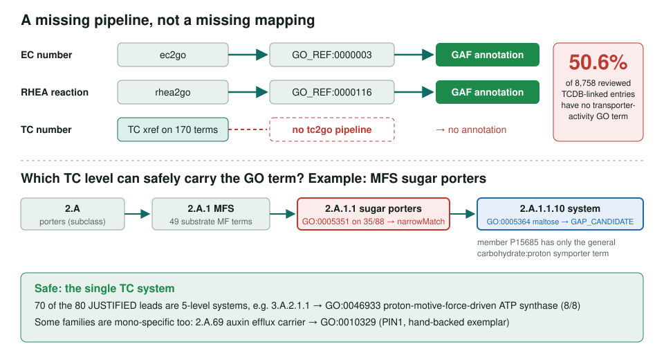
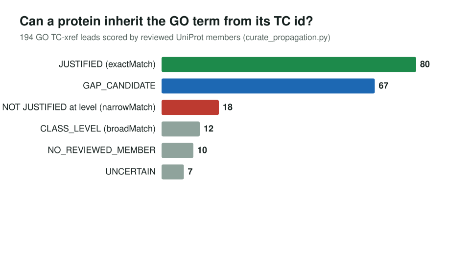

<!-- _class: lead -->

# TCDB to GO

Why transporter classifications never become GO annotations, and a scored starter set for a `tc2go` pipeline

AI Gene Review · projects/TCDB · 2026

---

<!-- _class: bluf -->

## Bottom line

- GO already links TC numbers to **170 MF terms**, but has **no `tc2go` pipeline**, so **50.6%** of reviewed TCDB-linked transporters (4,431 of 8,758) lack any transporter-activity term.
- We scored all **194** GO TC-to-GO leads against reviewed UniProt members: **80 safe to propagate** (70 at single-system level), 18 over-propagate, 67 point to missing specific terms.
- Four validated SSSOM sets, including 477 filtered rows from TCDB's own GO dump and 8 hand-backed exemplars.

---

## A missing pipeline, and which TC level is safe

---

## Why transporters

- TCDB is the **IUBMB-adopted** transporter classification; `class.subclass.family.subfamily.system`.
- EC and RHEA reach proteins via `ec2go` / `rhea2go`; TC has **term xrefs only**.
- TCDB's own `go.py` dump (34,497 rows) is **mostly CC/BP and noise**: only 13% of rows are transporter-activity MF; `protein binding` appears 452 times.

---

## Scoring the 194 leads

JUSTIFIED: ≥2 reviewed members and ≥70% carry the term. GAP_CANDIDATE: a specific system whose members all lack it (tested first).

---

## Hand-backed exemplars (`tc2go.sssom.yaml`)

| TC | GO term | Verdict | Backing protein |
|---|---|---|---|
| 2.A.22.1.1 SERT | GO:0005335 | exactMatch | SLC6A4 P31645 |
| 3.A.3.1.1 Na⁺/K⁺-ATPase | GO:0005391 | exactMatch | ATP1A1 P05023 |
| 2.A.69 AEC | GO:0010329 auxin efflux | exactMatch | PIN1 Q9C6B8 |
| 1.A.8 MIP | GO:0015250 water | narrowMatch | aquaglyceroporins differ |
| 2.A.17 POT/PTR | GO:0015112 nitrate | narrowMatch | CHL1/NRT1.1 Q05085 |
| 2.A.18 AAAP | GO:0010328 auxin influx | narrowMatch | AUX1 Q96247 |

Two more narrowMatch rows: 2.A.36 CPA1 (SOS1) and 2.A.38 Trk (HKT1 as counter-example).

---

## Status and next steps

- Complete: GO xrefs extracted and scored; `go.py` characterised; reverse gap quantified
- Complete: Four SSSOM sets pass `just validate-tcdb-mappings`
- Next: Package the 80 JUSTIFIED leads as a proposed `tc2go` pipeline for GO
- Next: Push the 67 GAP_CANDIDATE leads through gene review; closure-aware reverse gap
- Next: Rebuild the generated set at subfamily/system level

**Read more:** `projects/TCDB.md` · `projects/TCDB/tc2go.propagation.sssom.yaml` · `projects/TCDB/TCDB-METHODOLOGY.md`
