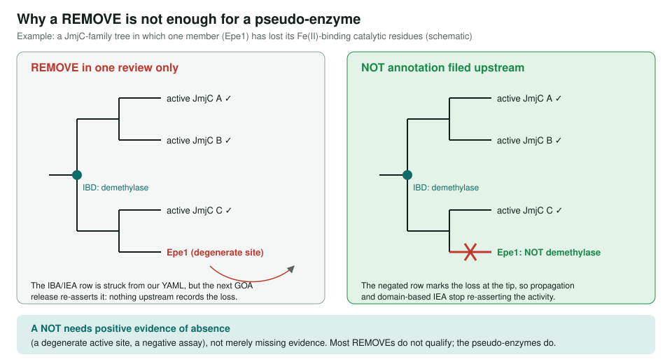
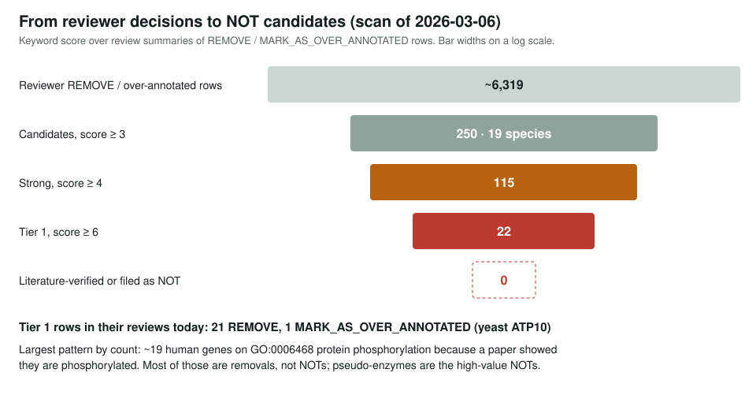

<!-- _class: lead -->

# Top-Nots

Mining ~6,300 reviewer REMOVE decisions for candidate NOT annotations

AI Gene Review · projects/TOP_NOTS · 2026

---

<!-- _class: bluf -->

## Bottom line

- A **NOT annotation** is the only way to stop pipelines re-asserting a wrong activity; a REMOVE cleans one review.
- A keyword score over ~6,319 REMOVE/over-annotated rows found **250 candidates in 19 species**, **115 strong**, **22 Tier 1**.
- None has yet been **literature-verified or filed** as a NOT: this is a worklist, not a submission.

---

## Why a REMOVE is not enough

---

## How candidates were found

- Scan every `*-ai-review.yaml` for `REMOVE` or `MARK_AS_OVER_ANNOTATED`.
- Score the review summary for negative-evidence phrases: *"does not have"*, *"lacks catalytic"*, *"pseudoenzyme"*, *"no detectable activity"*, *"does not catalyze"*, *"no intrinsic"*.
- **≥ 6** very high confidence · **4–5** strong · **3** moderate, manual review.
- A keyword hit is a lead: a formal NOT needs **positive evidence of absence**.

---

## The funnel

---

## Tier 1 examples

| Gene | Wrong term | Why it is absent |
|---|---|---|
| DROME CG6051 | PI3P phosphatase (IEA) | FYVE protein: binds PI3P, has no phosphatase activity |
| ANOGA PGRPS1 | amidase (IBA) | lacks the zinc-binding residues |
| human AKTIP | ubiquitin-conjugating enzyme (IBA) | UEV domain lacks catalytic cysteine |
| human PLD5 | catalytic activity (IEA) | lacks conserved HKD motifs |
| yeast YDJ1 | ATP binding (IEA) | DnaJ stimulates Hsp70 ATPase, binds no ATP |
| human SURF1 | cytochrome-c oxidase (IEA) | assembly factor, not the enzyme |
| human RASA1 | GTPase activity (TAS) | GAP: stimulates Ras, no intrinsic GTPase |

---

## Patterns

1. **Pseudo-enzymes** (highest value): Epe1, PLD5, AKTIP, AIP, CG6051, CPT1C, Pld4.
2. **Domain ≠ function**: dockerins as hydrolases; DnaJ domains as ATP-binding (YDJ1, DNAJA2, DNAJA4, Dnaja3, DnaJ).
3. **"Is phosphorylated" ≠ "does phosphorylation"**: ~19 human genes on `GO:0006468`. Largest by count, but mostly **removals, not NOTs**.
4. **Assembly factor ≠ complex activity**: SURF1, ATP10, IDH3B, Ccs.
5. **Upstream regulator ≠ direct activity**: EGFR as MAP3K; RASA1 as GTPase.

---

## Status and next steps

- ✅ Scan, scoring, pattern categories; 250 candidates ranked.
- ⬜ Verify the literature behind each Tier 1 negative claim.
- ⬜ Add `negated: true` proposals to review YAML for confirmed cases.
- ⬜ Fix the DnaJ ATP-binding class at the InterPro2GO mapping level; file a GO tracker issue for the phosphorylation class.
- ⬜ Systematic pseudo-enzyme screen (degenerate active-site motifs).

**Read more:** `projects/TOP_NOTS.md` · related `projects/PSEUDOENZYMES.md`, `projects/PAINT.md`
