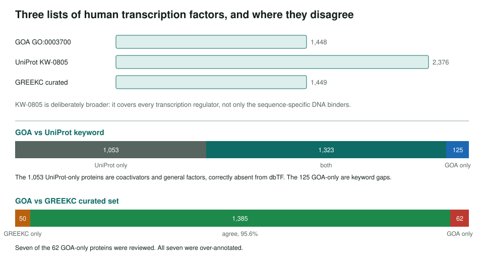
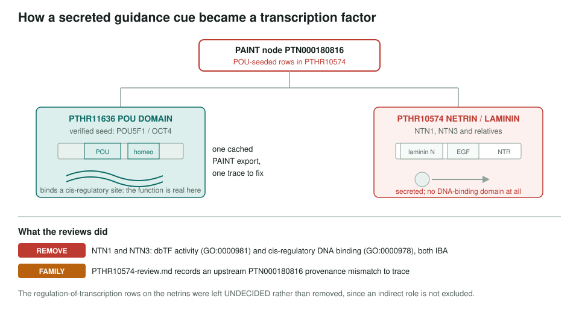

<!-- _class: lead -->

# Human dbTF annotations

### A DNA-binding domain is not a transcription factor

AI Gene Review · `projects/TRANSCRIPTION_FACTORS/`

---

<!-- _class: bluf -->

## Bottom line

- A February 2026 comparison used **1,447** GOA dbTF proteins (`GO:0003700` and descendants) and **1,449** GREEKC dbTFs; the two agree on **1,385**, or **95.6%**
- Seven of the 62 GOA-only proteins were reviewed in detail: six carried dbTF/cis-regulatory over-annotations and NME2 was retained as a non-core G-quadruplex regulator
- The false-negative direction is clean: ID1-4, the NCOA coactivators and homeobox-fold ceramide synthases are all correctly excluded

---

## The distinction that gets lost

A **dbTF** binds a specific DNA sequence and regulates transcription from it.

Two other things are routinely confused with it:

- **coTF** — a coactivator or corepressor. Acts on transcription, does not bind the site. `GO:0003713` / `GO:0003714`.
- **GTF** — a general factor or Mediator subunit. Part of the machinery, not a sequence-specific regulator.

And a **DBD alone proves nothing**: ceramide synthases carry a homeobox-like fold, the ID proteins carry a bHLH without its basic region.

---

## Three lists, three scopes

---

## What the seven reviews found

The 62 proteins GOA calls dbTF and GREEKC does not include enzymes (HDAC4, ABHD2), a noncanonical G-quadruplex regulator (NME2), a ribosomal protein (RPS3), RFX complex scaffolding subunits (RFXAP, RFXANK), and two secreted guidance molecules (NTN1, NTN3).

Reviewed outcomes:

| Gene | Row | Action |
|---|---|---|
| NTN1, NTN3 | dbTF activity, cis-regulatory DNA binding (IBA) | REMOVE |
| HDAC4 | activator; cis-regulatory DNA binding (IDA) | MODIFY → `GO:0003713`; MODIFY → `GO:0000976` |
| RPS3 | DNA-binding transcription activator activity (IMP) | MODIFY → `GO:0003713` |
| RFXAP | activator and regulatory-region DNA binding (IDA) | MODIFY → `GO:0003713` |
| RFXANK | activator; regulatory-region DNA binding (IDA) | MODIFY → `GO:0003713`; REMOVE |
| NME2 | DNA-binding transcription activator activity (IDA) | KEEP_AS_NON_CORE |

---

## One node, two families

---

## What the netrin case shows

The IBA `WITH/FROM` list is entirely POU domain proteins: POU2F1, POU1F1, POU5F1, POU4F1-3 and their fly, mouse, rat and worm orthologs.

- Netrins sit in **PTHR10574**; the verified POU5F1 seed sits in **PTHR11636**
- Netrins are secreted axon-guidance cues with laminin N, EGF and NTR domains and **no DNA-binding domain**
- The POU-seeded rows are present in the cached **PTHR10574** export; whether the mismatch came from tree placement, identifier mapping or export assembly still needs upstream tracing

Recorded in the family review `interpro/panther/PTHR10574/PTHR10574-review.md`.

---

## Evidence, and what is left to check

Of the 1,448 dbTF-annotated proteins in the raw QuickGO extraction, **945 have IEA-only support**. That is the pool where a machine-learning second pass could add something.

Planned but not run:

- DeepTFactor over the 945 IEA-only proteins, with saliency maps checked against Pfam DBD positions
- The remaining 55 of the 62 GOA-only proteins
- The 50 GREEKC-only proteins, mostly zinc fingers, as candidate false negatives
- MEIOSIN (C9JSJ3), the one bHLH-domain protein whose exclusion is unresolved

---

## Status

**Done:** three-way set comparison (GOA, UniProt KW-0805, GREEKC); seven gene reviews; the PTHR10574 family review; a synthesized guideline document.

**Files:** `projects/TRANSCRIPTION_FACTORS.md` (objective, workflow, tooling plan) and, in `projects/TRANSCRIPTION_FACTORS/`:

- `dbTF-discrepancy-analysis.md` — the set comparisons and evidence-code breakdown
- `greekc-goa-comparison.md` · `PANTHER-IBA-error-report.md`
- `tf-synthesized-guidelines.md` · `human-dbTF-list.tsv` and the diff files

**Open:** the ML pass, 105 unreviewed discrepant proteins, and a cross-check against TFCheckpoint 2.0.
