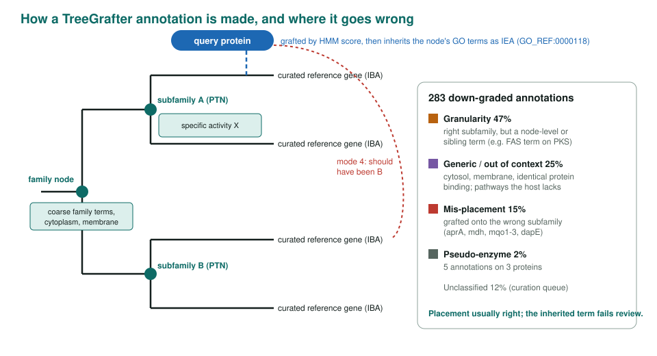
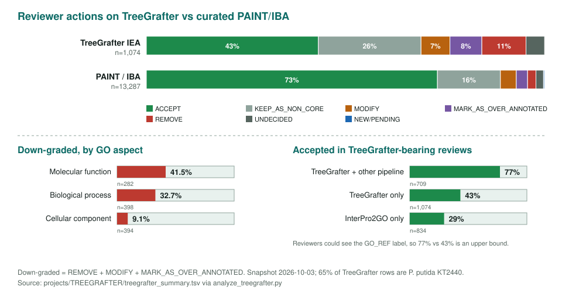

<!-- _class: lead -->

# TreeGrafter inference evaluation

How reviewers treated 898 automated PANTHER-graft GO annotations

AI Gene Review · projects/TREEGRAFTER · snapshot 2026-09-06

---

<!-- _class: bluf -->

## Bottom line

- Reviewers **accepted 41%** of TreeGrafter IEA annotations (`GO_REF:0000118`) as-is, against **72%** for curated PAINT/IBA; molecular-function terms were worst (**52% down-graded**).
- When another pipeline reproduced the call (`GO_REF:0000120`), acceptance rose to **77%**, an upper bound because reviewers saw the label.
- In **five of six** failures the graft placement was fine and the **inherited term** was wrong; errors cluster in a few PANTHER families.

---

## TreeGrafter is not PAINT

| | PAINT / IBA | TreeGrafter |
|---|---|---|
| Applies to | genes **in** the reference tree | sequences **grafted onto** it |
| Made by | curators | fully automated |
| Evidence / reference | IBA, `GO_REF:0000033` | IEA, `GO_REF:0000118` |
| Assigned by | GO_Central | TreeGrafter |

`GO_REF:0000120` is UniProt's merge of identical calls from several pipelines, so `GO_REF:0000118` rows are the TreeGrafter calls no other pipeline reproduced.

---

## How a graft annotation is made

---

## What reviewers did with them

---

## Family hotspots: upstream tickets

| Family | n | Down-graded | Problem |
|---|---:|---:|---|
| PTHR10543 beta-carotene dioxygenase | 8 | 100% | stilbene dioxygenases on the carotenoid subfamily |
| PTHR30443 EptA | 8 | 100% | node carries LPS core instead of pEtN transferase (mcr-1..4) |
| PTHR43775 fatty acid synthase | 4 | 100% | FAS term on PKS subfamilies (eryAI-III, Pks1) |
| PTHR43128 L-2-hydroxycarboxylate DH | 4 | 100% | MDH grafted onto the L-LDH subfamily |
| PTHR11558 spermidine synthase | 9 | 67% | spermidine terms on the PMT subfamily |

29 of 63 families with at least four reviewed annotations had half or more down-graded. Full table: TREEGRAFTER/treegrafter_family_hotspots.tsv

---

## Caveats

- ~70% of rows come from the ***P. putida* KT2440** batch; rates are directional.
- The reference is the AIGR corpus (AI-assisted, mixed maturity).
- Tables are **frozen at 2026-09-06**; at least 63 more `GO_REF:0000118` rows have landed since.
- `KEEP_AS_NON_CORE` is not an error: accept + non-core gives ~63% (TreeGrafter) vs ~88% (IBA).

---

## Status and next steps

- ✅ 898 annotations tallied; 306 down-grades classified into failure modes; family hotspots listed.
- ⬜ Send the hotspot families to PAINT / PANTHER as tickets.
- ⬜ **Blind the corroboration test** (hide `original_reference_id`).
- ⬜ Hand-curate the 66 keyword-placed failure-mode rows; broaden beyond *P. putida*.

**Read more:** `projects/TREEGRAFTER.md` · `TREEGRAFTER/failure-modes.md` · `analyze_treegrafter.py`
