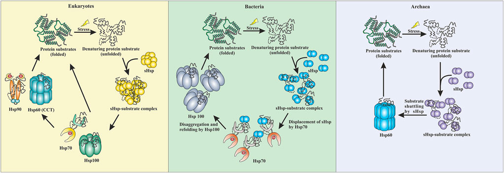
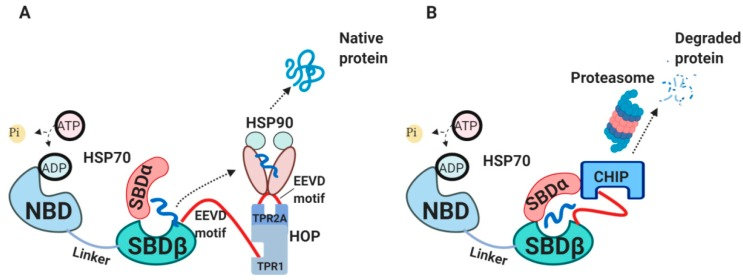

<!-- _class: lead -->

# Unfolded Protein Binding
# Annotation Review

**Reclassifying GO:0051082 & GO:0031249**

Chris Mungall | AI-Assisted Gene Review
2026-02-14

---

## The Problem

**GO:0051082** "unfolded protein binding" and **GO:0031249** "denatured protein binding" proposed for obsoletion ([go-ontology#30962](https://github.com/geneontology/go-ontology/issues/30962))

These terms conflate mechanistically distinct activities under a single "binding" label:

- ATP-dependent **foldases** that actively refold clients
- ATP-independent **holdases** that prevent aggregation in situ
- **Disaggregases** that solubilize existing aggregates
- **Sensors** that recognize misfolded proteins for degradation
- **Co-chaperones** that modulate chaperone ATPase cycles

---

## The Holdase-Foldase Network

Conserved across all domains of life: stress unfolds proteins; **sHSPs (holdases)** capture them to prevent aggregation; clients are handed off to **Hsp70 (foldase)** for ATP-dependent refolding, or to **Hsp100 (disaggregase)**. Eukaryotes also use Hsp90 and Hsp60/CCT.

<small>Figure 3 from <a href="https://doi.org/10.3389/fmolb.2022.832160">Luo et al. (2022) <i>Front Mol Biosci</i> 9:832160</a>, CC-BY 4.0</small>

---

## The Proteostasis Triage Decision

**(A)** HSP70-HOP-HSP90 axis: fold-forward pathway to native protein.
**(B)** HSP70-CHIP axis: ubiquitination and proteasomal degradation.

Co-chaperones (DNAJ, NEFs, BAG1/3) tune the **fold vs degrade** decision.

<small>Figure 2 from <a href="https://doi.org/10.3390/cells9030587">Radons (2020) <i>Cells</i> 9:587</a>, CC-BY 4.0</small>

---

## Recent Literature Context

Key reviews informing this reclassification:

- [**Mitra et al. (2022)**](https://doi.org/10.1146/annurev-biophys-090121-082906) *Annu Rev Biophys* 51:409 — ATP-independent chaperones; force-clamp experiments show context-dependent holdase/foldase switching
- [**Bhattacharjee et al. (2025)**](https://doi.org/10.1007/s12038-025-00506-6) *J Biosci* — Co-chaperones fine-tune HSP70: fold, hold, or degrade; O-GlcNAc modification of HSP27 promotes BAG3-mediated refolding
- [**Boopathy (2024)**](https://doi.org/10.1038/s44318-024-00333-9) — HUWE1 + HSP70 cooperate to clear nuclear inclusions, linking holdase activity to E3-mediated clearance
- [**Le et al. (2024)**](https://doi.org/10.1016/j.mocell.2023.12.001) *Mol Cells* — UBR1/UBR2 as ER-stress sensors: substrate load stabilizes these E3s to enhance PQC

---

## Scope of This Review

| Metric | Count |
|--------|-------|
| Unique genes reviewed | **148** |
| Human genes (primary) | 33 |
| Non-human genes | 115 |
| Species covered | 17 |
| Total annotations reviewed | **5,529** |
| Remaining PENDING | **0** |

All experimental annotations to GO:0051082/GO:0031249 across all species.

---

## Mechanism Classes

| Class | GO term | ATP? | Example |
|-------|---------|------|---------|
| **Foldase** | [GO:0044183](https://www.ebi.ac.uk/QuickGO/term/GO:0044183) | Yes | GroEL/ES, TRiC/CCT |
| **Holdase** | *NTR needed* | No | CRYAB, CLU |
| **Carrier-holdase** | [GO:0140309](https://www.ebi.ac.uk/QuickGO/term/GO:0140309) | No | Tim9-Tim10 |
| **Foldase/holdase** | GO:0044183 + holdase NTR | Yes | HSPA1A (HSP70) |
| **Co-chaperone** | *(see gap)* | N/A | DNAJB1, AHSA1 |
| **Disaggregase** | [GO:0140545](https://www.ebi.ac.uk/QuickGO/term/GO:0140545) | Yes | HSP104, HSPA1A |
| **Sensor** | *NTR proposed* | N/A | SYVN1, UGGT1 |

---

## Decision Rules

| Mechanism | Action | Replacement |
|-----------|--------|-------------|
| Foldase (GroEL, TRiC) | MODIFY | [GO:0044183](https://www.ebi.ac.uk/QuickGO/term/GO:0044183) |
| Foldase/holdase (HSP70) | MODIFY | GO:0044183 *(holdase NTR pending)* |
| Co-chaperone, J-domain | MODIFY | GO:0044183 *(interim)* |
| Holdase (sHSP, crystallin) | MODIFY | holdase NTR *(retain GO:0051082)* |
| Disaggregase | MODIFY | [GO:0140545](https://www.ebi.ac.uk/QuickGO/term/GO:0140545) |
| ER/QC sensor | REMOVE | *(not chaperones)* |
| HSP90 co-chaperone | OVER_ANNOTATED | *(not direct UPB)* |

---

## Impact: Human Genes (n=33)

| Primary action | Count | Notes |
|----------------|-------|-------|
| MODIFY to GO:0044183 (foldase) | 16 | HSP70 (6), J-domain interim (4), prefoldin (6) |
| MODIFY to holdase NTR | 7 | sHSPs, CLU, SCG5, DNAJB6, DNAJB8 |
| MODIFY to other specific MF | 2 | NPM1, AIP |
| MARK_AS_OVER_ANNOTATED | 5 | Sensor/co-chaperone cases |
| REMOVE | 3 | SYVN1, ERLEC1, GRPEL1 |

Plus 3 co-annotations to [GO:0140545](https://www.ebi.ac.uk/QuickGO/term/GO:0140545) (disaggregase): HSPA1A, HSPA1B, HSPA8

---

## Before/After Examples

| Gene | Before | After | Why |
|------|--------|-------|-----|
| HSPA1A | GO:0051082 | GO:0044183 + GO:0140545 | ATP-dependent foldase + disaggregase |
| CRYAB | GO:0051082 | holdase NTR | sHSP holdase; prevents aggregation in situ |
| DNAJB1 | GO:0051082 | GO:0044183 *(interim)* | J-domain co-chaperone, not independent foldase |
| SYVN1 | GO:0051082 | REMOVE | E3 ligase; recognizes misfolded substrates |
| NPM1 | GO:0051082 | [GO:0140713](https://www.ebi.ac.uk/QuickGO/term/GO:0140713) | Histone chaperone; UPB was secondary |

---

## Critical Finding: The Holdase Gap

**[GO:0140309](https://www.ebi.ac.uk/QuickGO/term/GO:0140309)** "unfolded protein carrier activity" does **not** fit most holdases.

- Created Nov 2025 for TIM carrier-holdases (Tim9-Tim10) in [go-ontology#30552](https://github.com/geneontology/go-ontology/issues/30552)
- Definition requires escort "between two different cellular components"
- "holdase" is a **BROAD** synonym (not exact) on GO:0140309
- Val acknowledged a general holdase term was needed but deferred it

**7 human genes + HSPH1 are in-situ holdases** that prevent aggregation without inter-compartment escort. They cannot use GO:0140309.

---

## Proposed: "Holdase Chaperone Activity"

**Definition:** Binding to an unfolded or misfolded protein to prevent its aggregation without actively catalyzing refolding. The holdase maintains the client protein in a soluble, folding-competent state.

**Parentage:** Direct child of GO:0003674 (molecular_function).
[GO:0140309](https://www.ebi.ac.uk/QuickGO/term/GO:0140309) (carrier-holdase) becomes a child of this new term.

**Affected genes:** CRYAA, CRYAB, HSPB6, CLU, SCG5, DNAJB6, DNAJB8, HSPH1

**[GO:0051082](https://www.ebi.ac.uk/QuickGO/term/GO:0051082) obsoletion must be blocked until this NTR exists.**

---

## Other Ontology Gaps

**Misfolded protein sensor activity**
- Recognition of misfolded conformation for QC degradation
- CHIP/STUB1 ubiquitinates chaperone-bound clients; UBR1/UBR2 recognize N-degrons ([Le et al. 2024](https://doi.org/10.1016/j.mocell.2023.12.001))
- Affects: SYVN1, SAN1 (yeast), Fbxo2 (mouse)

**Co-chaperone MF representation**
- [GO:0003767](https://www.ebi.ac.uk/QuickGO/term/GO:0003767) "co-chaperone activity" deliberately obsoleted
- No MF term for J-domain co-chaperone function (ATPase activation + substrate delivery)
- [GO:0044183](https://www.ebi.ac.uk/QuickGO/term/GO:0044183) used as pragmatic interim
- Affects all J-domain proteins across species

---

## Cross-Species Validation

The same mechanism classes apply universally across 17 species.

| Species | Genes | Highlights |
|---------|-------|------------|
| *S. cerevisiae* | 67 | All 14 mechanism classes represented |
| *E. coli* | 13 | Periplasmic holdases (SurA, Skp, Spy, HdeA/B) |
| *D. melanogaster* | 7 | sHSPs Hsp22-27 |
| *M. musculus* | 6 | Hspa8 largest review (240 annotations) |
| *R. norvegicus* | 4 | Hspa5/BiP (101 annotations) |
| Other (12 spp.) | 18 | Zebrafish crystallins, CnoX redox holdase |

---

## Notable Cross-Species Findings

- **SlrP** (*S. typhimurium*): **misannotation removed** — T3SS effector E3 ligase, not a chaperone
- **CnoX** (*E. coli*): redox-activated holdase — becomes active under oxidative stress when Cys residues are oxidized
- **Peroxiredoxins** (TSA1, pmp20, tpx1): dual-function — peroxidase at low stress, holdase at high stress (overoxidation switch)
- **Assembly factors** (ATP10, PET100, COX20): single-client chaperones, not general UPB — all OVER_ANNOTATED
- **IRE1** (yeast + *T. reesei*): UPR sensor, not chaperone — cross-kingdom confirmation

---

## What We Need from GO Editors

1. **Holdase NTR (BLOCKING)**: Create "holdase chaperone activity" for in-situ holdases
2. **Block [GO:0051082](https://www.ebi.ac.uk/QuickGO/term/GO:0051082) obsoletion** until holdase NTR exists (7 genes have no replacement)
3. **Preferred labels**: "foldase" exact synonym on GO:0044183; "holdase" exact on new term
4. **Co-chaperone MF gap**: How should J-domain function be annotated?
5. **HSP70 dual annotation**: Confirm foldase + holdase per experimental context
6. **Misfolded protein sensor**: New term for SYVN1, SAN1, Fbxo2?

---

<!-- _class: lead -->

## Summary

**148 genes** across **17 species**, **5,529 annotations** reviewed

The key bottleneck is the **holdase NTR** — without it, 7+ genes
cannot be reannotated and GO:0051082 obsoletion is blocked.

All gene review YAMLs: `genes/<SPECIES>/<GENE>/`
Validate: `just validate-all`
