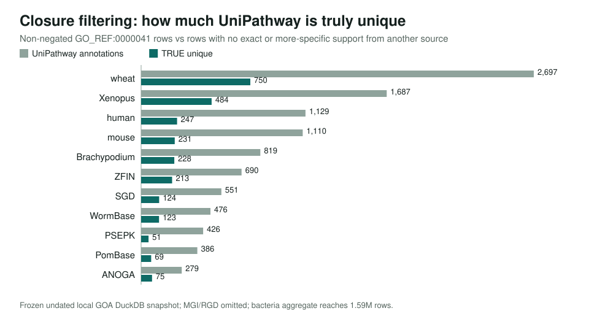
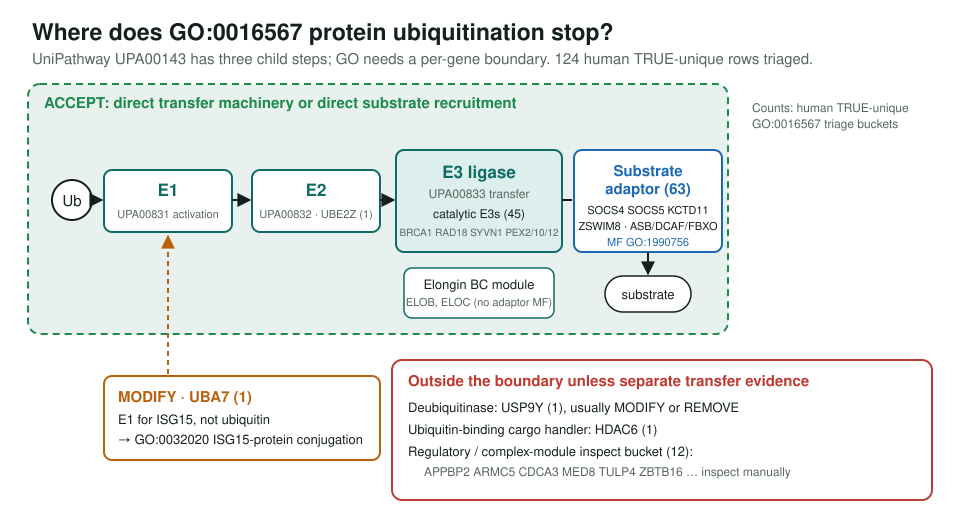
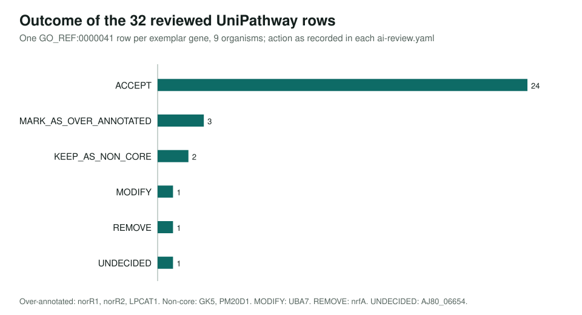

<!-- _class: lead -->

# UniPathway unique terms

Auditing GO_REF:0000041, a legacy pathway-vocabulary mapping, where it is the only source

AI Gene Review · projects/UNIPATHWAY · 2026

---

<!-- _class: bluf -->

## Bottom line

- **Closure filtering** removes rows already supported at the same or a more specific term: human UniPathway rows drop from **1,129 to 247** truly unique.
- **32 exemplar rows** across 9 organisms reviewed: **24 ACCEPT**. UniPathway is a net positive pathway gap filler, strongest in microbes.
- Errors are specific, not systemic: **UBA7** (ISG15, not ubiquitin) MODIFY; **nrfA** (not nitrate assimilation) REMOVE; **NorR** regulators over-annotated to denitrification.

---

## Why audit UniPathway

- `GO_REF:0000041` maps UniPathway pathways to GO BP terms. UniPathway is **archived and unmaintained**, yet its rows still sit in GOA.
- Question: is it a source to **trust, clean, or retire**?
- Same approach as the SPKW project: a row only counts as uniquely informative if **no other source** supports the gene at that term **or a descendant**.
- Review by biologically coherent **term groups** (ubiquitination, nitrogen cycle, plant cell wall), not random sampling.

---

## Most UniPathway rows are already covered

---

## The hard case: protein ubiquitination

---

## Nitrogen cycle: enzymes vs regulators vs wrong endpoint

| Gene (organism) | UniPathway term | Action |
|---|---|---|
| nirK1, nirK2, nosZ (*R. palustris*) | denitrification pathway | ACCEPT |
| Ferp_0128 (*Ferroglobus*) | denitrification pathway | ACCEPT |
| ureC1, ureC2 (*N. viennensis*) | urea catabolic process | ACCEPT |
| norR1, norR2 (*Cupriavidus*) | denitrification pathway | MARK_AS_OVER_ANNOTATED |
| nrfA (*Desulfotalea*) | nitrate assimilation | REMOVE |
| AJ80_06654 (fungus, singleton) | denitrification pathway | UNDECIDED |

nrfA is an ammonia-forming cytochrome c nitrite reductase (GO:0042279), a dissimilatory enzyme. NorR is an NO-responsive sigma-54 activator, not a pathway enzyme.

---

## Outcome across all exemplars

---

## Patterns

1. **Metabolic enzyme in its pathway → ACCEPT** (COX5B, catA, algE, Brachypodium PAL and UXS).
2. **Modification buckets need the mechanism**: E3s and substrate adaptors yes; UBL enzymes and DUBs no.
3. **Broad lipid parents** are correct but not core (GK5, PM20D1 non-core; LPCAT1 over-annotated).
4. **Regulators are not pathway enzymes** (norR1, norR2).
5. **Microbial signal dwarfs vertebrate**: 165,344 TRUE-unique bacterial rows vs 247 in human.

---

## Status and next steps

- Scans done: 13 single-species databases + 6 clade aggregates; **32 exemplar reviews** in `genes/`.
- Not yet done: full human `UPA00143` audit (124 genes), retinol/cholesterol CYP subset, bacterial denitrification set (615 rows, 530 taxa), nrfA nitrate-assimilation tail (14 rows).
- Recommendation: keep closure filtering as default; review microbial rows by term group.

**Read more:** `projects/UNIPATHWAY.md` · `genes/human/UBA7/` · `genes/DESPS/nrfA/`
