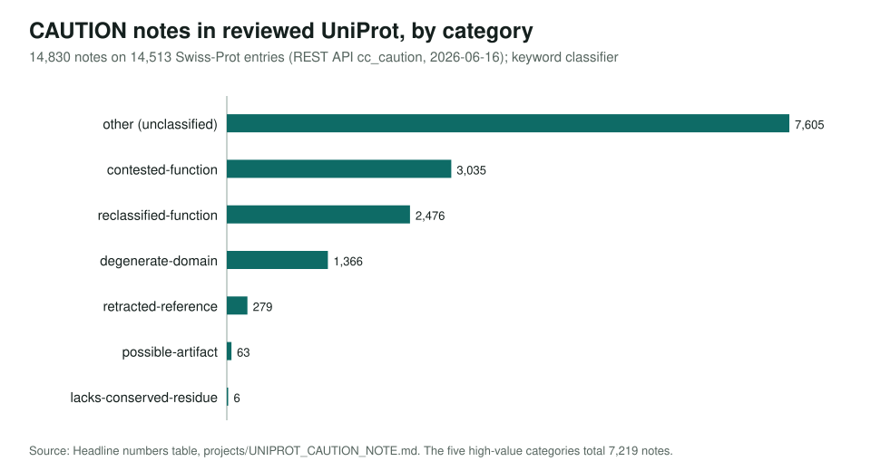
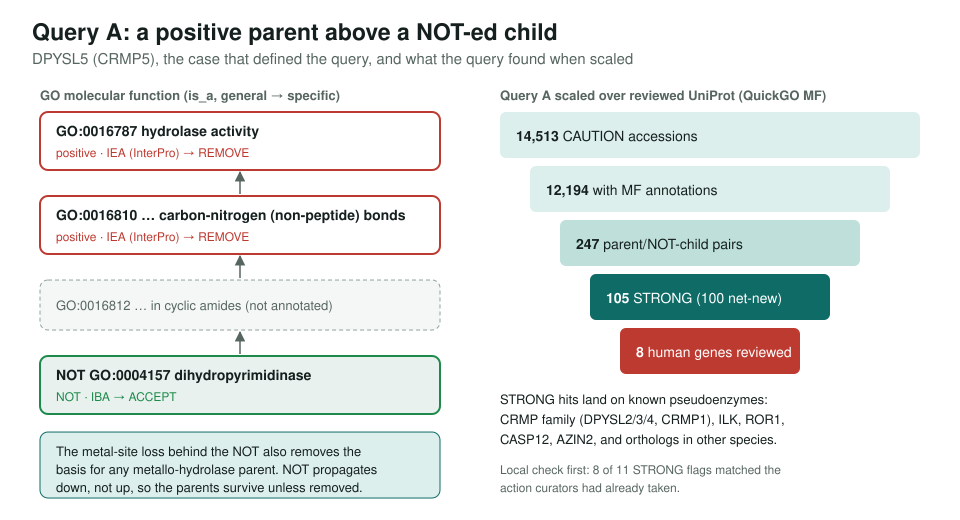

<!-- _class: lead -->

# UniProt CAUTION notes

Using curators' written warnings to find over-annotated GO functions

AI Gene Review · projects/UNIPROT_CAUTION_NOTE · 2026

---

<!-- _class: bluf -->

## Bottom line

- **14,830 CAUTION notes** on 14,513 reviewed UniProt entries; **7,219** flag contested, reclassified, pseudoenzyme, retracted or artifact functions.
- Two frozen Query A/B snapshots turn them into GO flags. Locally, strong flags matched curators' actions **8 of 11** times; UniProt-wide they **rediscovered known pseudoenzymes**.
- **13 human genes reviewed**; nine pseudoenzymes (CRMP family, ILK, ROR1, CASP12, AZIN2) each had an inferred catalytic row removed.

---

## What a CAUTION note is

- A free-text `CC -!- CAUTION:` comment in the UniProt flat file: the curator warns the reader.
- Distinct from the structured `SEQUENCE CAUTION` block (gene-model issues), which we exclude.
- Example (S. pombe Epe1): *"lacks the iron catalytic His … has no histone demethylase activity in vitro"*.
- These are exactly the cases where **IEA/IBA domain-to-function** mappings go wrong.

---

## What the notes are about

---

## Query A: positive parent, NOT-ed child

---

## Query B: the CAUTION paper, cited positively

- A CAUTION cites a PMID; GO uses the **same PMID** for a positive annotation, with no `NOT` from it.
- Frozen counts: 68 flags / 38 local genes; 1,140 UniProt-wide.
- Real catches: **CHMP1A** metallopeptidase from a mistranslated ORF (REMOVE); **ENDOU** serine peptidase from a refuted paper; **HDAC6** histone deacetylase.
- Over-flags: a paper makes several claims and only one is doubted. Needs activity-level matching, not PMID matching.

---

## Pseudoenzymes reviewed

| Gene | Removed inferred catalytic term | Real core role |
|---|---|---|
| DPYSL2/3, CRMP1, DPYSL5 | hydrolase activity (IEA) | cytoskeletal regulators, semaphorin signalling |
| DPYSL4 | cyclic-amide hydrolase (IBA); hydrolase parents UNDECIDED | same family |
| ILK | protein kinase activity | IPP-complex scaffold |
| ROR1 | protein kinase activity | Wnt coreceptor |
| CASP12 | cysteine-type peptidase activity | inflammasome modulator |
| AZIN2 | catalytic activity | antizyme inhibitor |

---

## Status and next steps

- Done: survey, 4,046-candidate worklist, Queries A/B local + UniProt-wide, **13 validated reviews**.
- Pending: report **9 local + 97 UniProt-wide** same-term GOA conflicts (positive and `NOT` on one term) upstream; audit **255** retracted-reference candidates; shrink the 7,605-note "other" bucket.
- Lesson: the GO `NOT` is the curated twin of a CAUTION. **CAUTIONs with no `NOT`** are the best targets.

**Read more:** `projects/UNIPROT_CAUTION_NOTE.md` · `projects/UNIPROT_CAUTION_NOTE/uniprot_wide_queries.md`
