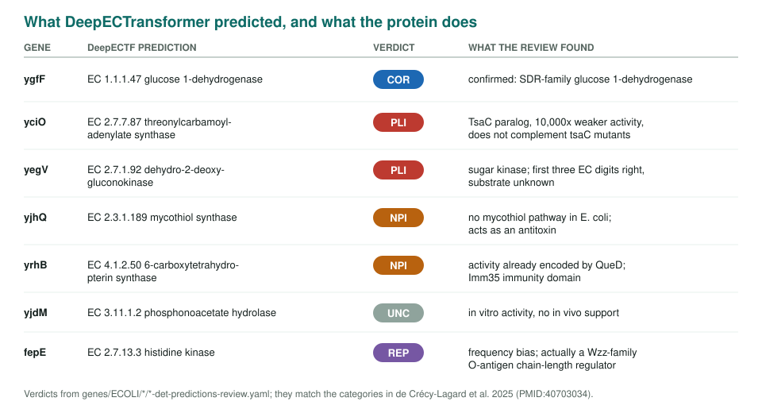
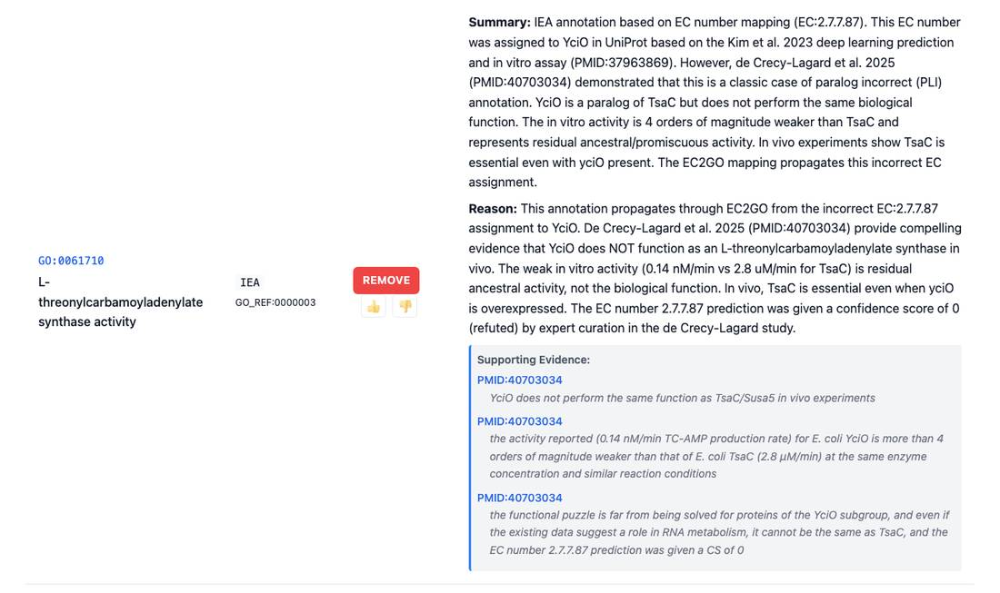
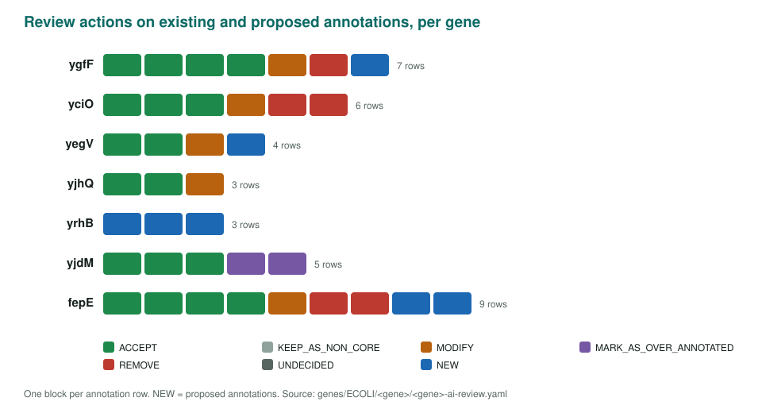

<!-- _class: lead -->

# Validating *E. coli* ML predictions

Seven gene reviews against an expert audit of DeepECTransformer

AI Gene Review · projects/VALIDATING_ECOLI_PREDICTIONS · 2026

---

<!-- _class: bluf -->

## Bottom line

- An expert audit (de Crécy-Lagard et al. 2025, PMID:40703034) found only **3 of 453** DeepECTransformer predictions for *E. coli* unknowns were **correct and novel**.
- We reviewed **7 genes** spanning five error categories; all 7 reviews are **complete** and our verdicts **match** the paper's.
- The same errors sit in **GOA**: yciO's TsaC activity rows and a fepE tyrosine-kinase IBA row were marked **REMOVE**.

---

## Why these seven

- The paper sorted every prediction into a taxonomy: **COR, CNN, LSP, UNC, PLI, NPI, REP**.
- We sampled across it to ask two questions:
  1. Does an agentic gene review reach the same verdict as the experts?
  2. Do the model's logic errors also appear in existing GO annotations?
- Each gene got a full `*-ai-review.yaml` plus a structured `*-det-predictions-review.yaml`.

---

## Prediction vs reality

---

## A paralog error, in GOA too

yciO review, shown: the IEA GO:0061710 threonylcarbamoyladenylate synthase row (GO_REF:0000003, propagated from the EC number) is marked REMOVE. Not in frame: the IDA row for the same term from the DeepECTF validation paper (PMID:37963869) is also REMOVE.

---

## Review actions across the seven genes

---

## Lessons

- **Paralogs** (yciO, yegV): a weak in vitro activity from a shared fold is not the biological function.
- **Pathway context** (yjhQ, yrhB): a predicted enzyme is wrong if the host lacks the pathway or already has the enzyme (QueD).
- **In vitro vs in vivo** (yjdM): phosphonoacetate hydrolase rows marked over-annotated.
- **Frequency bias** (fepE): "histidine kinase" for a Wzz O-antigen chain-length regulator.

---

## Status

- ✅ 7/7 gene reviews and prediction reviews complete (March 2026).
- The DeepECTF prediction table is browsable with the BioReason comparison material (`BIOREASON_COMPARISON/deepectf-eval.html`).

**Read more:** `projects/VALIDATING_ECOLI_PREDICTIONS.md` · `genes/ECOLI/<gene>/`
