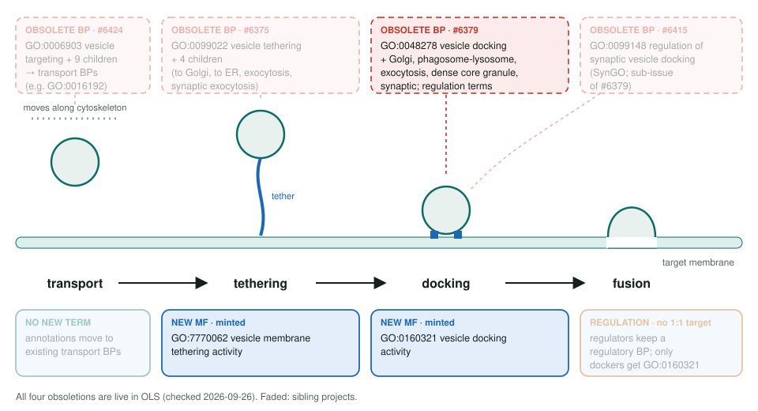
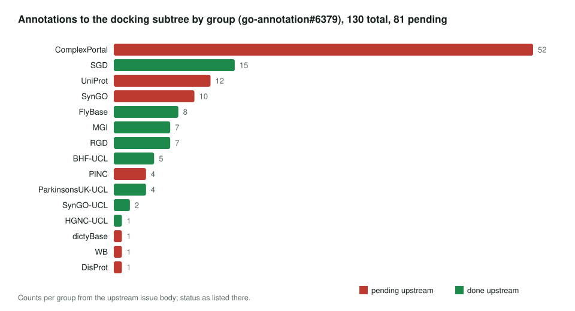

<!-- _class: lead -->

# Vesicle docking subtree obsoletion

GO:0048278 and 8 related process terms → MFs GO:0160321 docking and GO:7770062 tethering

AI Gene Review · projects/VESICLE_DOCKING_OBSOLETION · 2026

---

<!-- _class: bluf -->

## Bottom line

- GO **retired the vesicle docking process subtree** (9 terms) and minted two MFs: **GO:0160321** docking and **GO:7770062** tethering activity.
- This is the **parent tracker** (#6379): 130 upstream annotations, 96 still pending; siblings cover regulation, tethering and targeting.
- **Refresh fixed in #3237 (merged):** **USO1** → GO:7770062 tethering; **STX12** → GO:0005484 SNAP receptor activity, obsolete BP out of `core_functions`.

---

## Docking is one step of vesicle delivery

---

## Why a process became a function

- Upstream: each term **"represents a molecular function"**, the binding of a protein that attaches the vesicle to its target.
- The OLS text says annotations go to **GO:0160321 or GO:7770062**, so each row needs a choice between docking and tethering.
- *Regulation of vesicle docking* terms (GO:0106020-22) are obsolete too, with only a `consider` pointer to GO:0160321, so each regulatory row needs a curator's choice.
- Do not reuse **GO:0099023** vesicle tethering complex: it is a cellular component.

---

## Who holds the rows

---

## State in this repo

| Review | Obsolete term | Row | Action (#3237, merged) | New target |
|---|---|---|---|---|
| `human/USO1` (p115) | GO:0048211 Golgi vesicle docking | IBA | ACCEPT → MODIFY | GO:7770062 vesicle membrane tethering activity |
| `human/STX12` | GO:0048278 vesicle docking (also in `core_functions`) | IBA | ACCEPT → MODIFY | GO:0005484 SNAP receptor activity; core BP dropped |
| `mouse/Camk2a` | GO:0099148 (sibling tracker) | IMP, IDA | ACCEPT → MODIFY | GO:0048172 regulation of short-term neuronal synaptic plasticity |

STX12 was reviewed in June 2026 (#1217), after this page's impact scan. GOA `term.id`s stay as GOA supplies them; only actions and targets change.

---

## Next steps

1. **#3237** merged (USO1, STX12, plus Camk2a and TMF1 for the sibling trackers).
2. Queue new reviews: **STX1A, STXBP1, EXOC4, EXOC6, NSF**; yeast Uso1 and Sec1 later.

**Siblings:** `SYNAPTIC_VESICLE_DOCKING_OBSOLETION` (#6415) · `VESICLE_TETHERING_OBSOLETION` (#6375) · `VESICLE_TARGETING_OBSOLETION` (#6424) · ciliary, ER-PM, mito-ER trackers
**Upstream:** go-annotation#6379 · go-ontology#31880
