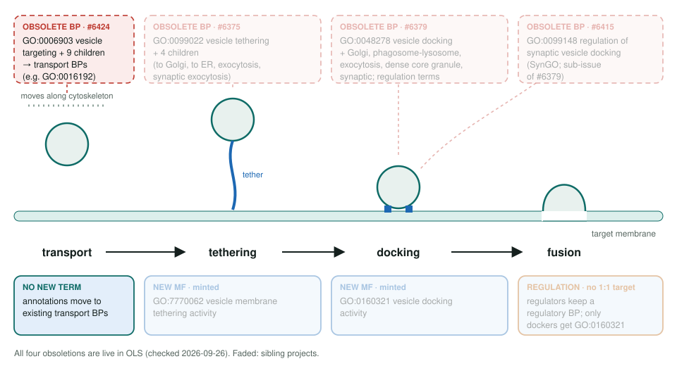
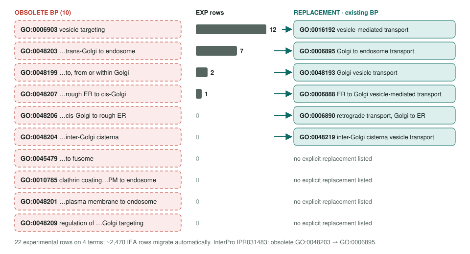

<!-- _class: lead -->

# Vesicle targeting obsoletion

GO:0006903 and 9 descendants → existing vesicle transport processes

AI Gene Review · projects/VESICLE_TARGETING_OBSOLETION · 2026

---

<!-- _class: bluf -->

## Bottom line

- GO **obsoleted vesicle targeting** (10 process terms): "targeting" versus "transport" was never applied consistently.
- **No new term:** 22 experimental rows on 4 terms move to existing transport BPs such as **GO:0016192** and **GO:0006895**.
- **Scoped, not started:** none of the queued human genes (YKT6, CLASP1/2, WIPI1, AP1AR) is reviewed; yeast **SPA2** keeps its row as non-core.

---

## Targeting is the step before tethering

---

## Ten terms, six replacements

---

## Why this one differs from its siblings

- Tethering and docking became **molecular functions** (GO:7770062, GO:0160321): a protein binds.
- Targeting did not: OLS says it is **redundant with GO:0016192**, a process that many activities contribute to.
- So each row is a **relabel to a transport BP**, and the review question is whether a more specific term fits.
- Example: **YKT6** is an R-SNARE; its SNARE MF says more than generic vesicle-mediated transport.

---

## State in this repo

| Gene | Row | Replacement | Review here |
|---|---|---|---|
| YKT6 (O15498) | IDA, GO:0006903 | GO:0016192 | none |
| CLASP1, CLASP2 | IMP, GO:0006903 | GO:0016192 | none |
| WIPI1 (Q5MNZ9) | IDA, GO:0048203 | GO:0006895 | none |
| AP1AR (Q63HQ0) | IDA, GO:0048203 | GO:0006895 | none |
| GLTP (Q9NZD2) | IMP, GO:0048207 (preprint) | GO:0006888 | none |
| yeast SPA2 | NAS, GO:0006903 (ComplexPortal) | GO:0016192 | KEEP_AS_NON_CORE |

---

## Next steps

1. `just fetch-gene human YKT6`; expect MODIFY toward the SNARE MF rather than a bare transport BP.
2. Then **CLASP1/CLASP2** as a pair, **WIPI1**, **AP1AR**; defer GLTP until the preprint is published.
3. Refresh **SPA2** once GOA moves its polarisome row to GO:0016192.

**Siblings:** `VESICLE_TETHERING_OBSOLETION` (#6375) · `VESICLE_DOCKING_OBSOLETION` (#6379) · `SYNAPTIC_VESICLE_DOCKING_OBSOLETION` (#6415)
**Upstream:** go-annotation#6424 · go-ontology#31865 (closed)
