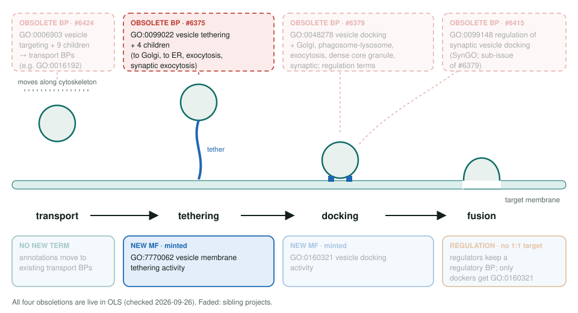
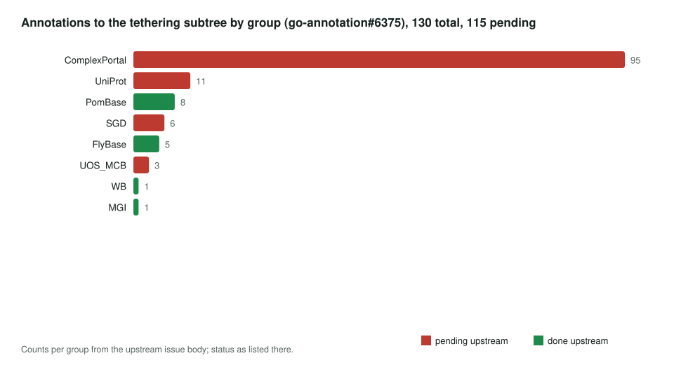
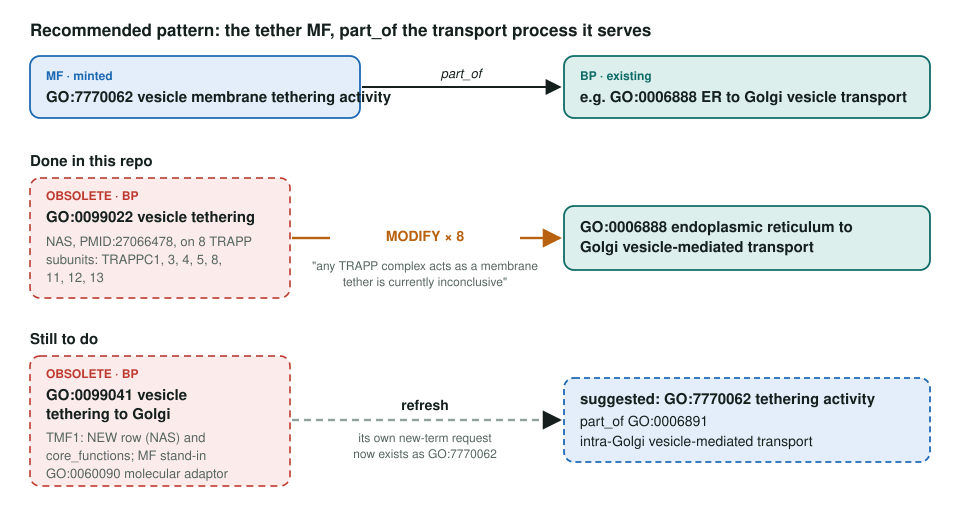

<!-- _class: lead -->

# Vesicle tethering subtree obsoletion

GO:0099022 and 4 children → MF GO:7770062 vesicle membrane tethering activity

AI Gene Review · projects/VESICLE_TETHERING_OBSOLETION · 2026

---

<!-- _class: bluf -->

## Bottom line

- GO **obsoleted vesicle tethering** (5 process terms) and minted **GO:7770062** vesicle membrane tethering activity.
- **8 TRAPP reviews** already MODIFY their obsolete GO:0099022 row to GO:0006888 ER to Golgi transport.
- **TMF1 fixed in #3237 (open):** its MF moves to **GO:7770062**, and the obsolete GO:0099041 row, core BP and new-term request are removed.

---

## Tethering is the first contact

---

## Why tethering became a function

- Upstream: the terms **represent a molecular function**, the bridging of vesicle and target membranes.
- Obsoleted: GO:0099022, **GO:0099041** to Golgi, GO:0099044 to ER, GO:0090522 exocytosis, GO:0099069 synaptic exocytosis.
- Pattern (ValWood): **MF part_of the transport BP**, e.g. GO:7770062 part_of GO:0006888.
- InterPro removed the exocyst mappings (IPR007225, IPR039682) and 2 UniRules to GO:0090522; IPR028280 → GO:0099041 was flagged too.

---

## Who holds the rows

---

## What changed in this repo

---

## Next steps

1. Merge **#3237** (TMF1 and USO1 → **GO:7770062**).
2. New reviews: **EXOC4, EXOC6** (exocyst; InterPro-flagged), then golgins **TRIP11, GOLGA5, GORAB**.
3. Keep wording consistent with the docking trackers; EXOC4 is shared, host it once.

**Siblings:** `VESICLE_DOCKING_OBSOLETION` (#6379) · `SYNAPTIC_VESICLE_DOCKING_OBSOLETION` (#6415) · `VESICLE_TARGETING_OBSOLETION` (#6424)
**Upstream:** go-annotation#6375 · go-ontology#31868, #31871, #31872, #31881
