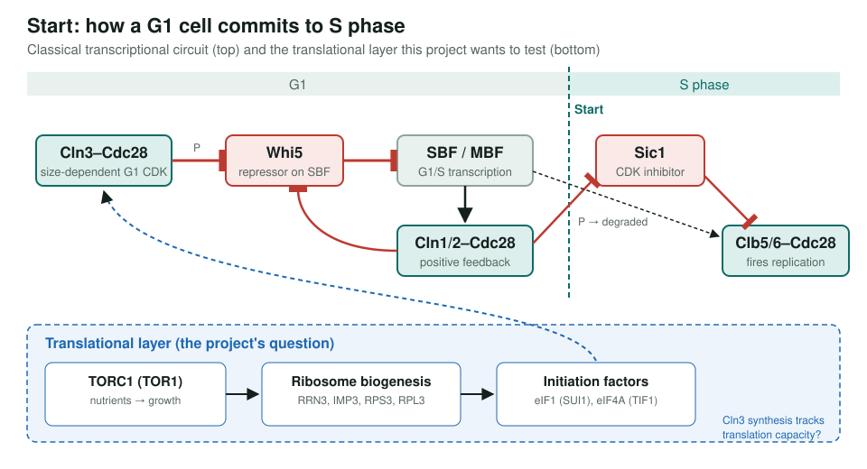
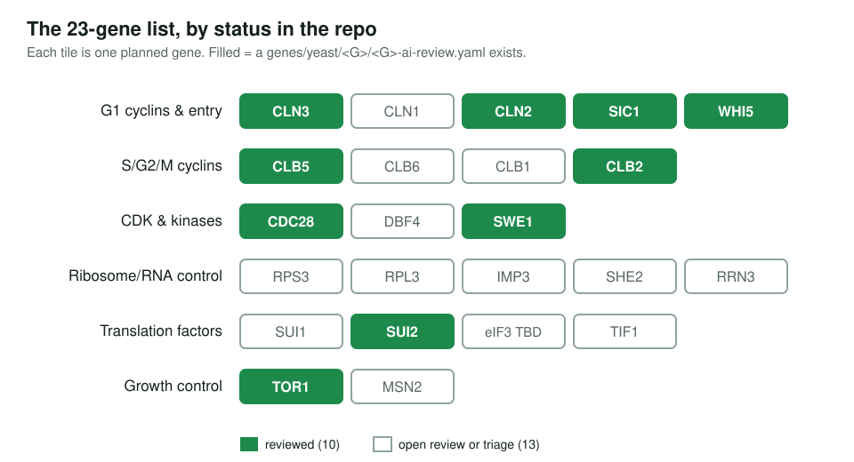

<!-- _class: lead -->

# Yeast cell cycle and translation control

A scoped review of 23 *S. cerevisiae* genes at the G1/S transition

AI Gene Review · projects/YEAST_CELL_CYCLE · scoping

---

<!-- _class: bluf -->

## Bottom line

- **Scoped, not yet started.** The plan is to review GO annotations for **23 genes** covering Start, the cyclins and CDK, and the translation machinery.
- The question: does GO capture **translational** control of the cell cycle as well as the transcriptional program?
- Status: **1 of 23** has a review (**TOR1**, 67 annotations); the other 22 have no folder yet.

---

## The circuit the project covers

---

## Why this set

- Start is one of the best-understood decision circuits in biology, so GO annotations can be checked against a clear mechanism.
- Recent work proposes that **translation capacity** (TORC1, ribosome biogenesis, initiation factors) helps time Start, a layer GO rarely links to the cell cycle.
- The review would separate **core cell-cycle functions** from **pleiotropic growth effects** that tend to be over-annotated to cell-cycle terms.

---

## Where the list stands

---

## Before starting

- **Fix the symbols.** Yeast eIF1 is `SUI1`; `EIF3` is a complex, not a gene; `EIF2A` needs checking. `SHE2` is listed as a ribosome biogenesis factor and its role should be confirmed.
- Run `just fetch-gene yeast <GENE>` for each gene, then deep research and review.
- Reuse the existing **TOR1** review (`genes/yeast/TOR1/`): 52 ACCEPT, 9 KEEP_AS_NON_CORE, 6 MARK_AS_OVER_ANNOTATED.

**Read more:** `projects/YEAST_CELL_CYCLE.md`
