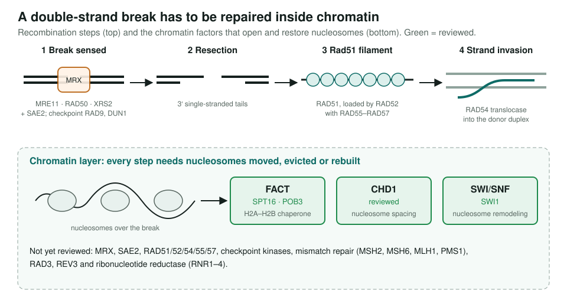
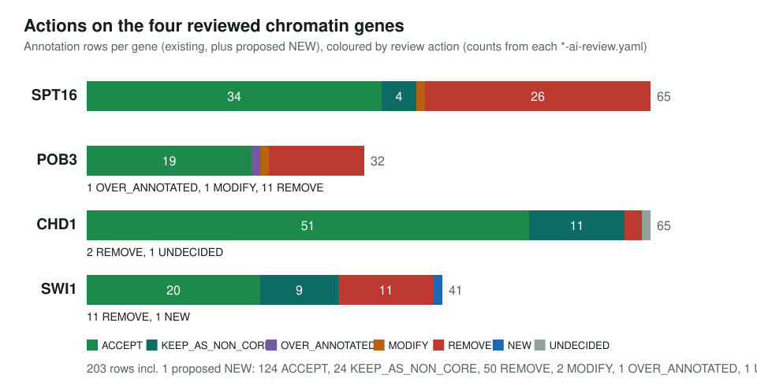
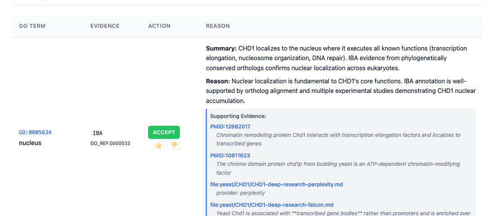

<!-- _class: lead -->

# Yeast DNA repair and chromatin

Reviewing GO annotations for 26 *S. cerevisiae* repair and chromatin genes

AI Gene Review · projects/YEAST_DNA_REPAIR_CHROMATIN · in progress

---

<!-- _class: bluf -->

## Bottom line

- The plan covers **26 genes**: checkpoint signalling, homologous recombination, FACT and remodelers, mismatch repair, translesion synthesis and dNTP supply.
- **4 of 26 reviewed**, all on the chromatin side: **SPT16, POB3, CHD1, SWI1** (191 existing annotation rows, plus 1 proposed NEW term).
- Almost every row was accepted or kept as non-core; **4 REMOVE**. The recombination, checkpoint and mismatch-repair genes have **no review yet**.

---

## The biology in one picture

---

## Why this set

- Repair proteins act on **chromatin, not naked DNA**, so the interesting annotations sit where repair and nucleosome handling meet.
- FACT (SPT16–POB3) and the remodelers CHD1 and SWI/SNF carry both **transcription** and **repair** annotations; the review has to decide which are core.
- The recombination genes (MRX, RAD51, RAD52, RAD54) are some of the best-characterised proteins in yeast, a strong test for over-annotation.

---

## What the four reviews decided

---

## Example rows

- **REMOVE** CHD1 `GO:0005739` mitochondrion (two HDA rows): CHD1 is a nuclear remodeler.
- **UNDECIDED** CHD1 `GO:0140002` histone H3K4me3 reader activity: conflicting yeast literature.
- **REMOVE** POB3 `GO:0003677` DNA binding (IEA from the SSRP1/POB3 InterPro domain).
- **NEW** SWI1 `GO:0031491` nucleosome binding, from cryo-EM structures of SWI/SNF on a nucleosome.

---

## What a review looks like

CHD1 review page: nucleus accepted; the IBA histone binding row kept as non-core, since CHD1 engages nucleosomes mainly through DNA.

---

## Status and next steps

- ✅ Reviewed: `genes/yeast/{SPT16,POB3,CHD1,SWI1}/`
- ⬜ 22 genes with no folder: MRX + SAE2, RAD51/52/54/55/57, RAD9, CHK1, DUN1, MSH2/MSH6/MLH1/PMS1, RAD3, REV3, RNR1–4.
- Fix checklist labels first: yeast 9-1-1 is **Ddc1–Rad17–Mec3**; RAD3 and REV3 are not base excision repair; DUN1 is listed twice.

**Read more:** `projects/YEAST_DNA_REPAIR_CHROMATIN.md`
