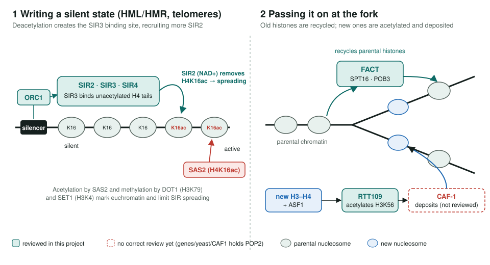
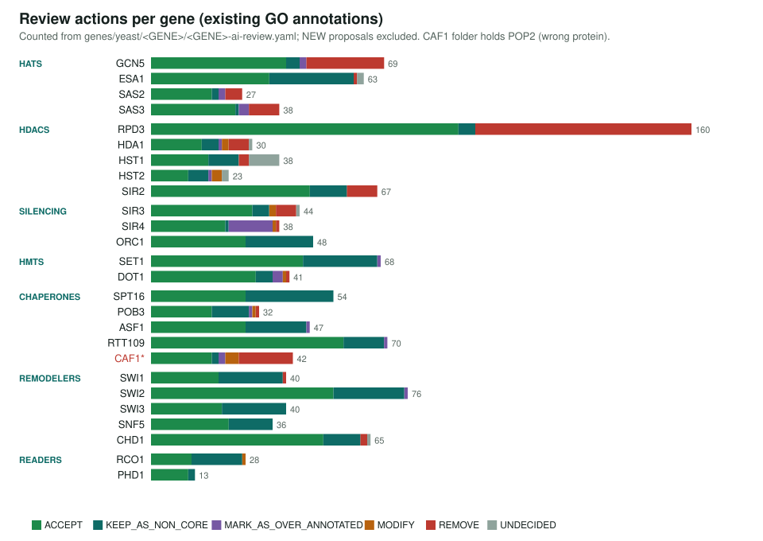
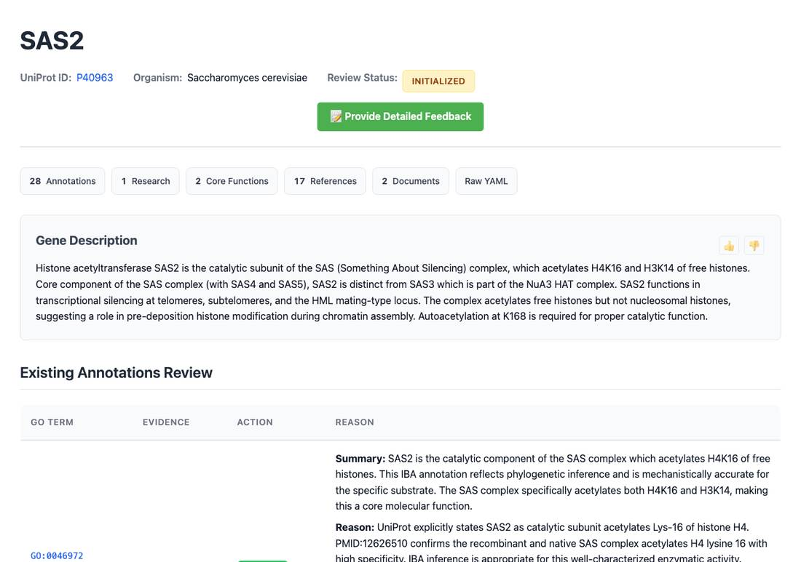

<!-- _class: lead -->

# Yeast epigenetics and histone inheritance

Reviewing GO annotations for the writers, erasers, readers, chaperones and remodelers of *S. cerevisiae* chromatin

AI Gene Review · projects/YEAST_EPIGENETICS_HISTONE_INHERITANCE · mature

---

<!-- _class: bluf -->

## Bottom line

- **28 genes** reviewed: **1,373 existing annotations** plus 11 proposed NEW rows.
- Current action split: **828 ACCEPT**, **184 KEEP_AS_NON_CORE**, **305 REMOVE**, 22 MODIFY, 19 MARK_AS_OVER_ANNOTATED, 15 UNDECIDED, 11 NEW.
- **270 of the 305 removals** are generic `protein binding` rows; one cleanup remains: CLR4 is a fission yeast gene to drop or replace.

---

## The biology: write a state, then copy it

---

## Why this set

- Yeast silent chromatin (HML/HMR, telomeres) is the best-worked example of a **self-propagating chromatin state**.
- Each gene class carries a typical annotation risk: HATs and HDACs get **substrate-level** terms by homology; SIR proteins pick up **replication** terms from ORC relatives; complex subunits get **complex-level** functions.
- The genes are well studied, so errors can be judged against direct experiments.

---

## What the reviews decided

---

## Example decisions

- **REMOVE** SAS2 `GO:0035267` NuA4 histone acetyltransferase complex (IBA): SAS2 is in the SAS complex, not NuA4.
- **REMOVE** SIR3 `GO:0006270` DNA replication initiation (IBA): SIR3 restrains origin activity; it does not start replication.
- **MARK_AS_OVER_ANNOTATED** DOT1 `GO:0008168` methyltransferase activity (IEA): the specific H3K79 term says more.
- **UNDECIDED** 7 HST1 rows: Sir2-like inferences and experimental rows that need the full text.

---

## What a review looks like

SAS2 review page: the description records the SAS complex and its H4K16/H3K14 substrates.

---

## Status and next steps

- ✅ Reviewed: 28 intended genes in `genes/yeast/` (HATs, HDACs, SIR, HMTs, FACT/CAF-1/ASF1/RTT109, SWI/SNF, CHD1, RCO1, PHD1)
- ✅ Chromatin assembly factor CAF-1: RLF2 (alias CAC1), CAC2 and MSI1 are now reviewed. The old `genes/yeast/CAF1/` folder was the CCR4-NOT deadenylase, now renamed POP2 and outside this project
- ⬜ CLR4: replace with an *S. cerevisiae* gene or drop

**Read more:** `projects/YEAST_EPIGENETICS_HISTONE_INHERITANCE.md`
