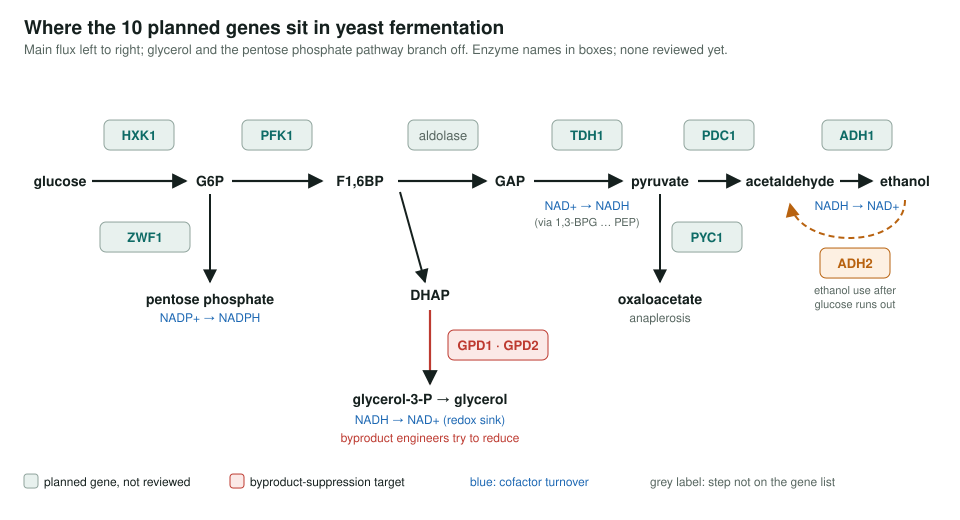
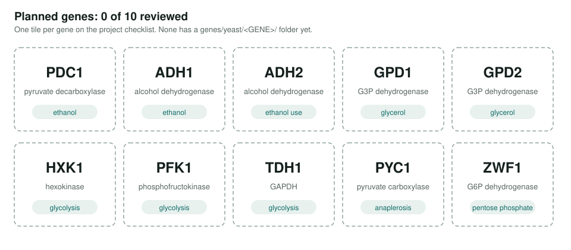

<!-- _class: lead -->

# Yeast metabolic engineering

A scoped plan to review GO annotations for 10 central-carbon genes that strain engineers target

AI Gene Review · projects/YEAST_METABOLIC_ENGINEERING · scoping

---

<!-- _class: bluf -->

## Bottom line

- **Scoped, not yet started:** 10 *S. cerevisiae* genes chosen, **0 reviewed**.
- The set covers ethanol production (PDC1, ADH1, ADH2), the glycerol byproduct (GPD1, GPD2), glycolysis (HXK1, PFK1, TDH1), anaplerosis (PYC1) and NADPH supply (ZWF1).
- Goal: check the annotations are accurate enough to support pathway design.

---

## Where the genes sit

---

## Why these genes

- Engineers raise ethanol or chemical yield by pushing flux to pyruvate and beyond, and by **cutting glycerol**, which yeast makes to reoxidise surplus NADH.
- Each step has **paralogs** (ADH1/ADH2, GPD1/GPD2, HXK1/HXK2, TDH1–3), so GO has to say which isoform does what.
- Well-characterised enzymes make a good test of whether annotations reach the right specific reaction terms.

---

## Status

---

## Next steps

- `just fetch-gene yeast <GENE>` for each of the 10, then deep research and annotation review.
- Check the list: on glucose, **HXK2** is the main hexokinase and **TDH3** the main GAPDH; consider reviewing paralog pairs together.
- Consider a yeast fermentation module (glucose to ethanol plus the glycerol branch) once the reviews exist.

**Read more:** `projects/YEAST_METABOLIC_ENGINEERING.md`
