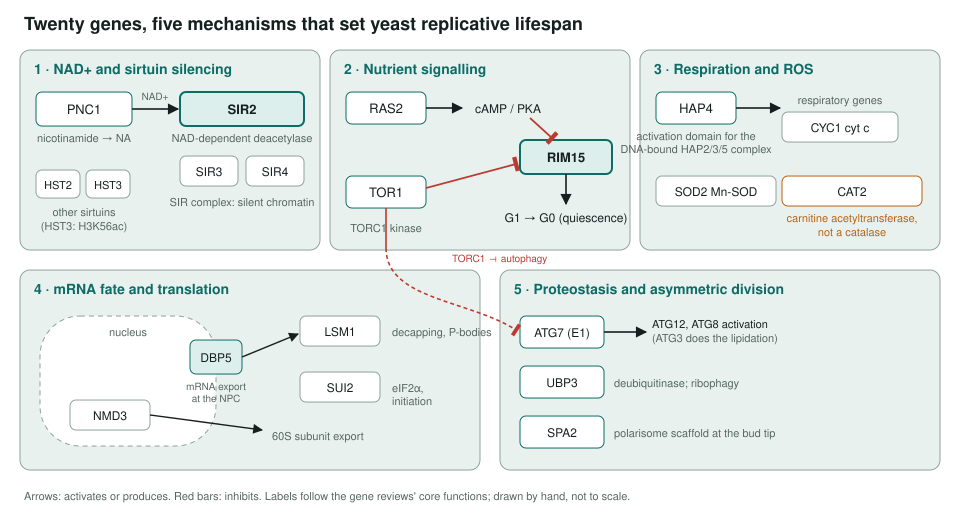
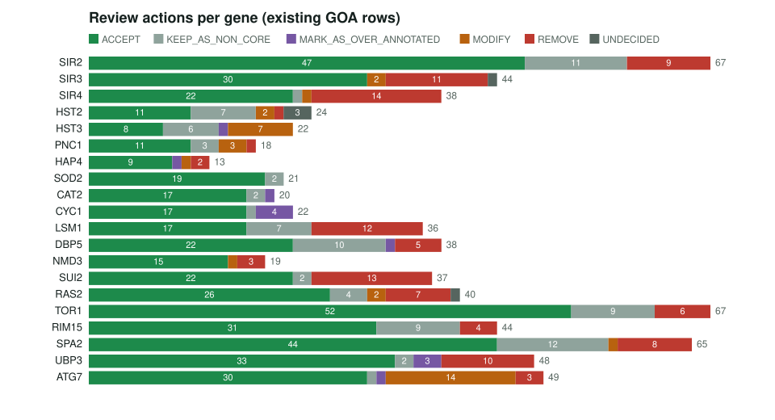
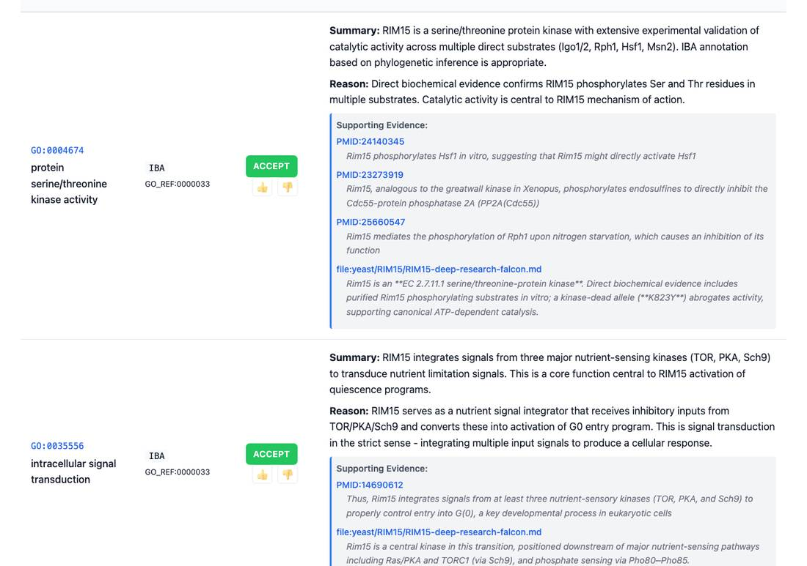

<!-- _class: lead -->

# Yeast replicative aging

Reviewing GO annotations for 20 genes that set how many times a yeast cell can divide

AI Gene Review · projects/YEAST_REPLICATIVE_AGING · 2025–2026

---

<!-- _class: bluf -->

## Bottom line

- Replicative lifespan in budding yeast depends on **sirtuins and NAD+**, **respiration and ROS defence**, **mRNA fate and translation**, **nutrient signalling** and **proteostasis**.
- We reviewed **every GO annotation** on **20 genes** across those five areas: **720 rows**, **480 ACCEPT (67%)**.
- None of the **97 `protein binding`** rows was accepted; wrong electronic terms were **removed** or **redirected** to the gene's actual mechanism.

---

## Why this set

- Yeast aging is a phenotype. GO should describe **what each gene product does**, not that its deletion shortens or extends lifespan.
- Five mechanisms, 20 genes: a test of whether per-gene review keeps **catalytic, regulatory and structural roles** apart.
  - SIR2 deacetylates; SIR3 and SIR4 are the **structural** partners.
  - HAP4 activates respiratory genes but is **not** a respiratory-chain component.
  - CAT2 is a **carnitine acetyltransferase**, despite its name.

---

## The five mechanisms

---

## Results per gene

---

## What a review looks like

RIM15 review page: each GOA row gets an action, a written reason and quoted evidence. The IBA kinase-activity row is accepted on direct biochemical evidence.

---

## Corrections that recur

| Gene | Term (evidence) | Action |
|---|---|---|
| SPA2 | GO:0005826 actomyosin contractile ring (IBA) | REMOVE |
| DBP5 | GO:0015031 protein transport (IEA) | REMOVE |
| LSM1 | GO:0006397 mRNA processing (IEA) | REMOVE |
| HAP4 | GO:0003677 DNA binding (IEA); GO:0098803 respiratory chain complex (IMP) | REMOVE |
| RIM15 | GO:1901992 positive regulation of mitotic cell cycle phase transition | MODIFY → G1 to G0 transition |
| ATG7 | GO:0006501 C-terminal protein lipidation (6 rows) | MODIFY → Atg8 conjugation to PE |

Plus 97 `protein binding` (GO:0005515) rows across 15 genes: 59 over-annotated, 26 removed, 7 modified, 5 non-core.

---

## Status and next steps

- ✅ **20/20 gene reviews** complete (`genes/yeast/<GENE>/<GENE>-ai-review.yaml`).
- The phase tallies in the project page (842 rows, 510 ACCEPT) were recorded in Dec 2025 and **differ from the current files**; the counts here come from the YAMLs.
- Open: 4 UNDECIDED rows (SIR3, HST2 ×2, RAS2); no module or pathway summary yet.

**Read more:** `projects/YEAST_REPLICATIVE_AGING.md` · `genes/yeast/`
