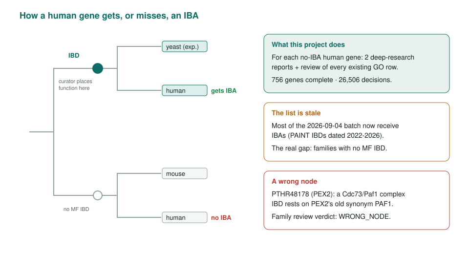
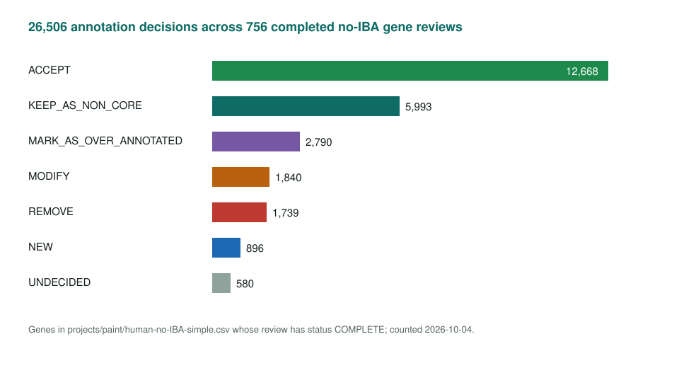
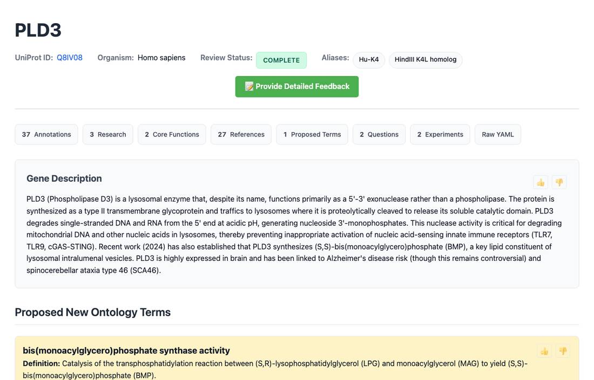

<!-- _class: lead -->

# PAINT: human genes with no IBA

Reviewing the genes that phylogenetic annotation does not reach

<span class="small">AI Gene Review · projects/PAINT · 2026</span>

---

<!-- _class: bluf -->

## Bottom line

- **7,593 human genes** (7,524 symbols) had no IBA annotation; each gets 2 deep-research reports and a full review of its GO rows.
- **756 reviews complete**, **26,506 decisions**: 12,668 accepted, 2,790 over-annotated, 1,739 removed, 896 NEW proposals.
- Lessons: the **no-IBA list is stale**; the real gap is **families with no MF IBD**; names mislead (**PLD3/PLD4 are exonucleases**).

---

## Why these genes

- A PAINT curator places a function at a tree node (IBD); descendants inherit it as **IBA**.
- A human gene with no IBA may be **poorly characterized**, **divergent**, or lack orthologs with experimental evidence.
- These are the genes where literature review adds most, and where a missing or misplaced node shows up.

---

## Where IBAs come from, and where they fail



---

## Per-gene workflow

```bash
just fetch-gene human GENE
just deep-research human GENE --provider falcon
just deep-research human GENE --provider cyberian
# review every row in GENE-ai-review.yaml
just validate human GENE
```

- The 2026-09-04 batch added a paired **PANTHER FamilyReview** for each gene's family (19 written).

---

## Results



---

## Example: a misleading name



<span class="small">PLD3 review page. PLD3 and PLD4 are 5'-3' exonucleases despite the name "phospholipase D"; PLD5 is catalytically inactive.</span>

---

## Findings from the 2026-09-04 batch

1. **Stale source list**: PEX11B, ORMDL3, CFAP61, LOXHD1, BCKDHA and BCKDHB, PEX13, PEX16, MTCH2, MBL2 now receive IBAs.
2. **Real gap**: no molecular-function IBD for BCKDH E1, PEX13, PEX16, NDUFV1's eukaryotic node.
3. **PTHR48178 (PEX2)**: Cdc73/Paf1 complex IBD from a PAF1 homonym → **WRONG_NODE**.
4. **NAALADL2** descends from the carboxypeptidase IBD node yet gets no IBA; an explicit IRD recommended, with a residue check showing loss of the catalytic Glu pair.

---

## Status and next steps

- 756 of 7,524 listed symbols complete (about 10.0%).
- Open: review 27 ready genes; re-derive the no-IBA list against current GOA; re-fetch IL10 GOA.

**Read more:** `projects/PAINT.md` · `projects/paint/human-no-IBA-simple.csv` · `interpro/panther/<PTHR>/`
