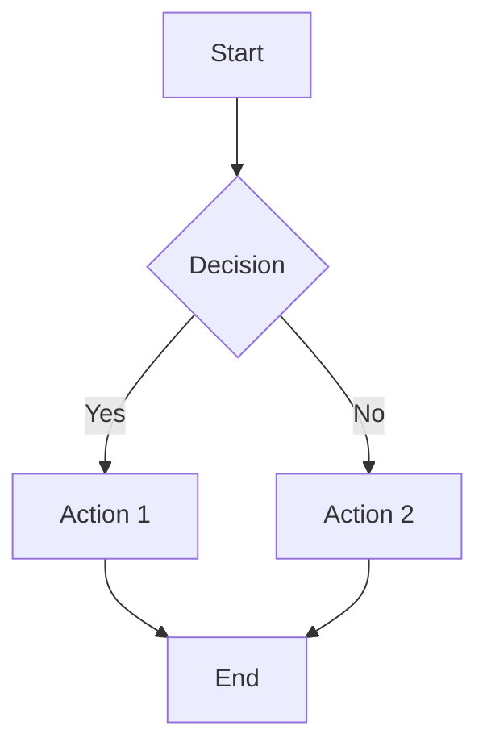
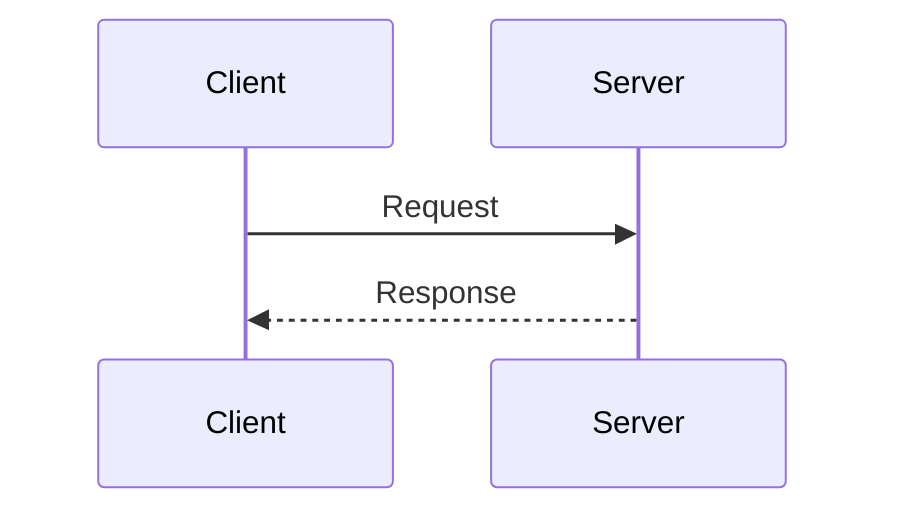

# Markdown and Documentation Validation Tools

This directory contains utilities for validating and converting markdown documentation files in the gene review project.

## Tools

### validate_pmid_references.py
Ensures all PMID citations in **pathway markdown files** are valid and present in the corresponding review YAML.

**IMPORTANT:** This tool ONLY validates `*-pathway.md` files. Other files like `*-notes.md` and `*-rendered.md` are allowed to have freeform content and are NOT validated.

**Usage:**
```bash
# Validate single pathway file
python validate_pmid_references.py genes/human/JAK1/JAK1-pathway.md

# Validate all pathway files in a gene directory
python validate_pmid_references.py genes/human/JAK1/

# Validate all pathway files in all genes
python validate_pmid_references.py genes/

# Via justfile
just validate-pmids genes/human/JAK1/JAK1-pathway.md
just validate-gene-pmids human JAK1
just validate-all-pmids
```

**Features:**
- **Only validates `*-pathway.md` files** (skips notes, rendered, and other markdown files)
- Checks PMID format validity (must contain only digits)
- Extracts PMIDs from markdown citations (e.g., `[PMID:12345]`, `PMID:12345`)
- Compares against references in corresponding `*-ai-review.yaml` file
- Reports invalid formats (e.g., `PMID:xxx123` will be flagged)
- Reports missing PMIDs that need to be added to the review

**What it checks in pathway files:**
- PMID format validity (digits only, no letters or special characters)
- All `[PMID:12345]` style citations
- All `PMID:12345` mentions (without brackets)
- Ensures every cited PMID exists in the review YAML's references section

**Files that are NOT validated:**
- `*-notes.md` - Can have freeform content, drafts, incomplete PMIDs
- `*-rendered.md` - Generated files that may have different formatting
- Any other markdown files that don't end with `-pathway.md`

### validate_mermaid.py
Validates mermaid syntax in markdown files.

**Usage:**
```bash
# Validate single file
python validate_mermaid.py genes/human/JAK1/JAK1-pathway.md

# Validate all files in directory
python validate_mermaid.py genes/

# Via justfile
just validate-mermaid genes/human/JAK1/JAK1-pathway.md
just validate-all-mermaid
```

**Features:**
- Finds all mermaid code blocks in markdown files
- Validates syntax using mermaid-cli if available
- Falls back to basic syntax checking if mermaid-cli not installed
- Reports line numbers for invalid blocks

### markdown_to_html.py
Converts markdown files with mermaid diagrams to standalone HTML.

**Usage:**
```bash
# Convert single file
python markdown_to_html.py input.md output.html
python markdown_to_html.py input.md  # Creates input.html

# Via justfile
just convert-to-html genes/human/JAK1/JAK1-pathway.md
just gene-pathway-html human JAK1
just convert-all-pathways
```

**Features:**
- Converts markdown to styled HTML
- Preserves mermaid diagrams for client-side rendering
- Includes mermaid.js CDN for diagram rendering
- Professional styling with responsive design
- Syntax highlighting for code blocks

## Comprehensive Validation

Run all validation checks at once:

```bash
# Validate a specific gene (YAML + PMIDs + Mermaid)
just validate human JAK1

# Validate everything
just validate-comprehensive
```

This runs:
1. YAML schema validation
2. PMID reference checking
3. Mermaid syntax validation

## Installation

### Optional: Install mermaid-cli for validation
```bash
npm install -g @mermaid-js/mermaid-cli
```

## MkDocs Integration

The repository also has MkDocs with mermaid support. To use:

1. Ensure `mkdocs.yml` includes:
```yaml
markdown_extensions:
  - pymdownx.superfences:
      custom_fences:
        - name: mermaid
          class: mermaid
          format: !!python/name:pymdownx.superfences.fence_code_format
```

2. Serve documentation:
```bash
just _serve
```

## Example Mermaid Diagrams

### Flowchart


### Sequence Diagram


## Troubleshooting

### Mermaid validation fails with "spawn Unknown system error"
- Install mermaid-cli: `npm install -g @mermaid-js/mermaid-cli`
- Or use basic validation mode (automatically falls back)

### HTML not rendering mermaid diagrams
- Ensure internet connection (uses CDN for mermaid.js)
- Check browser console for JavaScript errors
- Verify mermaid syntax is correct using validation tool