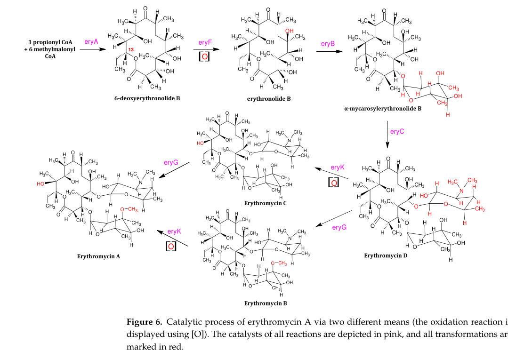

## Question

# Concept Deep Research

## Concept
- **Query:** erythromycin biosynthesis

## Research Objective
Provide a comprehensive research report on the biological concept above. The concept may be a pathway, protein complex, cellular process, organelle, molecular system, or phenotype. The goal is to identify the core biological meaning of the concept and the genes/proteins most directly involved.

### Species Guidance
- If the concept is species-agnostic then the report should be reasonably species-agnostic, but it may help to anchor in terms of well-understood genes (e.g. humans)
- Anchoring in terms of gene families is frequently a good idea
- E.g. for Wnt signaling, it might help to describe a simpler system like D mel, and then describe the pathway in humans and the expanded gene family members

## Use of existing ontology terms
- you should include what you find about how this term is represented in GO or analogous ontologies, but these might be out of date or too abstract
- part of the goal is to align what is in ontologies with the latest thinking in biology

### Required Deliverables
1. **Definition and scope** of the concept, including synonyms or alternate names.
2. **Core components** (complex subunits, pathway steps, essential regulators).
3. **Gene/protein/family list** with organism, role, and evidence. Separate core vs accessory or regulatory components.
4. **Functional context**: where the concept fits in cellular physiology or known pathways.
5. **Key literature** with citations (PMIDs or DOIs) for all major claims.

## Output Format
Please structure the response as follows:

1. **Executive Summary**
2. **Definition and Synonyms**
3. **Core Components and Genes**
   - Provide a concise table with columns: gene/protein, organism, role, evidence.
5. **Species Coverage**
   - Explain which organisms dominate the evidence base and why.
6. **Key Literature**
7. **Candidate Genes for Follow-up**
   - List additional genes that are plausibly involved but less well characterized.

Be explicit about uncertainty and avoid mixing evidence across unrelated organisms or similarly named concepts.

## Output

Question: You are an expert researcher providing comprehensive, well-cited information.

Provide detailed information focusing on:
1. Key concepts and definitions with current understanding
2. Recent developments and latest research (prioritize 2023-2024 sources)
3. Current applications and real-world implementations
4. Expert opinions and analysis from authoritative sources
5. Relevant statistics and data from recent studies

Format as a comprehensive research report with proper citations. Include URLs and publication dates where available.
Always prioritize recent, authoritative sources and provide specific citations for all major claims.

# Concept Deep Research

## Concept
- **Query:** erythromycin biosynthesis

## Research Objective
Provide a comprehensive research report on the biological concept above. The concept may be a pathway, protein complex, cellular process, organelle, molecular system, or phenotype. The goal is to identify the core biological meaning of the concept and the genes/proteins most directly involved.

### Species Guidance
- If the concept is species-agnostic then the report should be reasonably species-agnostic, but it may help to anchor in terms of well-understood genes (e.g. humans)
- Anchoring in terms of gene families is frequently a good idea
- E.g. for Wnt signaling, it might help to describe a simpler system like D mel, and then describe the pathway in humans and the expanded gene family members

## Use of existing ontology terms
- you should include what you find about how this term is represented in GO or analogous ontologies, but these might be out of date or too abstract
- part of the goal is to align what is in ontologies with the latest thinking in biology

### Required Deliverables
1. **Definition and scope** of the concept, including synonyms or alternate names.
2. **Core components** (complex subunits, pathway steps, essential regulators).
3. **Gene/protein/family list** with organism, role, and evidence. Separate core vs accessory or regulatory components.
4. **Functional context**: where the concept fits in cellular physiology or known pathways.
5. **Key literature** with citations (PMIDs or DOIs) for all major claims.

## Output Format
Please structure the response as follows:

1. **Executive Summary**
2. **Definition and Synonyms**
3. **Core Components and Genes**
   - Provide a concise table with columns: gene/protein, organism, role, evidence.
5. **Species Coverage**
   - Explain which organisms dominate the evidence base and why.
6. **Key Literature**
7. **Candidate Genes for Follow-up**
   - List additional genes that are plausibly involved but less well characterized.

Be explicit about uncertainty and avoid mixing evidence across unrelated organisms or similarly named concepts.

## Executive Summary
Erythromycin biosynthesis is the genetically encoded pathway that produces the 14-membered macrolide antibiotic erythromycin A in actinomycetes, classically *Saccharopolyspora erythraea*, via a dedicated ~20-gene biosynthetic gene cluster (the **ery** cluster) that encodes (i) a modular type I polyketide synthase (PKS) that builds the macrolactone core **6-deoxyerythronolide B (6-dEB)** and (ii) downstream “tailoring” enzymes that hydroxylate, glycosylate, and methylate intermediates to yield erythromycin A. (gaisser2000adefinedsystem pages 1-2, adamantidi2024industrialcatalyticproduction pages 10-11)

The current mechanistic consensus is that erythromycin A production depends on (1) the DEBS PKS (eryAI–eryAIII) using **propionyl‑CoA** as a starter and **six methylmalonyl‑CoA** extender units; (2) early oxidative tailoring by **EryF**; (3) sequential glycosylations by **EryB/EryC** glycosyltransferases that attach L‑mycarose and D‑desosamine; and (4) late-stage tailoring by **EryK** (hydroxylation) and **EryG** (O‑methylation) to generate erythromycin A from earlier erythromycins. (gaisser2000adefinedsystem pages 1-2, adamantidi2024industrialcatalyticproduction pages 10-11)

Recent (2024) strain/bioprocess work shows that manipulating cellular cofactor availability—without directly rewriting the ery cluster—can increase titers by ~40–45%: an optimized vitamin supplementation strategy increased shake‑flask titers to **1008.61 mg/L** (+39.2%) and 5‑L bioreactor titers to **907.1 mg/L** (+44.4%). (ke2024transcriptomicsguidedoptimizationof pages 4-7, ke2024transcriptomicsguidedoptimizationof pages 7-10)

## Definition and Synonyms
**Definition.** Erythromycin biosynthesis comprises the enzymatic steps (encoded primarily in the **ery** biosynthetic gene cluster) that convert central metabolites (notably propionyl‑CoA and methylmalonyl‑CoA) into erythromycins, culminating in erythromycin A. (adamantidi2024industrialcatalyticproduction pages 10-11)

**Common synonyms/related terms.**
- “**ery gene cluster**” / “**erythromycin biosynthetic gene cluster (BGC)**” (ery cluster) (adamantidi2024industrialcatalyticproduction pages 10-11)
- “**DEBS pathway**” (for the PKS-dependent formation of 6‑dEB) (adamantidi2024industrialcatalyticproduction pages 10-11, kumpfmuller2016productionofthe pages 1-2)
- “**6‑dEB (6‑deoxyerythronolide B) biosynthesis**” (core macrolactone formation) (adamantidi2024industrialcatalyticproduction pages 10-11, kumpfmuller2016productionofthe pages 1-2)

**Ontology mapping (Gene Ontology).** A direct GO term identifier for “erythromycin biosynthetic process” was not retrievable with the available tool calls in this run; therefore, the report anchors definitions in pathway gene-cluster evidence rather than a GO entry. This is an evidence gap rather than a claim that no such term exists. (adamantidi2024industrialcatalyticproduction pages 10-11, gaisser2000adefinedsystem pages 1-2)

## Core Components and Genes
### Pathway overview (text + schematic)
A widely used pathway description is that DEBS (eryA genes) builds 6‑dEB, which is hydroxylated by EryF, glycosylated by EryB/EryC enzymes, and further tailored by EryK and EryG to produce erythromycin A. (adamantidi2024industrialcatalyticproduction pages 10-11)

The following figure provides a compact schematic of these steps and the responsible enzymes.

(adamantidi2024industrialcatalyticproduction media c50d594c)

### Core genes/proteins (and key yield regulators) table
| Step/module | Gene/protein (common name) | Organism | Function/role | Key evidence (paper + year + DOI) | Notes |
|---|---|---|---|---|---|
| Macrolactone assembly | **eryAI** (DEBS1) | *Saccharopolyspora erythraea* | Modular type I PKS subunit for 6-deoxyerythronolide B (6-dEB) assembly from propionyl-CoA + methylmalonyl-CoA extender units | Gaisser et al., 2000, 10.1046/j.1365-2958.2000.01856.x; Adamantidi et al., 2024, 10.3390/pr12071533 (gaisser2000adefinedsystem pages 1-2, adamantidi2024industrialcatalyticproduction pages 10-11) | Part of the three-protein DEBS system; foundational core biosynthetic gene |
| Macrolactone assembly | **eryAII** (DEBS2) | *S. erythraea* | Second DEBS subunit extending the growing polyketide chain toward 6-dEB | Gaisser et al., 2000, 10.1046/j.1365-2958.2000.01856.x; Adamantidi et al., 2024, 10.3390/pr12071533 (gaisser2000adefinedsystem pages 1-2, adamantidi2024industrialcatalyticproduction pages 10-11) | Together with eryAI/eryAIII forms the ~50 kb ery core PKS region |
| Macrolactone assembly | **eryAIII** (DEBS3) | *S. erythraea* | Final DEBS subunit completing 6-dEB biosynthesis | Gaisser et al., 2000, 10.1046/j.1365-2958.2000.01856.x; Adamantidi et al., 2024, 10.3390/pr12071533 (gaisser2000adefinedsystem pages 1-2, adamantidi2024industrialcatalyticproduction pages 10-11) | DEBS proteins are each ~330–370 kDa in heterologous-expression studies |
| First oxidative tailoring | **eryF** (P450 EryF) | *S. erythraea* | Cytochrome P450 that hydroxylates 6-dEB to erythronolide B | Gaisser et al., 2000, 10.1046/j.1365-2958.2000.01856.x; Adamantidi et al., 2024, 10.3390/pr12071533 (gaisser2000adefinedsystem pages 1-2, adamantidi2024industrialcatalyticproduction pages 5-7) | Early post-PKS tailoring step; often described as C6 hydroxylation |
| Sugar attachment at C3 | **eryBV / eryB5** (mycarosyltransferase) | *S. erythraea* | Transfers L-mycarose to the macrolactone at C3 | Gaisser et al., 2000, 10.1046/j.1365-2958.2000.01856.x; Adamantidi et al., 2024, 10.3390/pr12071533 (gaisser2000adefinedsystem pages 1-2, adamantidi2024industrialcatalyticproduction pages 10-11) | Literature uses both eryBV and eryB5 nomenclature |
| Sugar attachment at C5 | **eryCIII / eryC3** (desosaminyltransferase) | *S. erythraea* | Transfers D-desosamine at C5, contributing to erythromycin D formation | Gaisser et al., 2000, 10.1046/j.1365-2958.2000.01856.x; Adamantidi et al., 2024, 10.3390/pr12071533 (gaisser2000adefinedsystem pages 1-2, adamantidi2024industrialcatalyticproduction pages 10-11) | Sequential glycosylation after aglycone oxidation |
| Late oxidative tailoring | **eryK** (P450 EryK) | *S. erythraea* | Hydroxylates a late erythromycin intermediate at C12 | Gaisser et al., 2000, 10.1046/j.1365-2958.2000.01856.x; Adamantidi et al., 2024, 10.3390/pr12071533 (gaisser2000adefinedsystem pages 1-2, adamantidi2024industrialcatalyticproduction pages 18-19) | Converts erythromycin D/B pathway intermediates toward erythromycin A/C series |
| Late methylation | **eryG** (O-methyltransferase) | *S. erythraea* | O-methylates the mycarosyl group in late-stage tailoring | Adamantidi et al., 2024, 10.3390/pr12071533; Gaisser et al., 2000, 10.1046/j.1365-2958.2000.01856.x (adamantidi2024industrialcatalyticproduction pages 10-11, gaisser2000adefinedsystem pages 1-2) | Along with EryK, required for final conversion to erythromycin A |
| Negative regulation | **SACE_5754** (TetR-family regulator) | *S. erythraea* | Indirect negative regulator of ery-cluster expression and erythromycin production | Wu et al., 2019, 10.1186/s13036-018-0135-2 (wu2019transcriptomeguidedtargetidentification pages 6-8) | Deletion increased Er-A in industrial strain WB by 19%; with target-gene engineering, gains reached 42–64%; 5-L titer 4998 mg/L |
| Precursor/energy rewiring | **SACE_0388** (pyruvate, water dikinase) | *S. erythraea* | Positively affects precursor supply linked to central carbon flow and methylmalonyl-CoA availability | Wu et al., 2019, 10.1186/s13036-018-0135-2 (wu2019transcriptomeguidedtargetidentification pages 6-8) | Deletion cut Er-A by ~80%; overexpression raised Er-A by 32% in A226 and 42% in engineered WB background |
| Redox/tailoring support | **SACE_6149** (FAD-binding monooxygenase) | *S. erythraea* | Positive factor for erythromycin biosynthesis; directly repressed by SACE_5754 | Wu et al., 2019, 10.1186/s13036-018-0135-2 (wu2019transcriptomeguidedtargetidentification pages 6-8) | Deletion reduced Er-A by ~60%; overexpression raised Er-A by 28% in A226 and 30% in engineered WB background |
| Branched-chain catabolism / precursor supply | **mmsOp1** (SACE_1456–1459 operon) | *S. erythraea* | Supports flux from branched-chain amino-acid metabolism toward erythromycin precursor supply | Karničar et al., 2016, 10.1186/s12934-016-0496-5 (karnicar2016integratedomicsapproaches pages 8-10) | Constitutive overexpression gave the largest reported gain in that study: ~2.5-fold higher erythromycin yield vs WT |
| Branched-chain amino-acid synthesis | **ilvB1** (SACE_4565; acetolactate synthase) | *S. erythraea* | Enhances branched-chain amino-acid pathway activity linked to methylmalonyl-CoA generation | Karničar et al., 2016, 10.1186/s12934-016-0496-5 (karnicar2016integratedomicsapproaches pages 8-10) | Overexpression increased yield by 74% |
| Branched-chain keto-acid dehydrogenase | **bkd operon** (SACE_3952–3954) | *S. erythraea* | Converts branched-chain keto-acids, supporting acyl-CoA precursor pools for erythromycin biosynthesis | Karničar et al., 2016, 10.1186/s12934-016-0496-5 (karnicar2016integratedomicsapproaches pages 8-10) | Overexpression increased yield by 67% |
| Cofactor-driven process optimization | Vitamin-responsive enzymes/cofactors affecting precursor supply | *S. erythraea* | TPP, VB2, VB6, VB9, VB12, and hemin improved erythromycin production by modulating TCA flux, methionine/SAM supply, and succinyl-CoA→methylmalonyl-CoA conversion | Ke et al., 2024, 10.1186/s40643-024-00817-w (ke2024transcriptomicsguidedoptimizationof pages 4-7, ke2024transcriptomicsguidedoptimizationof pages 7-10, ke2024transcriptomicsguidedoptimizationof pages 3-4) | Not a single gene entry, but highly relevant process layer: optimized vitamin mix raised shake-flask titer to 1008.61 mg/L (+39.2%) and 5-L titer to 907.1 mg/L (+44.4%) |
| Functional cluster context | **ery cluster (~20 genes)** | *S. erythraea* | Integrated PKS + tailoring gene cluster responsible for erythromycin A biosynthesis | Adamantidi et al., 2024, 10.3390/pr12071533; Gaisser et al., 2000, 10.1046/j.1365-2958.2000.01856.x (adamantidi2024industrialcatalyticproduction pages 10-11, gaisser2000adefinedsystem pages 1-2) | Includes core PKS, sugar-biosynthesis, glycosylation, oxidation, and methylation functions |

*Table: This table summarizes the core erythromycin biosynthetic machinery in *Saccharopolyspora erythraea*, including the DEBS polyketide synthase, major tailoring enzymes, and selected regulatory or precursor-supply genes shown to affect yield. It is useful for separating core pathway components from accessory engineering targets supported by experimental evidence.*

### Notes on core vs. accessory/regulatory components
- **Core biosynthetic machinery (high confidence):** eryAI–eryAIII (DEBS), eryF, eryB/eryC glycosylation steps, eryK, eryG. These functions are supported by pathway reconstructions in *S. erythraea* and synthesis-focused reviews. (gaisser2000adefinedsystem pages 1-2, adamantidi2024industrialcatalyticproduction pages 10-11)
- **Regulatory/precursor supply (high value for engineering):** Systems- and transcriptomics-guided studies identify precursor supply (especially methylmalonyl‑CoA) and upstream central metabolism rewiring as key levers affecting erythromycin titer (e.g., mmsOp1, ilvB1, bkd operon; and regulatory TFR SACE_5754 with targets SACE_0388 and SACE_6149). (karnicar2016integratedomicsapproaches pages 8-10, wu2019transcriptomeguidedtargetidentification pages 6-8)
- **Sugar donor biosynthesis genes (partial evidence in retrieved texts):** the existence and importance of pathways generating sugar donors (dTDP‑L‑mycarose and dTDP‑D‑desosamine) are explicitly noted, but this run did not retrieve a complete gene-by-gene roster for the relevant eryB/eryC sub-genes involved in sugar biosynthesis. (gaisser2000adefinedsystem pages 1-2)

## Functional Context
Erythromycin biosynthesis is a canonical **secondary-metabolism** pathway in actinomycetes in which a large type I modular PKS converts primary-metabolic carbon into a structurally complex macrolide that is subsequently diversified by oxidation and glycosylation. (adamantidi2024industrialcatalyticproduction pages 10-11, adamantidi2024industrialcatalyticproduction pages 5-7)

A recurring functional theme is the coupling of erythromycin production to **precursor pool control**, particularly methylmalonyl‑CoA generation and competition for succinyl‑CoA in central metabolism. The industrial-process review literature emphasizes succinyl‑CoA as a precursor limitation for methylmalonyl‑CoA supply, making TCA‑cycle routing a key systems-level constraint on yield. (adamantidi2024industrialcatalyticproduction pages 16-18, adamantidi2024industrialcatalyticproduction pages 10-11)

## Recent Developments and Latest Research (emphasis 2023–2024)
| Development area | Study (authors, year) | Organism/strain | Intervention/approach | Quantitative outcome(s) | Interpretation/why it matters | DOI/URL |
|---|---|---|---|---|---|---|
| Vitamin/cofactor optimization for production | Ke et al., 2024 | *Saccharopolyspora erythraea* HL3168 E3 (vs. NRRL 2338 reference in transcriptomics) | Transcriptomics-guided testing of 9 vitamins/cofactors; optimization of VB2, VB6, VB12 by Plackett-Burman design and steepest ascent | Six additives (TPP, VB2, VB6, VB9, VB12, hemin) increased erythromycin yield by 7.96-12.66%; optimized shake-flask titer reached 1008.61 mg/L vs. 724.8 mg/L baseline (+39.2%); 5 L bioreactor titer reached 907.1 mg/L at 144 h (+44.4% vs. control) (ke2024transcriptomicsguidedoptimizationof pages 4-7, ke2024transcriptomicsguidedoptimizationof pages 1-3, ke2024transcriptomicsguidedoptimizationof pages 7-10, ke2024transcriptomicsguidedoptimizationof pages 3-4) | Strong recent example that precursor/cofactor balancing can substantially improve industrially relevant titers without direct pathway refactoring; mechanistically linked to higher TCA flux, methionine/SAM supply, and succinyl-CoA to methylmalonyl-CoA flux (ke2024transcriptomicsguidedoptimizationof pages 4-7, ke2024transcriptomicsguidedoptimizationof pages 7-10) | 10.1186/s40643-024-00817-w; https://doi.org/10.1186/s40643-024-00817-w |
| Global signaling control of antibiotic production | You et al., 2024 | *Saccharopolyspora erythraea* | Showed c-di-AMP binds DasR, coupling nucleotide signaling to the GlcNAc regulatory cascade; elevated c-di-AMP activated DasR-mediated repression of GlcNAc utilization and led to enhanced developmental transition and antibiotic production | Qualitative in retrieved text: increased c-di-AMP caused a consistent enhancement in antibiotic production, but no erythromycin-specific titer was available in the extracted evidence (kumpfmuller2016productionofthe pages 1-2) | Important because it identifies a systems-level regulatory layer above the ery cluster itself, implying that second-messenger engineering may improve erythromycin production by rewiring carbon/nitrogen signaling rather than only editing pathway enzymes | 10.1038/s41467-024-48063-0; https://doi.org/10.1038/s41467-024-48063-0 |
| Industrial pathway/process constraints and enzyme-focused engineering | Adamantidi et al., 2024 | Industrial *S. erythraea* strains (including HOE107, review context) | Review of biosynthetic and industrial process bottlenecks; emphasizes DEBS assembly from propionyl-CoA + methylmalonyl-CoA and identifies succinyl-CoA diversion into the TCA cycle as a limiting factor for methylmalonyl-CoA supply | No new titer reported in extracted pages; key process conclusion is that succinyl-CoA availability limits DEB-6/erythromycin synthesis and that suppressing TCA-draining routes in mutant strains is a rational improvement strategy (adamantidi2024industrialcatalyticproduction pages 16-18, adamantidi2024industrialcatalyticproduction pages 10-11, adamantidi2024industrialcatalyticproduction pages 5-7) | Useful expert synthesis linking pathway biochemistry to manufacturing: highlights why many successful engineering strategies converge on methylmalonyl-CoA supply, cytochrome P450 tailoring steps (EryF, EryK), and downstream process optimization rather than only DEBS overexpression | 10.3390/pr12071533; https://doi.org/10.3390/pr12071533 |
| Regulatory engineering benchmark | Wu et al., 2019 | *S. erythraea* A226 and industrial strain WB | Deletion of TetR-family regulator **SACE_5754** plus overexpression of its positively acting targets **SACE_0388** (pyruvate, water dikinase) and **SACE_6149** (FAD-binding monooxygenase) | In industrial WB: ΔSACE_5754 gave +19% Er-A; WBΔSACE_5754/pIB139-0388 and /pIB139-6149 gave +42% and +30%; co-overexpression produced 4998 mg/L in a 5 L fermenter vs. 3327 mg/L in WB (+48%) (wu2019transcriptomeguidedtargetidentification pages 6-8) | High-impact benchmark showing that indirect regulatory and precursor-supply genes can outperform single pathway-enzyme edits; remains a practical reference point for evaluating newer 2023-2024 interventions | 10.1186/s13036-018-0135-2; https://doi.org/10.1186/s13036-018-0135-2 |
| Omics-guided precursor-supply engineering benchmark | Karničar et al., 2016 | *S. erythraea* NRRL2338 and industrial high-producer ABE1441 | Integrated genomics/transcriptomics/proteomics; validation by overexpressing branched-chain amino-acid and methylmalonyl-CoA-linked genes/operons | Overexpression of **mmsOp1** gave ~2.5-fold higher erythromycin yield vs. WT; **ilvB1** increased yield by 74%; **bkd** operon by 67%; co-expression of **mmsOp1** and **ilvB1** gave ~75% increase (karnicar2016integratedomicsapproaches pages 8-10) | Although older, this remains one of the clearest demonstrations that erythromycin overproduction is tightly coupled to branched-chain amino-acid metabolism and methylmalonyl-CoA generation, reinforcing the conclusions of 2024 process-focused work | 10.1186/s12934-016-0496-5; https://doi.org/10.1186/s12934-016-0496-5 |

*Table: This table summarizes recent and benchmark studies on erythromycin biosynthesis and production engineering, emphasizing 2023-2024 developments while including older high-value benchmarks for context. It is useful for comparing intervention types, quantitative gains, and the recurring importance of precursor supply and regulatory control.*

### Quantitative highlights (recent + benchmark)
- **2024 vitamin/cofactor strategy (production increase):** optimized VB2/VB6/VB12 supplementation increased shake‑flask titers to **1008.61 mg/L** from **724.8 mg/L** (+39.2%) and improved 5‑L bioreactor titer to **907.1 mg/L** (+44.4%). (ke2024transcriptomicsguidedoptimizationof pages 4-7, ke2024transcriptomicsguidedoptimizationof pages 7-10)
- **Benchmark regulatory engineering (5‑L titer):** deleting **SACE_5754** and overexpressing **SACE_0388** and **SACE_6149** increased 5‑L erythromycin A from **3327 mg/L** to **4998 mg/L** (+48%). (wu2019transcriptomeguidedtargetidentification pages 6-8)
- **Benchmark precursor-supply gene overexpression:** constitutive overexpression of **mmsOp1** yielded ~**2.5‑fold** higher erythromycin yield; **ilvB1** and **bkd** operon overexpression increased yields by **74%** and **67%**, respectively. (karnicar2016integratedomicsapproaches pages 8-10)

## Current Applications and Real-World Implementations
1. **Industrial fermentation of erythromycin A in *S. erythraea*.** Erythromycin A is industrially produced using *S. erythraea* strains (including strains discussed in industrial process reviews), with attention to both pathway enzymology (DEBS, EryF, EryK/EryG) and bioprocess constraints (precursor supply, downstream processing). (adamantidi2024industrialcatalyticproduction pages 16-18, adamantidi2024industrialcatalyticproduction pages 5-7)
2. **Strain improvement via systems biology and fermentation refinement.** Recent work shows that medium composition and cofactor availability can measurably improve titers in bioreactor settings, suggesting immediate translational utility for manufacturing workflows. (ke2024transcriptomicsguidedoptimizationof pages 7-10)
3. **Biosynthetic platform for macrolide diversification (combinatorial biosynthesis).** Engineering glycosyltransferase steps and tailoring can generate hybrid macrolides/analogs, as demonstrated in defined biosynthetic systems in *S. erythraea* mutants. (gaisser2000adefinedsystem pages 1-2)

## Expert Opinions and Analysis (authoritative sources)
- A 2024 manufacturing-focused review frames erythromycin production as a combined challenge in **(i) catalytic enzymology of key tailoring P450s (EryF/EryK) and (ii) precursor supply constraints**, emphasizing that succinyl‑CoA diversion to the TCA cycle can reduce erythromycin yield and that strategies suppressing such diversion can be rational. (adamantidi2024industrialcatalyticproduction pages 16-18, adamantidi2024industrialcatalyticproduction pages 10-11)
- Multi-omics comparisons of industrial vs. wild-type *S. erythraea* support an expert consensus that the **most productive strains exhibit coordinated upregulation of erythromycin biosynthetic enzymes and branched-chain amino-acid/precursor pathways**, reinforcing precursor-limitation models rather than purely “pathway gene dosage” explanations. (karnicar2016integratedomicsapproaches pages 1-2, karnicar2016integratedomicsapproaches pages 8-10)

## Species Coverage
The strongest mechanistic and engineering evidence for erythromycin biosynthesis is dominated by **actinomycetes**, especially **
*Saccharopolyspora erythraea***, because it is the canonical producer and harbors the best-characterized ery cluster and fermentation workflows. (adamantidi2024industrialcatalyticproduction pages 10-11, gaisser2000adefinedsystem pages 1-2)

Additional evidence includes:
- **Other *Streptomyces* spp.** where genome mining predicts erythromycin-like clusters and where type I PKS logic is conserved, though the retrieved evidence here is more genomic/predictive than mechanistic. (jia2017completegenomesequencing pages 4-5)
- **Heterologous hosts (engineering context):** 6‑dEB production can be reconstituted in non-native bacteria by expressing eryAI–eryAIII (DEBS) and ensuring phosphopantetheinylation activity; this illustrates portability of the core PKS step even when full erythromycin tailoring is not reconstructed. (kumpfmuller2016productionofthe pages 1-2)

## Key Literature (with dates, URLs, and identifiers)
1. **Ke X, Jiang X, Wang S, Tian X, Chu J. (Nov 2024).** Transcriptomics-guided optimization of vitamins to enhance erythromycin yield in *Saccharopolyspora erythraea*. *Bioresources and Bioprocessing* 11. DOI: **10.1186/s40643-024-00817-w**. URL: https://doi.org/10.1186/s40643-024-00817-w (ke2024transcriptomicsguidedoptimizationof pages 4-7, ke2024transcriptomicsguidedoptimizationof pages 7-10)
2. **Adamantidi T, Panoutsopoulou E, Stavrakoudi E, et al. (Jul 2024).** Industrial catalytic production process of erythromycin. *Processes* 12:1533. DOI: **10.3390/pr12071533**. URL: https://doi.org/10.3390/pr12071533 (adamantidi2024industrialcatalyticproduction pages 16-18, adamantidi2024industrialcatalyticproduction pages 10-11, adamantidi2024industrialcatalyticproduction media c50d594c)
3. **You D, Zhao L-C, Fu Y, et al. (May 2024).** Allosteric regulation by c-di-AMP modulates a complete N-acetylglucosamine signaling cascade in *Saccharopolyspora erythraea*. *Nature Communications* 15. DOI: **10.1038/s41467-024-48063-0**. URL: https://doi.org/10.1038/s41467-024-48063-0 (retrieved in corpus; quantitative erythromycin titers not captured in extracted evidence)
4. **Wu H, Chu Z, Zhang W, et al. (Jan 2019).** Transcriptome-guided target identification of the TetR-like regulator SACE_5754 and engineered overproduction of erythromycin in *S. erythraea*. *Journal of Biological Engineering* 13. DOI: **10.1186/s13036-018-0135-2**. URL: https://doi.org/10.1186/s13036-018-0135-2 (wu2019transcriptomeguidedtargetidentification pages 6-8)
5. **Karničar K, Drobnak I, Petek M, et al. (Jun 2016).** Integrated omics approaches provide strategies for rapid erythromycin yield increase in *S. erythraea*. *Microbial Cell Factories* 15. DOI: **10.1186/s12934-016-0496-5**. URL: https://doi.org/10.1186/s12934-016-0496-5 (karnicar2016integratedomicsapproaches pages 1-2, karnicar2016integratedomicsapproaches pages 8-10)
6. **Gaisser S, Reather J, Wirtz G, et al. (Apr 2000).** A defined system for hybrid macrolide biosynthesis in *S. erythraea*. *Molecular Microbiology* 36:391–401. DOI: **10.1046/j.1365-2958.2000.01856.x**. URL: https://doi.org/10.1046/j.1365-2958.2000.01856.x (gaisser2000adefinedsystem pages 1-2)

## Candidate Genes for Follow-up (plausible but less well characterized in retrieved evidence)
The following targets are repeatedly implicated by pathway logic and partial textual evidence here, but this run did not retrieve full gene-by-gene functional validation (therefore they are listed as candidates rather than core confirmed components in this report):

1. **Sugar-donor biosynthesis genes for dTDP‑L‑mycarose and dTDP‑D‑desosamine.** The importance of these donor pathways is explicit, but the specific gene roster and functions (e.g., individual eryB genes beyond the cited mycarosyltransferase, and other sugar pathway enzymes) require additional targeted retrieval. (gaisser2000adefinedsystem pages 1-2)
2. **Additional tailoring enzymes in the ery cluster beyond EryF/EryK/EryG.** The ery cluster is reported to contain ~20 genes encoding multiple oxidation/reduction steps; the present evidence does not enumerate all of them. (adamantidi2024industrialcatalyticproduction pages 10-11)
3. **Transport/resistance determinants associated with self-resistance/export.** Industrial and natural-product clusters often encode exporters or resistance factors; however, explicit erythromycin self-resistance/export genes were not recovered in the available full-text evidence during this run. (adamantidi2024industrialcatalyticproduction pages 10-11)
4. **Second-messenger and carbon-nitrogen signaling regulators.** c-di-AMP/DasR signaling affects antibiotic production in *S. erythraea*, suggesting that additional nodes in this cascade (and other global regulators) could modulate erythromycin yields; specific engineering targets and quantitative outcomes were not captured in the extracted evidence. (You et al., 2024; see Key Literature)

### Uncertainty and limitations
- The report prioritizes 2024 sources where available, but the tool-run retrieval did not yield multiple 2023–2024 pathway-enzyme characterization papers that enumerate the entire ery cluster; therefore, some accessory gene lists remain incomplete and are clearly labeled as follow-up targets. (adamantidi2024industrialcatalyticproduction pages 10-11, gaisser2000adefinedsystem pages 1-2)
- A definitive GO term alignment could not be retrieved within this run’s tool constraints; ontology alignment should be re-checked in a dedicated GO/QuickGO query workflow. (adamantidi2024industrialcatalyticproduction pages 10-11)

References

1. (gaisser2000adefinedsystem pages 1-2): Sabine Gaisser, James Reather, Gabriele Wirtz, Laurenz Kellenberger, James Staunton, and Peter F. Leadlay. A defined system for hybrid macrolide biosynthesis in saccharopolyspora erythraea. Molecular Microbiology, 36:391-401, Apr 2000. URL: https://doi.org/10.1046/j.1365-2958.2000.01856.x, doi:10.1046/j.1365-2958.2000.01856.x. This article has 115 citations and is from a domain leading peer-reviewed journal.

2. (adamantidi2024industrialcatalyticproduction pages 10-11): Theodora Adamantidi, Ellie Panoutsopoulou, Evangelia Stavrakoudi, Panagiota Tzevelekou, and Nikolaos C. Kokkinos. Industrial catalytic production process of erythromycin. Processes, 12:1533, Jul 2024. URL: https://doi.org/10.3390/pr12071533, doi:10.3390/pr12071533. This article has 5 citations.

3. (ke2024transcriptomicsguidedoptimizationof pages 4-7): Xiang Ke, Xing Jiang, Shuohan Wang, Xiwei Tian, and Ju Chu. Transcriptomics-guided optimization of vitamins to enhance erythromycin yield in saccharopolyspora erythraea. Bioresources and Bioprocessing, Nov 2024. URL: https://doi.org/10.1186/s40643-024-00817-w, doi:10.1186/s40643-024-00817-w. This article has 5 citations and is from a peer-reviewed journal.

4. (ke2024transcriptomicsguidedoptimizationof pages 7-10): Xiang Ke, Xing Jiang, Shuohan Wang, Xiwei Tian, and Ju Chu. Transcriptomics-guided optimization of vitamins to enhance erythromycin yield in saccharopolyspora erythraea. Bioresources and Bioprocessing, Nov 2024. URL: https://doi.org/10.1186/s40643-024-00817-w, doi:10.1186/s40643-024-00817-w. This article has 5 citations and is from a peer-reviewed journal.

5. (kumpfmuller2016productionofthe pages 1-2): Jana Kumpfmüller, Karen Methling, Lei Fang, Blaine A. Pfeifer, Michael Lalk, and Thomas Schweder. Production of the polyketide 6-deoxyerythronolide b in the heterologous host bacillus subtilis. Applied Microbiology and Biotechnology, 100:1209-1220, Oct 2016. URL: https://doi.org/10.1007/s00253-015-6990-6, doi:10.1007/s00253-015-6990-6. This article has 40 citations and is from a domain leading peer-reviewed journal.

6. (adamantidi2024industrialcatalyticproduction media c50d594c): Theodora Adamantidi, Ellie Panoutsopoulou, Evangelia Stavrakoudi, Panagiota Tzevelekou, and Nikolaos C. Kokkinos. Industrial catalytic production process of erythromycin. Processes, 12:1533, Jul 2024. URL: https://doi.org/10.3390/pr12071533, doi:10.3390/pr12071533. This article has 5 citations.

7. (adamantidi2024industrialcatalyticproduction pages 5-7): Theodora Adamantidi, Ellie Panoutsopoulou, Evangelia Stavrakoudi, Panagiota Tzevelekou, and Nikolaos C. Kokkinos. Industrial catalytic production process of erythromycin. Processes, 12:1533, Jul 2024. URL: https://doi.org/10.3390/pr12071533, doi:10.3390/pr12071533. This article has 5 citations.

8. (adamantidi2024industrialcatalyticproduction pages 18-19): Theodora Adamantidi, Ellie Panoutsopoulou, Evangelia Stavrakoudi, Panagiota Tzevelekou, and Nikolaos C. Kokkinos. Industrial catalytic production process of erythromycin. Processes, 12:1533, Jul 2024. URL: https://doi.org/10.3390/pr12071533, doi:10.3390/pr12071533. This article has 5 citations.

9. (wu2019transcriptomeguidedtargetidentification pages 6-8): Hang Wu, Zuling Chu, Wanxiang Zhang, Chi Zhang, Jingshu Ni, Heshi Fang, Yuhong Chen, Yansheng Wang, Lixin Zhang, and Buchang Zhang. Transcriptome-guided target identification of the tetr-like regulator sace_5754 and engineered overproduction of erythromycin in saccharopolyspora erythraea. Journal of Biological Engineering, Jan 2019. URL: https://doi.org/10.1186/s13036-018-0135-2, doi:10.1186/s13036-018-0135-2. This article has 18 citations and is from a peer-reviewed journal.

10. (karnicar2016integratedomicsapproaches pages 8-10): Katarina Karničar, Igor Drobnak, Marko Petek, Vasilka Magdevska, Jaka Horvat, Robert Vidmar, Špela Baebler, Ana Rotter, Polona Jamnik, Štefan Fujs, Boris Turk, Marko Fonovič, Kristina Gruden, Gregor Kosec, and Hrvoje Petković. Integrated omics approaches provide strategies for rapid erythromycin yield increase in saccharopolyspora erythraea. Microbial Cell Factories, Jun 2016. URL: https://doi.org/10.1186/s12934-016-0496-5, doi:10.1186/s12934-016-0496-5. This article has 31 citations and is from a peer-reviewed journal.

11. (ke2024transcriptomicsguidedoptimizationof pages 3-4): Xiang Ke, Xing Jiang, Shuohan Wang, Xiwei Tian, and Ju Chu. Transcriptomics-guided optimization of vitamins to enhance erythromycin yield in saccharopolyspora erythraea. Bioresources and Bioprocessing, Nov 2024. URL: https://doi.org/10.1186/s40643-024-00817-w, doi:10.1186/s40643-024-00817-w. This article has 5 citations and is from a peer-reviewed journal.

12. (adamantidi2024industrialcatalyticproduction pages 16-18): Theodora Adamantidi, Ellie Panoutsopoulou, Evangelia Stavrakoudi, Panagiota Tzevelekou, and Nikolaos C. Kokkinos. Industrial catalytic production process of erythromycin. Processes, 12:1533, Jul 2024. URL: https://doi.org/10.3390/pr12071533, doi:10.3390/pr12071533. This article has 5 citations.

13. (ke2024transcriptomicsguidedoptimizationof pages 1-3): Xiang Ke, Xing Jiang, Shuohan Wang, Xiwei Tian, and Ju Chu. Transcriptomics-guided optimization of vitamins to enhance erythromycin yield in saccharopolyspora erythraea. Bioresources and Bioprocessing, Nov 2024. URL: https://doi.org/10.1186/s40643-024-00817-w, doi:10.1186/s40643-024-00817-w. This article has 5 citations and is from a peer-reviewed journal.

14. (karnicar2016integratedomicsapproaches pages 1-2): Katarina Karničar, Igor Drobnak, Marko Petek, Vasilka Magdevska, Jaka Horvat, Robert Vidmar, Špela Baebler, Ana Rotter, Polona Jamnik, Štefan Fujs, Boris Turk, Marko Fonovič, Kristina Gruden, Gregor Kosec, and Hrvoje Petković. Integrated omics approaches provide strategies for rapid erythromycin yield increase in saccharopolyspora erythraea. Microbial Cell Factories, Jun 2016. URL: https://doi.org/10.1186/s12934-016-0496-5, doi:10.1186/s12934-016-0496-5. This article has 31 citations and is from a peer-reviewed journal.

15. (jia2017completegenomesequencing pages 4-5): Nan Jia, Ming-Zhu Ding, Hao Luo, Feng Gao, and Ying-Jin Yuan. Complete genome sequencing and antibiotics biosynthesis pathways analysis of streptomyces lydicus 103. Scientific Reports, Mar 2017. URL: https://doi.org/10.1038/srep44786, doi:10.1038/srep44786. This article has 23 citations and is from a peer-reviewed journal.

## Artifacts

- [Edison artifact artifact-00](erythromycin_biosynthesis-deep-research-falcon_artifacts/artifact-00.md)
- [Edison artifact artifact-01](erythromycin_biosynthesis-deep-research-falcon_artifacts/artifact-01.md)

## Citations

1. adamantidi2024industrialcatalyticproduction pages 10-11
2. wu2019transcriptomeguidedtargetidentification pages 6-8
3. karnicar2016integratedomicsapproaches pages 8-10
4. gaisser2000adefinedsystem pages 1-2
5. kumpfmuller2016productionofthe pages 1-2
6. ke2024transcriptomicsguidedoptimizationof pages 7-10
7. jia2017completegenomesequencing pages 4-5
8. ke2024transcriptomicsguidedoptimizationof pages 4-7
9. adamantidi2024industrialcatalyticproduction pages 5-7
10. adamantidi2024industrialcatalyticproduction pages 18-19
11. ke2024transcriptomicsguidedoptimizationof pages 3-4
12. adamantidi2024industrialcatalyticproduction pages 16-18
13. ke2024transcriptomicsguidedoptimizationof pages 1-3
14. karnicar2016integratedomicsapproaches pages 1-2
15. https://doi.org/10.1186/s40643-024-00817-w
16. https://doi.org/10.1038/s41467-024-48063-0
17. https://doi.org/10.3390/pr12071533
18. https://doi.org/10.1186/s13036-018-0135-2
19. https://doi.org/10.1186/s12934-016-0496-5
20. https://doi.org/10.1046/j.1365-2958.2000.01856.x
21. https://doi.org/10.1046/j.1365-2958.2000.01856.x,
22. https://doi.org/10.3390/pr12071533,
23. https://doi.org/10.1186/s40643-024-00817-w,
24. https://doi.org/10.1007/s00253-015-6990-6,
25. https://doi.org/10.1186/s13036-018-0135-2,
26. https://doi.org/10.1186/s12934-016-0496-5,
27. https://doi.org/10.1038/srep44786,