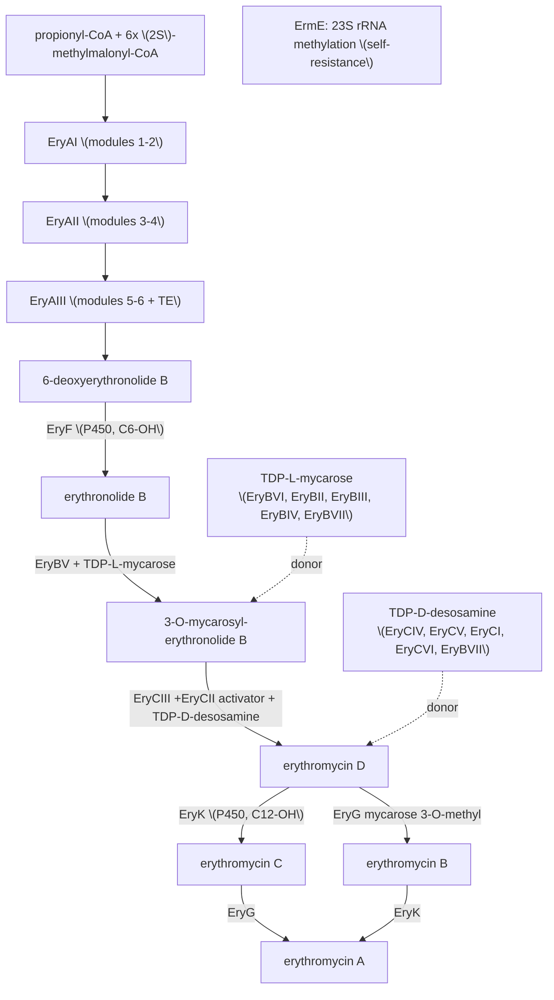

# Erythromycin biosynthesis — concept notes

> Concept-level research notes for the AI gene review project. Manually authored;
> provenance recorded inline as `[PMID:xxxx "supporting text"]`. Gene→UniProt mappings
> verified against UniProt (organism *Saccharopolyspora erythraea* NRRL 2338,
> NCBITaxon:405948); cluster membership and product names aligned to **MIBiG BGC0000055**.
> Genes with a full review under `genes/SACEN/` are marked **reviewed**.

## 1. Definition and scope

Erythromycin biosynthesis is the pathway that produces the clinically important macrolide
antibiotics erythromycin A–D in the actinomycete *Saccharopolyspora erythraea* (the
**representative species**). It is encoded by the contiguous *ery* cluster (MIBiG
**BGC0000055**) and combines a **modular type I polyketide synthase** with two **deoxysugar**
pathways and post-PKS tailoring:

1. **Macrolactone assembly** — the 6-deoxyerythronolide B synthase (**DEBS**; EryAI/AII/AIII)
   condenses one propionyl-CoA starter with six (2S)-methylmalonyl-CoA extenders over 6
   modules to give **6-deoxyerythronolide B (6-dEB)**.
2. **Post-PKS oxidation** — the cytochrome P450 **EryF** hydroxylates 6-dEB at C-6 →
   **erythronolide B (EB)**; **EryK** later hydroxylates at C-12.
3. **Glycosylation** — **EryBV** attaches **TDP-L-mycarose** (→ 3-O-mycarosyl-erythronolide B,
   MEB); **EryCIII** (activated by the pseudoenzyme **EryCII**) attaches **TDP-D-desosamine**
   (→ **erythromycin D**). Dedicated EryB* (mycarose) and EryC* (desosamine) enzymes build the
   nucleotide sugars.
4. **Tailoring** — **EryK** (C-12 hydroxylation) and **EryG** (3''-O-methylation of mycarose →
   cladinose) convert erythromycin D, via B and C, into **erythromycin A**.

Self-resistance is provided by **ErmE** (23S rRNA N6-adenine methyltransferase).

## 2. How erythromycin biosynthesis is represented in GO (and MIBiG)

- **GO biological process:** `GO:1901115` *erythromycin biosynthetic process* (child of
  `GO:0017000` antibiotic biosynthetic process / `GO:0044550` secondary metabolite
  biosynthetic process). The pathway is currently represented in GO only at the
  whole-process level plus per-enzyme MF terms; there is no GO-CAM connecting the steps.
- **Per-step MF terms** that exist: `GO:2.3.1.94`-style EC mapping for DEBS, P450 monooxygenase
  terms for EryF/EryK, `GO:0016758` hexosyltransferase for the two GTs, methyltransferase terms
  for EryG/EryCVI/EryBIII. **EC 2.4.1.278** (EryCIII desosaminyltransferase) has **no specific GO
  MF term** (flagged in `genes/SACEN/eryCIII/`).
- **MIBiG BGC0000055** is the authoritative cluster reference (23 genes). Two of its gene
  annotations are contradicted by structural/UniProt evidence — see §6.

## 3. Core components and genes

Representative species *S. erythraea* NRRL 2338. UniProt accessions and EC numbers verified.

### A. Macrolactone assembly — DEBS modular type I PKS

| Gene | UniProt | EC | Role | Status |
|---|---|---|---|---|
| eryAI | A4F7N8 | 2.3.1.94 | DEBS, loading + modules 1-2 | not reviewed |
| eryAII | A4F7P0 | 2.3.1.94 | DEBS, modules 3-4 | not reviewed |
| eryAIII | A4F7P1 | 2.3.1.94 | DEBS, modules 5-6 + thioesterase (releases 6-dEB) | not reviewed |
| (TEII) | A4F7P6 | 3.1.2.14 | type II thioesterase (PKS proofreading) | not reviewed |

### B. Post-PKS P450 oxidations

| Gene | UniProt | EC | Role | Status |
|---|---|---|---|---|
| eryF | Q00441 | 1.14.15.35 | P450eryF / CYP107A1; 6-dEB C-6 hydroxylase (→ EB) | not reviewed |
| eryK | P48635 | 1.14.13.154 | CYP113A1; erythromycin C-12 hydroxylase | not reviewed |

### C. Glycosyltransferases (+ activator)

| Gene | UniProt | EC | Role | Status |
|---|---|---|---|---|
| eryBV | A4F7N6 | 2.4.1.- | mycarosyltransferase: TDP-L-mycarose → EB (→ MEB); paralog of EryCIII | not reviewed |
| **eryCIII** | A4F7P3 | 2.4.1.278 | desosaminyltransferase: TDP-D-desosamine → MEB (→ erythromycin D) | **reviewed** (`genes/SACEN/eryCIII/`) |
| **eryCII** | A4F7P2 | — | allosteric **activator** of EryCIII (heme-less P450 pseudoenzyme; see §6) | **reviewed** (`genes/SACEN/eryCII/`) |

### D. TDP-D-desosamine biosynthesis (EryC*)

| Gene | UniProt | EC | Role | Status |
|---|---|---|---|---|
| eryCIV | A4F7N3 | — | NDP-6-deoxyhexose 3,4-dehydratase | not reviewed |
| eryCV | A4F7N2 | — | NDP-4,6-dideoxyhexose 3,4-enoyl reductase | not reviewed |
| eryCI | P14290 | (2.6.1.-) | PLP-dependent transaminase (see §6 naming discrepancy) | not reviewed |
| eryCVI | A4F7N5 | 2.1.1.- | TDP-desosamine N,N-dimethyltransferase | not reviewed |

### E. TDP-L-mycarose biosynthesis (EryB*)

| Gene | UniProt | EC | Role | Status |
|---|---|---|---|---|
| eryBVI | A4F7N4 | 4.2.1.- | NDP-4-keto-6-deoxyglucose 2,3-dehydratase | not reviewed |
| eryBII | A4F7P4 | 1.1.1.91 | TDP-4-keto-6-deoxyhexose 2,3-reductase | not reviewed |
| eryBIII | A4F7P8 | 2.1.1.- | NDP-4-keto-2,6-dideoxyhexose 3-C-methyltransferase | not reviewed |
| eryBIV | A4F7N7 | 1.1.1.- | dTDP-4-keto-6-deoxy-L-hexose 4-reductase | not reviewed |
| eryBVII | A4F7N1 | 5.1.3.13 | dTDP-4-deoxyglucose 3,5-epimerase (shared by both sugar pathways) | not reviewed |
| eryBI | A4F7P9 | 3.2.1.21 | beta-D-glucosidase (role debated; possible resistance/recycling) | not reviewed |

### F. Tailoring O-methylation

| Gene | UniProt | EC | Role | Status |
|---|---|---|---|---|
| eryG | A4F7P5 | 2.1.1.254 | erythromycin 3''-O-methyltransferase (mycarose → cladinose; C/D → A/B) | not reviewed |

### G. Self-resistance & accessory

| Gene | UniProt | EC | Role | Status |
|---|---|---|---|---|
| ermE | P07287 | 2.1.1.184 | 23S rRNA N6-adenine MTase; macrolide self-resistance | not reviewed |
| (esterase) | A4F7M9 | — | putative erythromycin esterase | not reviewed |
| (transposase) | A4F7N9 | — | transposase — not biosynthetic | excluded |

## 4. Pathway

## 5. Species coverage

The pathway is defined almost entirely in *S. erythraea* (the producer); DEBS in particular is
the textbook model modular PKS. Individual enzymes have orthologs/analogs across actinomycete
macrolide producers (e.g. oleandomycin OleP1/OleG2, pikromycin DesVII/DesVIII for the GT +
activator pair), which is why the EryCII-type GT activator is a **family** phenomenon (≥12
members). For curation, *S. erythraea* is the canonical representative.

## 6. MIBiG / annotation discrepancies (candidate upstream corrections)

1. **eryCII — MIBiG "TDP-4-keto-6-deoxy-glucose 3,4-isomerase" vs activator pseudoenzyme.**
   MIBiG places eryCII as a catalytic desosamine-pathway isomerase. The crystal structure
   (PDB 2YJN) shows it is a **heme-less cytochrome-P450 homologue with no active site** that
   **allosterically activates/stabilizes EryCIII** (which is inactive without it)
   [PMID:22056329 "thus, they are not active P450 enzymes"]. UniProt (A4F7P2) agrees: a P450-family
   protein that "lacks the heme-binding sites" — not a sugar isomerase. → MIBiG's catalytic
   assignment appears wrong. Captured in `genes/SACEN/eryCII/`; cross-ref `projects/PSEUDOENZYMES.md`.
2. **eryCI — UniProt legacy name "sensory transduction protein" vs transaminase.** EryCI is the
   desosamine PLP-dependent transaminase in MIBiG/literature; UniProt P14290 carries the legacy
   name "Erythromycin biosynthesis sensory transduction protein EryC1". Flag when eryCI is curated.

## 7. Curation status

- **Reviewed (2/23):** eryCIII (desosaminyl GT) + eryCII (its activator) — the desosaminylation
  node, curated as the catalytic + pseudoenzyme-activator exemplar (`projects/BGC.md`).
- **Candidate follow-up (tractable, non-megasynthase):** eryF, eryK (P450s); eryBV (2nd GT);
  eryG (O-MTase); the EryB*/EryC* deoxysugar enzymes; ermE.
- **Largest effort:** eryAI/AII/AIII (DEBS megasynthases; module-level review).

## 8. References

- MIBiG BGC0000055 — gene set and product annotations.
- [PMID:22056329 "EryCII stabilizes EryCIII and also functions as an allosteric activator of the GT"] — Moncrieffe et al. 2012, *J Mol Biol* (PDB 2YJN).
- [PMID:15303858 "EryCIII converts alpha-mycarosyl erythronolide B into erythromycin D using TDP-d-desosamine as the glycosyl donor"] — Lee et al. 2004, *JACS*.
- Per-gene primary references are recorded in the individual `genes/SACEN/*/` reviews.

### Deep research companion

`erythromycin_biosynthesis-deep-research-falcon.md` (Edison/falcon; 27 citations) is a
machine-generated companion. It is **complementary** to these notes:
- *It adds* a yield-engineering / precursor-supply layer absent here — methylmalonyl-CoA
  supply, the TetR regulator SACE_5754 and its targets (SACE_0388, SACE_6149), and the
  `mmsOp1`/`ilvB1`/`bkd` precursor operons — plus recent (2023–24) literature.
- *It does not* cover the EryCII isomerase-vs-activator discrepancy or the per-gene
  deoxysugar (EryB*/EryC*) roster (its own "Uncertainty" section flags the latter gap), so
  §3 and §6 above remain the authoritative MIBiG-aligned curation.
