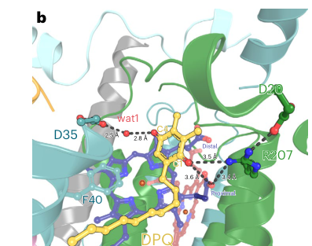

## Question

# Concept Deep Research

## Concept
- **Query:** Photosynthesis

## Research Objective
Provide a comprehensive research report on the biological concept above. The concept may be a pathway, protein complex, cellular process, organelle, molecular system, or phenotype. The goal is to identify the core biological meaning of the concept and the genes/proteins most directly involved.

### Species Guidance
- If the concept is species-agnostic then the report should be reasonably species-agnostic, but it may help to anchor in terms of well-understood genes (e.g. humans)
- Anchoring in terms of gene families is frequently a good idea
- E.g. for Wnt signaling, it might help to describe a simpler system like D mel, and then describe the pathway in humans and the expanded gene family members

## Use of existing ontology terms
- you should include what you find about how this term is represented in GO or analogous ontologies, but these might be out of date or too abstract
- part of the goal is to align what is in ontologies with the latest thinking in biology

### Required Deliverables
1. **Definition and scope** of the concept, including synonyms or alternate names.
2. **Core components** (complex subunits, pathway steps, essential regulators).
3. **Gene/protein/family list** with organism, role, and evidence. Separate core vs accessory or regulatory components.
4. **Functional context**: where the concept fits in cellular physiology or known pathways.
5. **Key literature** with citations (PMIDs or DOIs) for all major claims.

## Output Format
Please structure the response as follows:

1. **Executive Summary**
2. **Definition and Synonyms**
3. **Core Components and Genes**
   - Provide a concise table with columns: gene/protein, organism, role, evidence.
5. **Species Coverage**
   - Explain which organisms dominate the evidence base and why.
6. **Key Literature**
7. **Candidate Genes for Follow-up**
   - List additional genes that are plausibly involved but less well characterized.

Be explicit about uncertainty and avoid mixing evidence across unrelated organisms or similarly named concepts.

## Output

Question: You are an expert researcher providing comprehensive, well-cited information.

Provide detailed information focusing on:
1. Key concepts and definitions with current understanding
2. Recent developments and latest research (prioritize 2023-2024 sources)
3. Current applications and real-world implementations
4. Expert opinions and analysis from authoritative sources
5. Relevant statistics and data from recent studies

Format as a comprehensive research report with proper citations. Include URLs and publication dates where available.
Always prioritize recent, authoritative sources and provide specific citations for all major claims.

# Concept Deep Research

## Concept
- **Query:** Photosynthesis

## Research Objective
Provide a comprehensive research report on the biological concept above. The concept may be a pathway, protein complex, cellular process, organelle, molecular system, or phenotype. The goal is to identify the core biological meaning of the concept and the genes/proteins most directly involved.

### Species Guidance
- If the concept is species-agnostic then the report should be reasonably species-agnostic, but it may help to anchor in terms of well-understood genes (e.g. humans)
- Anchoring in terms of gene families is frequently a good idea
- E.g. for Wnt signaling, it might help to describe a simpler system like D mel, and then describe the pathway in humans and the expanded gene family members

## Use of existing ontology terms
- you should include what you find about how this term is represented in GO or analogous ontologies, but these might be out of date or too abstract
- part of the goal is to align what is in ontologies with the latest thinking in biology

### Required Deliverables
1. **Definition and scope** of the concept, including synonyms or alternate names.
2. **Core components** (complex subunits, pathway steps, essential regulators).
3. **Gene/protein/family list** with organism, role, and evidence. Separate core vs accessory or regulatory components.
4. **Functional context**: where the concept fits in cellular physiology or known pathways.
5. **Key literature** with citations (PMIDs or DOIs) for all major claims.

## Output Format
Please structure the response as follows:

1. **Executive Summary**
2. **Definition and Synonyms**
3. **Core Components and Genes**
   - Provide a concise table with columns: gene/protein, organism, role, evidence.
5. **Species Coverage**
   - Explain which organisms dominate the evidence base and why.
6. **Key Literature**
7. **Candidate Genes for Follow-up**
   - List additional genes that are plausibly involved but less well characterized.

Be explicit about uncertainty and avoid mixing evidence across unrelated organisms or similarly named concepts.

# Research Report: Photosynthesis (Concept Deep Research)

## 1. Executive Summary
Photosynthesis is a bioenergetic process in which light energy is converted into chemical energy, enabling net fixation of inorganic carbon into biomass; in oxygenic photosynthesis this is coupled to water oxidation and O2 evolution. It is implemented by a conserved thylakoid-membrane electron-transfer chain—Photosystem II (PSII) → plastoquinone (PQ) → cytochrome b6f → plastocyanin/cytochrome c6 → Photosystem I (PSI) → ferredoxin/FNR—whose proton-coupled electron transfer builds a proton motive force (pmf) used by ATP synthase to produce ATP; ATP and NADPH then drive CO2 assimilation via the Calvin–Benson–Bassham (CBB) cycle centered on Rubisco. (kılıcUnknownyearphotosyntheticsignalingupon pages 12-16, lempiainenUnknownyearandregulationof pages 18-21, milrad2024regulationofmicroalgal pages 1-3)

Recent (2023–2024) research has sharpened mechanistic understanding at multiple scales: (i) near-atomic cryo-EM resolved plastoquinone reduction chemistry in plant cytochrome b6f, identifying water-mediated proton donation and water channels consistent with a “quinone–water exchange” mechanism (Nature Plants, Oct 2024). (pintscher2024molecularbasisof pages 1-2, pintscher2024molecularbasisof pages 5-6, pintscher2024molecularbasisof media 438420fe)
(ii) cryo-EM and time-resolved fluorescence dissected functional heterogeneity in plant PSII–LHCII megacomplex architectures, assigning regulatory roles to small subunits such as PsbR/PsbY and linking megacomplex organization to QB occupancy and oxygen evolution (Science Advances, Dec 2024). (shan2024architectureandfunctional pages 1-2, shan2024architectureandfunctional pages 10-11)
(iii) in situ structural biology (STAgSPA) revealed native cyanobacterial phycobilisome–PSII “super-PBS” coupling, providing a physical model for multi-antenna excitation delivery to PSII reaction centers (Nature Communications, Aug 2024). (zhang2024insitustructural pages 1-2, zhang2024insitustructural pages 6-8)
(iv) carbon-fixation control is increasingly understood as including “repair” and feedback layers, including RuBP-activated allostery of α-carboxysome carbonic anhydrase (Science Advances, May 2024) and plant CbbY phosphatases that clear Rubisco inhibitory byproducts (Nature Communications, May 2023). (pulsford2024cyanobacterialαcarboxysomecarbonic pages 1-2, leister2023anancientmetabolite pages 5-6)

Quantitatively, best-case plant light-to-biomass conversion efficiency has been summarized as ~0.03 versus a theoretical maximum of ~0.09, motivating efforts to optimize electron transport, photoprotection (NPQ), and carbon fixation. (stirbet2024fromleafto pages 1-2)

## 2. Definition and Synonyms
**Definition (current understanding).** Oxygenic photosynthesis is the light-driven conversion of CO2 and water into reduced carbon (sugars/biomass), releasing molecular oxygen, and is functionally partitioned into (a) **light reactions** (photochemistry and electron transport producing ATP/NADPH via pmf) and (b) **carbon reactions** (CO2 assimilation via the CBB cycle). (stirbet2024fromleafto pages 1-2, kılıcUnknownyearphotosyntheticsignalingupon pages 12-16, lempiainenUnknownyearandregulationof pages 18-21)

**Synonyms / related terms.**
- **Oxygenic photosynthesis** (plants, algae, cyanobacteria): water-splitting at PSII OEC and O2 release. (kılıcUnknownyearphotosyntheticsignalingupon pages 12-16, milrad2024regulationofmicroalgal pages 1-3)
- **Light-dependent reactions / photosynthetic electron transport chain (PETC)**: PSII→PQ→cyt b6f→PC/cyt c6→PSI→Fd/FNR. (kılıcUnknownyearphotosyntheticsignalingupon pages 12-16, milrad2024regulationofmicroalgal pages 1-3)
- **Calvin–Benson cycle / Calvin–Benson–Bassham (CBB) cycle**: ATP/NADPH-driven CO2 assimilation centered on Rubisco, plus RuBP regeneration. (lempiainenUnknownyearandregulationof pages 18-21, milrad2024regulationofmicroalgal pages 1-3)

**Ontology representation (GO alignment).** The process is commonly operationalized in functional genomics using Gene Ontology terms including **GO:0015979 (photosynthesis)** and related chloroplast/thylakoid/photosystem terms in enrichment analyses, reflecting the broad, process-level grouping used by GO (rather than a mechanistic decomposition into complexes and regulatory modules). (stirbet2024fromleafto pages 1-2)

**Scope note / uncertainty.** This report focuses on oxygenic photosynthesis because the retrieved 2023–2024 mechanistic advances and gene lists overwhelmingly address oxygen-evolving systems (PSII/PSI/cyt b6f/ATP synthase and CBB cycle). Anoxygenic photosynthesis is conceptually distinct (does not evolve O2 and uses alternative reaction centers and donors) and is not covered in comparable detail here due to lack of direct evidence in the retrieved sources.

## 3. Core Components and Genes
The core concept maps naturally to modules: (1) PSII water oxidation and PQ reduction, (2) inter-photosystem electron/proton transfer by cytochrome b6f, (3) PSI reducing power generation and NADP+ reduction, (4) ATP synthase pmf-to-ATP conversion, (5) CBB cycle carbon fixation, (6) regulatory/protective systems (NPQ, state transitions, cyclic electron flow), and (7) CO2 concentrating mechanisms (CCMs) and carbon-fixation regulation/repair.

| Module | Gene/protein (family) | Exemplar organism(s) | Role | Evidence |
|---|---|---|---|---|
| PSII | **PsbA (D1), PsbD (D2)** | *Arabidopsis thaliana*, *Synechocystis* sp. PCC 6803 | **Core** reaction-center heterodimer; binds primary cofactors and mediates electron transfer from water-oxidation side toward plastoquinone acceptors QA/QB | (kılıcUnknownyearphotosyntheticsignalingupon pages 12-16, kılıcUnknownyearphotosyntheticsignalingupon pages 16-19, shan2024architectureandfunctional pages 1-2) |
| PSII | **PsbB (CP47), PsbC (CP43)** | *Arabidopsis*, *Synechocystis* | **Core antenna** chlorophyll-binding inner antennae delivering excitation to the reaction center; CP43/CP47 also implicated in low-energy chlorophyll transfer networks | (shan2024architectureandfunctional pages 1-2, zhang2024insitustructural pages 6-8) |
| PSII | **PsbO, PsbP, PsbQ** | *Arabidopsis* | **Accessory/extrinsic OEC** proteins stabilizing the oxygen-evolving complex and lumenal side of PSII; levels and binding are affected by PsbR status | (shan2024architectureandfunctional pages 1-2, shan2024architectureandfunctional pages 18-18) |
| PSII | **PsbR** | *Arabidopsis* | **Accessory/regulatory** small PSII subunit; stromal/lumenal coupling role, stabilizes PsbP, influences QB occupancy, excitation transfer, oxygen evolution, and stacked supercomplex organization | (shan2024architectureandfunctional pages 1-2, shan2024architectureandfunctional pages 10-11) |
| PSII | **PsbY, PsbE/PsbF (cyt b559)** | *Arabidopsis* | **Accessory/regulatory** subunits near PSII dimer interface; implicated in redox control/protection and megacomplex regulation with PsbR | (shan2024architectureandfunctional pages 1-2, shan2024architectureandfunctional pages 18-18) |
| PSII antenna | **LHCII (LHCB family), CP24/LHCB6** | *Arabidopsis* | **Accessory antenna/regulatory** outer antennae increasing absorption cross-section and contributing to photoprotection and megacomplex formation under low light | (kılıcUnknownyearphotosyntheticsignalingupon pages 16-19, shan2024architectureandfunctional pages 1-2) |
| Cytochrome b6f | **PetA (cyt f), PetB (cyt b6), PetC (Rieske FeS), PetD (subunit IV)** | *Arabidopsis*, spinach, algae | **Core** inter-photosystem complex linking PSII to PSI, catalyzing Q-cycle, proton translocation, and electron transfer to plastocyanin/cyt c6; often rate-limiting for electron transport | (nazari2024enhancingphotosynthesisand pages 5-6, milrad2024regulationofmicroalgal pages 1-3, pintscher2024molecularbasisof pages 1-2) |
| Cytochrome b6f | **PetC / Rieske FeS** | *Nicotiana tabacum*, *Arabidopsis* | **Core with engineering relevance** catalytic high-potential chain subunit; overexpression increased functional cyt b6f abundance (~40% in tobacco) and improved electron transport/CO2 assimilation in some settings | (nazari2024enhancingphotosynthesisand pages 5-6) |
| Cytochrome b6f | **Qn-site waters, D35(sIV), R207(b6)** | spinach cyt b6f | **Catalytic microenvironment** defining plastoquinone reduction mechanism; substrate PQ/DPQ binds without direct haem contact, using water-mediated proton delivery and water channels | (pintscher2024molecularbasisof pages 3-4, pintscher2024molecularbasisof pages 5-6, pintscher2024molecularbasisof pages 1-2) |
| PSI | **PsaA, PsaB** | *Arabidopsis*, *Synechocystis*, algae | **Core** heterodimeric reaction-center subunits binding P700 and electron-transfer cofactors; highly conserved across oxygenic phototrophs | (kılıcUnknownyearphotosyntheticsignalingupon pages 12-16, kılıcUnknownyearphotosyntheticsignalingupon pages 16-19, milrad2024regulationofmicroalgal pages 1-3) |
| PSI | **PsaC, PsaD, PsaE** | *Synechocystis*, plants | **Core/accessory electron-transfer side** stromal/cytoplasmic subunits supporting FX/FA/FB cluster function and ferredoxin reduction; recent assembly intermediate work highlights importance of PsaC for proper FX formation | (pintscher2024molecularbasisof pages 11-20) |
| PSI antenna | **LHCI (LHCA family)** | *Arabidopsis*, green algae | **Accessory antenna** peripheral PSI light harvesting with lineage-specific plasticity; architecture varies strongly across algae/plants | (stirbet2024fromleafto pages 1-2, milrad2024regulationofmicroalgal pages 1-3) |
| ATP synthase | **AtpA/AtpB/AtpE etc.; γ-subunit ATPase** | *Arabidopsis*, chlorophytes | **Core** thylakoid F0F1 ATP synthase using pmf to generate ATP for carbon fixation; γ-subunit overexpression can raise ATP production/photosynthetic rate | (nazari2024enhancingphotosynthesisand pages 1-2, kılıcUnknownyearphotosyntheticsignalingupon pages 16-19) |
| Mobile carriers | **Plastoquinone/PQH2** | all oxygenic phototrophs | **Core mobile carrier** accepts electrons at PSII QB and diffuses to cyt b6f; substrate orientation and reduction chemistry at cyt b6f Qn refined structurally in 2024 | (kılıcUnknownyearphotosyntheticsignalingupon pages 12-16, milrad2024regulationofmicroalgal pages 1-3, pintscher2024molecularbasisof pages 1-2) |
| Mobile carriers | **Plastocyanin (PC); cytochrome c6 (Cyt c6)** | plants, green algae, cyanobacteria | **Core/conditional mobile carrier** shuttles electrons from cyt b6f to PSI; PC vs Cyt c6 usage depends on lineage and metal availability | (kılıcUnknownyearphotosyntheticsignalingupon pages 12-16, milrad2024regulationofmicroalgal pages 1-3) |
| Mobile carriers | **Ferredoxin (Fd); FNR** | plants, algae, cyanobacteria | **Core terminal acceptor system** PSI reduces Fd, and FNR reduces NADP+ to NADPH for the Calvin cycle and other assimilatory pathways | (kılıcUnknownyearphotosyntheticsignalingupon pages 12-16, lempiainenUnknownyearandregulationof pages 18-21, nazari2024enhancingphotosynthesisand pages 1-2) |
| Calvin–Benson cycle | **RbcL/RbcS (Rubisco)** | plants, cyanobacteria, algae | **Core** CO2-fixing enzyme of the CBB cycle; catalytic performance is central but constrained by oxygenase side-reaction and inhibitor susceptibility | (stirbet2024fromleafto pages 1-2, milrad2024regulationofmicroalgal pages 1-3, nazari2024enhancingphotosynthesisand pages 9-11) |
| Calvin–Benson cycle | **PRK (phosphoribulokinase)** | plants, algae | **Core** regenerates RuBP, the Rubisco substrate, and is part of the major control points of RuBP regeneration | (lempiainenUnknownyearandregulationof pages 18-21, nazari2024enhancingphotosynthesisand pages 9-11) |
| Calvin–Benson cycle | **SBPase** | plants | **Core/regulatory leverage point** RuBP-regeneration enzyme frequently targeted in photosynthesis-improvement strategies | (khan2024photosynthesisgeneticstrategies pages 1-2, karthick2024improvingcropyield pages 6-8) |
| Calvin–Benson cycle | **GAPDH, transketolase, aldolase, FBPase** | plants, algae | **Core** reduction and regeneration-phase enzymes that complete triose-phosphate production and RuBP regeneration | (lempiainenUnknownyearandregulationof pages 18-21) |
| Rubisco regulation | **RCA / Rubisco activase** | crops, *Arabidopsis*, wheat, maize | **Regulatory** AAA+ chaperone-like activator that removes inhibitory sugars from Rubisco active sites; thermal sensitivity makes it a major engineering target | (kılıcUnknownyearphotosyntheticsignalingupon pages 12-16, nazari2024enhancingphotosynthesisand pages 9-11, karthick2024improvingcropyield pages 6-8) |
| Rubisco damage repair | **CbbY phosphatases (AtCbbYA, AtCbbYB; bacterial RsCbbY)** | *Arabidopsis thaliana*, *Rhodobacter sphaeroides* | **Regulatory/repair** dephosphorylate the Rubisco inhibitor XuBP to Xu5P after activase-mediated release, preventing inhibitor rebinding and sustaining photosynthesis | (leister2023anancientmetabolite pages 1-2, leister2023anancientmetabolite pages 5-6) |
| NPQ | **PsbS** | *Arabidopsis*, higher plants | **Regulatory/photoprotective** qE-related sensor/effector that promotes dissipation of excess PSII excitation as heat through antenna reorganization and xanthophyll engagement | (nazari2024enhancingphotosynthesisand pages 5-6, khan2024photosynthesisgeneticstrategies pages 1-2) |
| NPQ/xanthophyll cycle | **VDE, ZEP** | plants | **Regulatory/photoprotective** xanthophyll-cycle enzymes modulating violaxanthin↔zeaxanthin interconversion and dynamic energy dissipation | (nazari2024enhancingphotosynthesisand pages 5-6) |
| State transitions | **STN7 kinase, TAP38/PPH1 phosphatase** | plants | **Regulatory** antagonistic phosphorylation/dephosphorylation machinery controlling LHCII redistribution between PSII and PSI during state transitions | (kılıcUnknownyearphotosyntheticsignalingupon pages 12-16) |
| Cyclic electron flow | **PGR5, PGRL1** | plants, green algae | **Regulatory** major cyclic electron flow components contributing to pmf generation, photoprotection, and balancing ATP/NADPH under fluctuating light | (kılıcUnknownyearphotosyntheticsignalingupon pages 12-16, kılıcUnknownyearphotosyntheticsignalingupon pages 16-19) |
| Cyclic electron flow | **NDH / NDH-1 complex** | plants, cyanobacteria | **Accessory/regulatory** alternative cyclic electron-transfer route aiding redox balance and pmf formation | (kılıcUnknownyearphotosyntheticsignalingupon pages 16-19) |
| Alternative electron sinks | **Flavodiiron proteins (Flv)** | cyanobacteria, some algae | **Accessory/regulatory** dissipate excess electrons and protect PSI/PSII under rapid environmental shifts | (kılıcUnknownyearphotosyntheticsignalingupon pages 16-19) |
| CCM | **Carbonic anhydrases (CA; CsoSCA)** | cyanobacteria, algae, plants | **Core/accessory CCM** interconvert CO2/HCO3− to elevate CO2 near Rubisco; α-carboxysome CA (CsoSCA) is allosterically activated by RuBP in cyanobacteria | (nazari2024enhancingphotosynthesisand pages 5-6, pulsford2024cyanobacterialαcarboxysomecarbonic pages 1-2, pulsford2024cyanobacterialαcarboxysomecarbonic pages 6-7) |
| CCM | **Carboxysome shell/system (α-carboxysome), pyrenoid-associated CCM** | α-cyanobacteria; *Chlamydomonas* | **Accessory/regulatory compartmentation** concentrates inorganic carbon around Rubisco using microcompartments/pyrenoids and transporter networks | (pulsford2024cyanobacterialαcarboxysomecarbonic pages 1-2, karthick2024improvingcropyield pages 6-8) |
| CCM transporters | **HLA3, LCIA, LCI1, LCIB, CAH3** | *Chlamydomonas reinhardtii* | **Accessory/regulatory CCM network** bicarbonate/CO2 uptake, retention, and conversion around the pyrenoid in the algal biophysical CCM | (karthick2024improvingcropyield pages 6-8) |

*Table: This table organizes the main photosynthesis genes and protein families by functional module, separating core catalytic components from accessory and regulatory factors. It is useful as a compact reference for mapping the concept of photosynthesis onto specific genes across model plants, cyanobacteria, and algae.*

### Mechanistic highlight with structural visual evidence (cytochrome b6f)
A 2024 cryo-EM study of spinach cytochrome b6f resolved PQ/DPQ bound at the Qn site and showed PQ is not in direct contact with the haem; instead a bound water molecule (wat1) coordinated to a PQ carbonyl and nearby residues (including D35 in subunit IV and R207 in cyt b6) is positioned to act as an immediate proton donor, with multiple water-filled channels connecting Qn to the aqueous exterior—supporting a quinone–water exchange mechanism for catalysis. (pintscher2024molecularbasisof pages 1-2, pintscher2024molecularbasisof pages 5-6, pintscher2024molecularbasisof media 438420fe)

## 5. Species Coverage
**Plants (Arabidopsis/spinach/tobacco crop models).** Many regulatory and crop-improvement targets (PsbS-mediated NPQ, PsbR-linked PSII megacomplex organization, engineering of cytochrome b6f subunits, ATP synthase subunits, stomatal conductance genes) are developed in higher plant contexts because of agricultural relevance and the availability of genetics and field-translation pipelines. (nazari2024enhancingphotosynthesisand pages 5-6, nazari2024enhancingphotosynthesisand pages 1-2, shan2024architectureandfunctional pages 1-2)

**Cyanobacteria.** Cyanobacteria dominate mechanistic and evolutionary work on “minimal” oxygenic photosystems and CCMs (carboxysomes), and are tractable for structural and synthetic-biology applications (e.g., PSI variants used as hybrid solar catalysts; in situ PBS–PSII architecture). (zhang2024insitustructural pages 1-2, pulsford2024cyanobacterialαcarboxysomecarbonic pages 1-2)

**Microalgae (e.g., Chlamydomonas and diverse lineages).** Algae expand the diversity of light-harvesting systems and electron-transfer regulation, with many studies emphasizing regulation of pmf partitioning (ΔpH/ΔΨ), choice of soluble electron carriers (PC vs cytochrome c6), and lineage-specific adjustments in variable aquatic environments. (milrad2024regulationofmicroalgal pages 1-3, karthick2024improvingcropyield pages 6-8)

**Cross-species caution.** While core complexes are conserved, antenna architectures and regulatory wiring (NPQ implementations, state transitions, CCM designs) can differ substantially between cyanobacteria, green algae, and plants; thus gene-function transfer (e.g., engineering CCMs into crops) requires careful attention to compartmentalization and accessory proteins. (zhang2024insitustructural pages 6-8, karthick2024improvingcropyield pages 6-8)

## 6. Key Literature (recent-first; includes URLs, dates, DOIs)
**Core definitions / models / quantitative efficiency**
- Stirbet A, Guo Y, Lazár D, Govindjee. *From leaf to multiscale models of photosynthesis: applications and challenges for crop improvement.* **Photosynthesis Research** (Apr 2024). DOI: **10.1007/s11120-024-01083-9**. URL: https://doi.org/10.1007/s11120-024-01083-9. Key quantitative summary: ε ~0.03 best plants vs ~0.09 theoretical. (stirbet2024fromleafto pages 1-2)

**Electron transfer mechanisms (2024 structural biology)**
- Pintscher S et al. *Molecular basis of plastoquinone reduction in plant cytochrome b6f.* **Nature Plants** (Oct 2024). DOI: **10.1038/s41477-024-01804-x**. URL: https://doi.org/10.1038/s41477-024-01804-x. High-resolution cryo-EM (down to 1.9 Å) defining water-mediated PQ reduction and water channels at Qn. (pintscher2024molecularbasisof pages 1-2, pintscher2024molecularbasisof pages 5-6)

**Photosystem/antenna supercomplex architecture (2024)**
- Shan J et al. *Architecture and functional regulation of a plant PSII–LHCII megacomplex.* **Science Advances** (Dec 2024). DOI: **10.1126/sciadv.adq9967**. URL: https://doi.org/10.1126/sciadv.adq9967. Links PsbR/PsbY positioning to QB occupancy, excitation transfer, oxygen evolution; provides functional heterogeneity measurements (e.g., residual fluorescence fraction, QA→QB kinetics). (shan2024architectureandfunctional pages 1-2, shan2024architectureandfunctional pages 10-11)
- Zhang X et al. *In situ structural determination of cyanobacterial phycobilisome–PSII supercomplex by STAgSPA strategy.* **Nature Communications** (Aug 2024). DOI: **10.1038/s41467-024-51460-0**. URL: https://doi.org/10.1038/s41467-024-51460-0. In situ ~3.5 Å structure supporting multi-PBS coupling and energy-transfer hypotheses. (zhang2024insitustructural pages 1-2, zhang2024insitustructural pages 6-8)

**Carbon-concentrating mechanisms (CCMs) and carbon-fixation regulation/repair (2023–2024)**
- Pulsford SB et al. *Cyanobacterial α-carboxysome carbonic anhydrase is allosterically regulated by the Rubisco substrate RuBP.* **Science Advances** (May 2024). DOI: **10.1126/sciadv.adk7283**. URL: https://doi.org/10.1126/sciadv.adk7283. Establishes RuBP-activated allostery of CsoSCA and modeling of lumen pH effects. (pulsford2024cyanobacterialαcarboxysomecarbonic pages 1-2, pulsford2024cyanobacterialαcarboxysomecarbonic pages 6-7)
- Leister D et al. *An ancient metabolite damage-repair system sustains photosynthesis in plants.* **Nature Communications** (May 2023). DOI: **10.1038/s41467-023-38804-y**. URL: https://doi.org/10.1038/s41467-023-38804-y. Identifies AtCbbYA/AtCbbYB as XuBP phosphatases; reports kinetic parameters and physiological phenotypes linking Rubisco inhibitor clearance to photosynthesis performance. (leister2023anancientmetabolite pages 1-2, leister2023anancientmetabolite pages 5-6)

**Regulatory and applied engineering perspectives (2024 reviews; field-oriented targets)**
- Nazari M et al. *Enhancing Photosynthesis and Plant Productivity through Genetic Modification.* **Cells** (Aug 2024). DOI: **10.3390/cells13161319**. URL: https://doi.org/10.3390/cells13161319. Highlights engineering levers: PsbS/VDE/ZEP for NPQ, RieskeFeS and cyt b6f abundance, ATP synthase γ-subunit, FNR, stomatal genes (EPF, SLAC1). (nazari2024enhancingphotosynthesisand pages 5-6, nazari2024enhancingphotosynthesisand pages 1-2)
- Khan N et al. *Photosynthesis: Genetic Strategies Adopted to Gain Higher Efficiency.* **IJMS** (Aug 2024). DOI: **10.3390/ijms25168933**. URL: https://doi.org/10.3390/ijms25168933. Summarizes genetic optimization opportunities and reports review-based estimate that tuning NPQ dynamics during sun–shade transitions could improve biomass up to ~30%. (khan2024photosynthesisgeneticstrategies pages 1-2)
- Milrad Y et al. *Regulation of Microalgal Photosynthetic Electron Transfer.* **Plants** (Jul 2024). DOI: **10.3390/plants13152103**. URL: https://doi.org/10.3390/plants13152103. Reviews microalgal pmf and electron-transfer regulation under fluctuating environments. (milrad2024regulationofmicroalgal pages 1-3)
- Karthick PV et al. *Improving Crop Yield through Increasing Carbon Gain and Reducing Carbon Loss.* **Plants** (May 2024). DOI: **10.3390/plants13101317**. URL: https://doi.org/10.3390/plants13101317. Summarizes CCM concepts (pyrenoid/carboxysome) and Rubisco/RCA engineering targets, including thermostable activase rationale. (karthick2024improvingcropyield pages 6-8)

## 7. Candidate Genes for Follow-up (plausible but less well characterized in the retrieved evidence base)
The following genes/proteins are strongly implicated as photosynthesis-relevant regulators or engineering targets in recent work, but either (i) appear primarily as cited factors without detailed mechanistic evidence in the retrieved excerpts, or (ii) are diverse lineage-specific modules requiring context-specific validation:

1. **TSP9** (thylakoid-associated protein 9): appears as a bound component in cytochrome b6f structural context and may modulate access/interaction surfaces; warrants functional genetics linking binding to electron-transfer kinetics. (pintscher2024molecularbasisof pages 5-6)
2. **Flavodiiron proteins (Flv)**: cited as alternative electron sinks in oxygenic phototrophs; roles differ across cyanobacteria/algae and may be absent in higher plants, making them candidates for synthetic photoprotection routes. (kılıcUnknownyearphotosyntheticsignalingupon pages 16-19)
3. **PTOX (plastid terminal oxidase)** and **NDH-1/NDH**: alternative electron pathways that tune redox balance and pmf; their physiological roles can be conditional (stress/light regimes), suggesting opportunities for quantitative phenotyping and modeling. (kılıcUnknownyearphotosyntheticsignalingupon pages 16-19)
4. **CP12** and redox-regulated Calvin-cycle complexing factors (e.g., GAPDH/PRK supramolecular regulation): widely considered important for dark/light transitions, but not deeply evidenced in the retrieved 2023–2024 primary excerpts here. (meloni2024studyofphotosynthetic pages 110-111)
5. **Carboxysome shell components and Ci transporters** beyond CsoSCA (e.g., α-carboxysome structural proteins; cyanobacterial Ci uptake systems): necessary for complete CCM engineering but not enumerated in detail in the retrieved evidence snippets. (pulsford2024cyanobacterialαcarboxysomecarbonic pages 1-2)

---

## Real-world applications and implementations (briefly, with evidence)
- **Crop photosynthesis engineering:** Reviews identify practical gene targets already used experimentally (e.g., overexpression of cyt b6f RieskeFeS to increase functional cyt b6f abundance, ATP synthase γ-subunit overexpression, and stomatal conductance genes as CO2-uptake regulators). (nazari2024enhancingphotosynthesisand pages 5-6, nazari2024enhancingphotosynthesisand pages 1-2)
- **Photoprotection optimization:** NPQ engineering via PsbS and xanthophyll-cycle enzymes is presented as a lever for improving performance under fluctuating light, with review-based biomass gains up to ~30% proposed for faster NPQ relaxation/retuning. (khan2024photosynthesisgeneticstrategies pages 1-2, nazari2024enhancingphotosynthesisand pages 5-6)
- **Renewable-energy biohybrids:** Cyanobacterial PSI variants (e.g., quinone-exchangeable mutants) are positioned as platforms for stable solar-fuel catalysts, motivating structural characterization workflows. (pintscher2024molecularbasisof pages 11-20)

## Key quantitative statistics (from recent literature)
- **Efficiency gap:** light-to-biomass conversion efficiency ε ~0.03 in best plants versus theoretical ~0.09 (and lower in field settings). (stirbet2024fromleafto pages 1-2)
- **NPQ tuning potential:** review-based estimate that tuning NPQ during sun–shade transitions might improve biomass by up to ~30% (context: genetic strategies and field translation discussion). (khan2024photosynthesisgeneticstrategies pages 1-2)
- **Cyt b6f engineering:** review reports ~40% rise in functional cyt b6f abundance in tobacco upon RieskeFeS overexpression (with associated changes in electron transport and assimilation reported in the review context). (nazari2024enhancingphotosynthesisand pages 5-6)
- **Rubisco inhibitor repair kinetics:** Arabidopsis CbbY phosphatases show XuBP selectivity and kinetics (e.g., AtCbbYB KM ~0.182 mM, kcat ~0.54 s−1; AtCbbYA KM ~0.04 mM, kcat ~2.13 s−1; strong selectivity for XuBP over RuBP). (leister2023anancientmetabolite pages 5-6)
- **Structural resolution enabling chemistry:** cytochrome b6f cryo-EM maps reach ~1.9 Å with hundreds of resolved waters, enabling explicit mechanistic proposals for proton delivery and channeling. (pintscher2024molecularbasisof pages 3-4, pintscher2024molecularbasisof pages 2-3)

References

1. (kılıcUnknownyearphotosyntheticsignalingupon pages 12-16): M Kılıç. Photosynthetic signaling upon changes in light conditions. Unknown journal, Unknown year.

2. (lempiainenUnknownyearandregulationof pages 18-21): T Lempiäinen. And regulation of photosynthesis. Unknown journal, Unknown year.

3. (milrad2024regulationofmicroalgal pages 1-3): Yuval Milrad, Laura Mosebach, and Felix Buchert. Regulation of microalgal photosynthetic electron transfer. Plants, 13:2103, Jul 2024. URL: https://doi.org/10.3390/plants13152103, doi:10.3390/plants13152103. This article has 12 citations.

4. (pintscher2024molecularbasisof pages 1-2): Sebastian Pintscher, Rafał Pietras, Bohun Mielecki, Mateusz Szwalec, Anna Wójcik-Augustyn, Paulina Indyka, Michał Rawski, Łukasz Koziej, Marcin Jaciuk, Grzegorz Ważny, Sebastian Glatt, and Artur Osyczka. Molecular basis of plastoquinone reduction in plant cytochrome b6f. Nature Plants, 10:1814-1825, Oct 2024. URL: https://doi.org/10.1038/s41477-024-01804-x, doi:10.1038/s41477-024-01804-x. This article has 15 citations and is from a highest quality peer-reviewed journal.

5. (pintscher2024molecularbasisof pages 5-6): Sebastian Pintscher, Rafał Pietras, Bohun Mielecki, Mateusz Szwalec, Anna Wójcik-Augustyn, Paulina Indyka, Michał Rawski, Łukasz Koziej, Marcin Jaciuk, Grzegorz Ważny, Sebastian Glatt, and Artur Osyczka. Molecular basis of plastoquinone reduction in plant cytochrome b6f. Nature Plants, 10:1814-1825, Oct 2024. URL: https://doi.org/10.1038/s41477-024-01804-x, doi:10.1038/s41477-024-01804-x. This article has 15 citations and is from a highest quality peer-reviewed journal.

6. (pintscher2024molecularbasisof media 438420fe): Sebastian Pintscher, Rafał Pietras, Bohun Mielecki, Mateusz Szwalec, Anna Wójcik-Augustyn, Paulina Indyka, Michał Rawski, Łukasz Koziej, Marcin Jaciuk, Grzegorz Ważny, Sebastian Glatt, and Artur Osyczka. Molecular basis of plastoquinone reduction in plant cytochrome b6f. Nature Plants, 10:1814-1825, Oct 2024. URL: https://doi.org/10.1038/s41477-024-01804-x, doi:10.1038/s41477-024-01804-x. This article has 15 citations and is from a highest quality peer-reviewed journal.

7. (shan2024architectureandfunctional pages 1-2): Jianyu Shan, Dariusz M. Niedzwiedzki, Rupal S. Tomar, Zhenfeng Liu, and Haijun Liu. Architecture and functional regulation of a plant psii-lhcii megacomplex. Science Advances, Dec 2024. URL: https://doi.org/10.1126/sciadv.adq9967, doi:10.1126/sciadv.adq9967. This article has 27 citations and is from a highest quality peer-reviewed journal.

8. (shan2024architectureandfunctional pages 10-11): Jianyu Shan, Dariusz M. Niedzwiedzki, Rupal S. Tomar, Zhenfeng Liu, and Haijun Liu. Architecture and functional regulation of a plant psii-lhcii megacomplex. Science Advances, Dec 2024. URL: https://doi.org/10.1126/sciadv.adq9967, doi:10.1126/sciadv.adq9967. This article has 27 citations and is from a highest quality peer-reviewed journal.

9. (zhang2024insitustructural pages 1-2): Xing Zhang, Yanan Xiao, Xin You, Shan Sun, and Sen-Fang Sui. In situ structural determination of cyanobacterial phycobilisome–psii supercomplex by stagspa strategy. Nature Communications, Aug 2024. URL: https://doi.org/10.1038/s41467-024-51460-0, doi:10.1038/s41467-024-51460-0. This article has 34 citations and is from a highest quality peer-reviewed journal.

10. (zhang2024insitustructural pages 6-8): Xing Zhang, Yanan Xiao, Xin You, Shan Sun, and Sen-Fang Sui. In situ structural determination of cyanobacterial phycobilisome–psii supercomplex by stagspa strategy. Nature Communications, Aug 2024. URL: https://doi.org/10.1038/s41467-024-51460-0, doi:10.1038/s41467-024-51460-0. This article has 34 citations and is from a highest quality peer-reviewed journal.

11. (pulsford2024cyanobacterialαcarboxysomecarbonic pages 1-2): Sacha B. Pulsford, Megan A. Outram, Britta Förster, Timothy Rhodes, Simon J. Williams, Murray R. Badger, G. Dean Price, Colin J. Jackson, and Benedict M. Long. Cyanobacterial α-carboxysome carbonic anhydrase is allosterically regulated by the rubisco substrate rubp. Science Advances, May 2024. URL: https://doi.org/10.1126/sciadv.adk7283, doi:10.1126/sciadv.adk7283. This article has 25 citations and is from a highest quality peer-reviewed journal.

12. (leister2023anancientmetabolite pages 5-6): Dario Leister, Anurag Sharma, Natalia Kerber, Thomas Nägele, Bennet Reiter, Viviana Pasch, Simon Beeh, Peter Jahns, Roberto Barbato, Mathias Pribil, and Thilo Rühle. An ancient metabolite damage-repair system sustains photosynthesis in plants. Nature Communications, May 2023. URL: https://doi.org/10.1038/s41467-023-38804-y, doi:10.1038/s41467-023-38804-y. This article has 10 citations and is from a highest quality peer-reviewed journal.

13. (stirbet2024fromleafto pages 1-2): A. Stirbet, Yanxia Guo, Dušan Lazár, and Govindjee Govindjee. From leaf to multiscale models of photosynthesis: applications and challenges for crop improvement. Photosynthesis research, Apr 2024. URL: https://doi.org/10.1007/s11120-024-01083-9, doi:10.1007/s11120-024-01083-9. This article has 25 citations and is from a peer-reviewed journal.

14. (kılıcUnknownyearphotosyntheticsignalingupon pages 16-19): M Kılıç. Photosynthetic signaling upon changes in light conditions. Unknown journal, Unknown year.

15. (shan2024architectureandfunctional pages 18-18): Jianyu Shan, Dariusz M. Niedzwiedzki, Rupal S. Tomar, Zhenfeng Liu, and Haijun Liu. Architecture and functional regulation of a plant psii-lhcii megacomplex. Science Advances, Dec 2024. URL: https://doi.org/10.1126/sciadv.adq9967, doi:10.1126/sciadv.adq9967. This article has 27 citations and is from a highest quality peer-reviewed journal.

16. (nazari2024enhancingphotosynthesisand pages 5-6): Mansoureh Nazari, Mojtaba Kordrostami, Ali Akbar Ghasemi-Soloklui, Julian J. Eaton-Rye, Pavel Pashkovskiy, Vladimir Kuznetsov, and Suleyman I. Allakhverdiev. Enhancing photosynthesis and plant productivity through genetic modification. Aug 2024. URL: https://doi.org/10.3390/cells13161319, doi:10.3390/cells13161319. This article has 42 citations.

17. (pintscher2024molecularbasisof pages 3-4): Sebastian Pintscher, Rafał Pietras, Bohun Mielecki, Mateusz Szwalec, Anna Wójcik-Augustyn, Paulina Indyka, Michał Rawski, Łukasz Koziej, Marcin Jaciuk, Grzegorz Ważny, Sebastian Glatt, and Artur Osyczka. Molecular basis of plastoquinone reduction in plant cytochrome b6f. Nature Plants, 10:1814-1825, Oct 2024. URL: https://doi.org/10.1038/s41477-024-01804-x, doi:10.1038/s41477-024-01804-x. This article has 15 citations and is from a highest quality peer-reviewed journal.

18. (pintscher2024molecularbasisof pages 11-20): Sebastian Pintscher, Rafał Pietras, Bohun Mielecki, Mateusz Szwalec, Anna Wójcik-Augustyn, Paulina Indyka, Michał Rawski, Łukasz Koziej, Marcin Jaciuk, Grzegorz Ważny, Sebastian Glatt, and Artur Osyczka. Molecular basis of plastoquinone reduction in plant cytochrome b6f. Nature Plants, 10:1814-1825, Oct 2024. URL: https://doi.org/10.1038/s41477-024-01804-x, doi:10.1038/s41477-024-01804-x. This article has 15 citations and is from a highest quality peer-reviewed journal.

19. (nazari2024enhancingphotosynthesisand pages 1-2): Mansoureh Nazari, Mojtaba Kordrostami, Ali Akbar Ghasemi-Soloklui, Julian J. Eaton-Rye, Pavel Pashkovskiy, Vladimir Kuznetsov, and Suleyman I. Allakhverdiev. Enhancing photosynthesis and plant productivity through genetic modification. Aug 2024. URL: https://doi.org/10.3390/cells13161319, doi:10.3390/cells13161319. This article has 42 citations.

20. (nazari2024enhancingphotosynthesisand pages 9-11): Mansoureh Nazari, Mojtaba Kordrostami, Ali Akbar Ghasemi-Soloklui, Julian J. Eaton-Rye, Pavel Pashkovskiy, Vladimir Kuznetsov, and Suleyman I. Allakhverdiev. Enhancing photosynthesis and plant productivity through genetic modification. Aug 2024. URL: https://doi.org/10.3390/cells13161319, doi:10.3390/cells13161319. This article has 42 citations.

21. (khan2024photosynthesisgeneticstrategies pages 1-2): Naveed Khan, Seok-Hyun Choi, Choon-Hwan Lee, Mingnan Qu, and Jong-Seong Jeon. Photosynthesis: genetic strategies adopted to gain higher efficiency. International Journal of Molecular Sciences, 25:8933, Aug 2024. URL: https://doi.org/10.3390/ijms25168933, doi:10.3390/ijms25168933. This article has 26 citations.

22. (karthick2024improvingcropyield pages 6-8): Palanivelu Vikram Karthick, Alagarswamy Senthil, Maduraimuthu Djanaguiraman, Kuppusamy Anitha, Ramalingam Kuttimani, Parasuraman Boominathan, Ramasamy Karthikeyan, and Muthurajan Raveendran. Improving crop yield through increasing carbon gain and reducing carbon loss. Plants, 13:1317, May 2024. URL: https://doi.org/10.3390/plants13101317, doi:10.3390/plants13101317. This article has 15 citations.

23. (leister2023anancientmetabolite pages 1-2): Dario Leister, Anurag Sharma, Natalia Kerber, Thomas Nägele, Bennet Reiter, Viviana Pasch, Simon Beeh, Peter Jahns, Roberto Barbato, Mathias Pribil, and Thilo Rühle. An ancient metabolite damage-repair system sustains photosynthesis in plants. Nature Communications, May 2023. URL: https://doi.org/10.1038/s41467-023-38804-y, doi:10.1038/s41467-023-38804-y. This article has 10 citations and is from a highest quality peer-reviewed journal.

24. (pulsford2024cyanobacterialαcarboxysomecarbonic pages 6-7): Sacha B. Pulsford, Megan A. Outram, Britta Förster, Timothy Rhodes, Simon J. Williams, Murray R. Badger, G. Dean Price, Colin J. Jackson, and Benedict M. Long. Cyanobacterial α-carboxysome carbonic anhydrase is allosterically regulated by the rubisco substrate rubp. Science Advances, May 2024. URL: https://doi.org/10.1126/sciadv.adk7283, doi:10.1126/sciadv.adk7283. This article has 25 citations and is from a highest quality peer-reviewed journal.

25. (meloni2024studyofphotosynthetic pages 110-111): Maria Meloni. Study of photosynthetic and stress-related enzymes: from functional characterization to physiological roles. Text, Jan 2024. URL: https://doi.org/10.48676/unibo/amsdottorato/11658, doi:10.48676/unibo/amsdottorato/11658. This article has 0 citations and is from a peer-reviewed journal.

26. (pintscher2024molecularbasisof pages 2-3): Sebastian Pintscher, Rafał Pietras, Bohun Mielecki, Mateusz Szwalec, Anna Wójcik-Augustyn, Paulina Indyka, Michał Rawski, Łukasz Koziej, Marcin Jaciuk, Grzegorz Ważny, Sebastian Glatt, and Artur Osyczka. Molecular basis of plastoquinone reduction in plant cytochrome b6f. Nature Plants, 10:1814-1825, Oct 2024. URL: https://doi.org/10.1038/s41477-024-01804-x, doi:10.1038/s41477-024-01804-x. This article has 15 citations and is from a highest quality peer-reviewed journal.

## Artifacts

- [Edison artifact artifact-00](photosynthesis-deep-research-falcon_artifacts/artifact-00.md)

## Citations

1. stirbet2024fromleafto pages 1-2
2. nazari2024enhancingphotosynthesisand pages 5-6
3. pintscher2024molecularbasisof pages 11-20
4. karthick2024improvingcropyield pages 6-8
5. khan2024photosynthesisgeneticstrategies pages 1-2
6. milrad2024regulationofmicroalgal pages 1-3
7. pintscher2024molecularbasisof pages 5-6
8. meloni2024studyofphotosynthetic pages 110-111
9. leister2023anancientmetabolite pages 5-6
10. pintscher2024molecularbasisof pages 1-2
11. shan2024architectureandfunctional pages 1-2
12. shan2024architectureandfunctional pages 10-11
13. zhang2024insitustructural pages 1-2
14. zhang2024insitustructural pages 6-8
15. shan2024architectureandfunctional pages 18-18
16. pintscher2024molecularbasisof pages 3-4
17. nazari2024enhancingphotosynthesisand pages 1-2
18. nazari2024enhancingphotosynthesisand pages 9-11
19. leister2023anancientmetabolite pages 1-2
20. pintscher2024molecularbasisof pages 2-3
21. https://doi.org/10.1007/s11120-024-01083-9.
22. https://doi.org/10.1038/s41477-024-01804-x.
23. https://doi.org/10.1126/sciadv.adq9967.
24. https://doi.org/10.1038/s41467-024-51460-0.
25. https://doi.org/10.1126/sciadv.adk7283.
26. https://doi.org/10.1038/s41467-023-38804-y.
27. https://doi.org/10.3390/cells13161319.
28. https://doi.org/10.3390/ijms25168933.
29. https://doi.org/10.3390/plants13152103.
30. https://doi.org/10.3390/plants13101317.
31. https://doi.org/10.3390/plants13152103,
32. https://doi.org/10.1038/s41477-024-01804-x,
33. https://doi.org/10.1126/sciadv.adq9967,
34. https://doi.org/10.1038/s41467-024-51460-0,
35. https://doi.org/10.1126/sciadv.adk7283,
36. https://doi.org/10.1038/s41467-023-38804-y,
37. https://doi.org/10.1007/s11120-024-01083-9,
38. https://doi.org/10.3390/cells13161319,
39. https://doi.org/10.3390/ijms25168933,
40. https://doi.org/10.3390/plants13101317,
41. https://doi.org/10.48676/unibo/amsdottorato/11658,